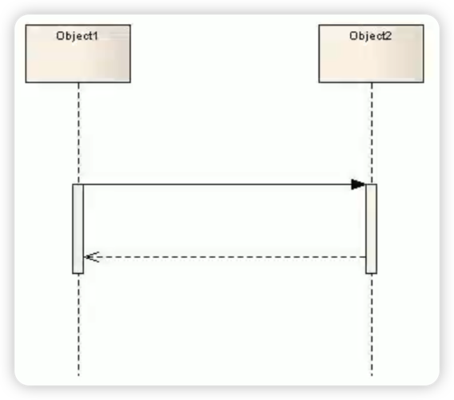

<p align="center">
 
 <p align="center"><b><font size=6>软件工程</font></b></p>
 <p align="center"><b>优质软件开发过程的基本原理及其计量方法 & 优质的软件开发技术<br>持续更新中...</b></p>
</p>


<div align=center>


<div align=left>
<!-- 顶部至此截止 -->


<!-- SPbSTU  -->

 <p align="center">
  
  </br>
  </br>
  <b><b>Санкт-Петербургский государственный политехнический университет</b></br></b>
  <b>Институт компьютерных наук и технологий</b>
 </p>
 <p align="center"></p>

</p>

<div align=left>
<!-- SPbSTU 最后一行 -->


[toc]

> 基于圣彼得堡国立理工大学的讲座


# 软件生命周期

## 软件产品

> Программное изделие (продукт)

软件产品（产品）--应按照国际、国家、公司标准和其他规范性文件开发，按照批准的TP制造，按照相关标准和技术规范（TS）验收，有注册号、工业产品分类代码、制造商的商标。


## 软件生命周期及其阶段

**软件开发的关键阶段：**

> Основные этапы эволюции ПО

| 真实世界                                                     | 抽象出来的世界模型                                           |
| ------------------------------------------------------------ | ------------------------------------------------------------ |
| 1. 要求/Требования/Requirements<br /><br />我们为什么要做一个软件产品？<br />结果应该是什么？ | 2. 规格/Спецификации/Specifications<br /><br />我们将如何开发软件产品以满足需求？ |
| 8. 维护/Эксплуатация и сопровождение / Maintenance<br /><br />结果是什么？ | 3,4,5,6,7. 实施/Реализация/ Development<br /><br />我们用编程语言中实现？ |


1. **【第 1 阶段】**

    - **需求分析（Анализ требований）**,编写一份文件，在文件中，根据流程自动化的需要和以往经验，正式确定用户对未来服务的目标、要求和标准，并评估实施投资的经济可行性。

        > 确定软件需求的主要方法有：
        >
        > https://wiki.mbalib.com/wiki/%E8%BD%AF%E4%BB%B6%E9%9C%80%E6%B1%82%E8%8E%B7%E5%8F%96
        >
        > 　　**1、用户访谈**（Интервью с пользователем）
        >
        > 　　用户访谈是一种最基本的需求获取手段，它是指分析人员以个别访谈或小组会议的形式与用户进行初步的[沟通](https://wiki.mbalib.com/wiki/沟通)。用户访谈的形式包括结构化和非结构化两种，结构化是指分析人员按照一定准则事先准备好一系列问题，通过用户对问题的回答来获取有关目标软件方面的内容；非结构化则是只列出一个粗糙的想法，根据访谈的具体情况来进行发挥。
        >
        > 　　**2、用户调查（Опрос пользователей）**
        >
        > 　　在进行用户访谈时，由于很多关键人员的时间有限，不易安排过多的时间或者项目涉及的客户面较广，不可能一一访谈。因此，就[需要](https://wiki.mbalib.com/wiki/需要)借助用户调查的方法，通过精心设计要问的问题，然后下发到[相关](https://wiki.mbalib.com/wiki/相关)的人员手中，让他们填写，再从所填写的内容中获取系统的需求信息，这样就可以克服上述的问题。
        >
        > 　　用户调查最大的不足就是缺乏灵活性，而且可能存在受调查人员不能很好表述自己想法的限制。
        >
        > 　　**3、现场观摩（Обследования на месте (в полевых условиях)）**
        >
        > 　　俗话说，百闻不如一见，对于许多较为复杂的[流程](https://wiki.mbalib.com/wiki/流程)和系统而言，是很难用自然语言表达清楚的。因此，为了能够对系统的需求获得全面的了解，实际观察用户的操作过程就是一种行之有效的方法。现场观摩就是走到[客户](https://wiki.mbalib.com/wiki/客户)的工作场所，一边观察，一边听客户讲解，甚至可以安排人员跟随客户一起工作一段时间。这样就可以使得分析人员对客户的需求有更加直观的理解。但是，在现场观摩过程中必须切记：建造软件系统不仅仅只是为了模拟客户的手工操作过程，还必须将最好的经济效益、最快的处理速度、最合理的操作流程和最友好的用户界面等作为[软件设计](https://wiki.mbalib.com/wiki/软件设计)的目标。
        >
        > 　　**4、文档考古**（Программная археология（Software archaeology））
        >
        > 　　文档考古是指对历史存在的一些文档进行研究，从带有[数据](https://wiki.mbalib.com/wiki/数据)的[文件](https://wiki.mbalib.com/wiki/文件)、表单、[报表](https://wiki.mbalib.com/wiki/报表)等文档中获取所需信息的过程。对于一些数据流程比较复杂的、工作表单较多的[项目](https://wiki.mbalib.com/wiki/项目)来说，就可以应用这种方法。
        >
        > 　　**5、建立联合分析小组**（Создание совместной аналитической группы）
        >
        > 　　在系统开发时，[系统分析员](https://wiki.mbalib.com/wiki/系统分析员)和用户之间由于[知识结构](https://wiki.mbalib.com/wiki/知识结构)的差异，难免存在难逾越的交流鸿沟。
        >
        > 　　用户提供的需求信息，在系统分析员看来可能是零散和片面甚至无法理解的。因此，为了能够减少交流上的问题，就[需要](https://wiki.mbalib.com/wiki/需要)一个领域专家来帮助进行[沟通](https://wiki.mbalib.com/wiki/沟通)，即可以建立一个由[用户](https://wiki.mbalib.com/wiki/用户)、系统分析员和领域专家参加的联合分析小组来共同完成需求的获取。
        >
        > 　　**6、[原型法（Метод прототипирования）](https://wiki.mbalib.com/wiki/原型法)**
        >
        > 　　原型是在软件开发中被广泛使用的一种工具，在软件系统的很多开发阶段都起着非常重要的作用。原型法就是尽可能快地建造一个粗糙的系统，这系统实现了目标系统的某些或全部功能，但是这个系统可能在[可靠性](https://wiki.mbalib.com/wiki/可靠性)、界面的友好性或其他方面上存在缺陷。建造这样一个系统的目的是为了考察某一方面的可行性，如算法的可行性，[技术](https://wiki.mbalib.com/wiki/技术)的可行性，或考察是否满足用户的需求等。原型是在最终系统产生之前的一个局部真实表现，可以让人们能够对一些具体问题进行基于[实物](https://wiki.mbalib.com/wiki/实物)的[有效沟通](https://wiki.mbalib.com/wiki/有效沟通)，从而帮助人们尽早解决软件开发中存在的各种[不确定性](https://wiki.mbalib.com/wiki/不确定性)。
        >
        > 　　原型主要有三种类型：探索型，实验型，进化型。探索型的目的是要弄清楚对目标系统的要求，确定所希望的特性，并探讨多种方案的可行性，实验型是用于大规模开发和实现前，考核方案是否合适，[规约](https://wiki.mbalib.com/wiki/规约)说明是否可靠；进化型的目的不在于改进规约说明，而是将系统建造得易于变化，在改进原型的过程中，逐步将原型进化成最终系统。
        >
        > 　　对于原型法的使用也有两种不同的策略：废弃策略和追加策略。废弃策略是指先建造一个功能简单而且[质量要求](https://wiki.mbalib.com/wiki/质量要求)不高的模型系统，针对这个系统反复进行修改，形成比较好的思想，据此设计出较完整、[准确](https://wiki.mbalib.com/wiki/准确)、一致、可靠的最终系统，系统构造完成后，原来的模型系统就被废弃不用。探索型和实验型属于这种策略。追加策略则与之不同，它是指在原模型的基础之上不断增加和修改，最终产生实用的系统。
        >
        > 　　在需求模糊的不确定性较大的情况下，使用[原型方法](https://wiki.mbalib.com/wiki/原型方法)来进行需求信息的获取尤其有效。
        >
        > 　　**7、模型驱动**（управляемые модели）
        >
        > 　　前面的面谈、原型、观察以及文档审查等方法可以通过执行一些具体的获取行为来对系统需求进行[认知](https://wiki.mbalib.com/wiki/认知)和理解。但是大多数软件系统，尤其是对于复杂的系统而言，它们的需求获取任务绝不是可以通过一两次这样简单的获取行为就能够完成的。为了能够使得获取行为相互配合、减少不必要的精力耗费和防止出现获取信息的遗漏，可以采用模型驱动的方法。
        >
        > 　　模型驱动方法是一类以[定义](https://wiki.mbalib.com/wiki/定义)明确的模型为理论基础，依据模型指导和组织活动开展的需求获取方法。这些方法的模型定义确定了所要收集的信息类型，模型的建立和完善的过程就是进行需求获取的过程。常见的模型驱动方法有面向目标的方法(Goal—Oriented Methods)、基于场景的方法(Scenario—Based Methods)和基于用例模型的方法(Use Case—Based Methods)。
        >
        > 　　这里主要讨论一下基于用例模型的方法。建立[用例模型](https://wiki.mbalib.com/wiki/用例模型)是一种需求获取的有效方法，其简洁清晰的描述方式容易被软件人员和[用户](https://wiki.mbalib.com/wiki/用户)共同理解和接受。在[用例模型](https://wiki.mbalib.com/wiki/用例模型)中，角色和用例是两个基本概念，分别代表着系统外部的执行者和系统应包含的功能，因此，建立用例模型的主要工作是确定角色、确定用例和描述用例。用例模型以用户和任务为中心，将整个工作的焦点集中在从用户的角度说明系统能够干什么，完全不考虑具体的实现细节，从而达到准确地理解客户需求的目的。这种方法已经在许多大型系统的开发中取得成效，实践证明它能有效地解决用户参与的问题。
        >
        > 　　**8、基于上下文的方法**（Контекстный подход）
        >
        > 　　软件系统是作为一个整体存在的，它通过和环境的交互来解决用户的问题，满足用户的需求。软件系统中的每项功能都是依存于一定的背景和上下文环境，因此，要正确地理解系统的功能就必须要正确地理解它的背景和上下文知识。基于上下文的方法就是注重于系统的环境、开发[组织](https://wiki.mbalib.com/wiki/组织)的业务背景、涉众的特征以及[目标](https://wiki.mbalib.com/wiki/目标)等。与前面的方法相比，它更加注重用户在一定环境下表现出来的[行为](https://wiki.mbalib.com/wiki/行为)，通过分析用户的行为得到[信息](https://wiki.mbalib.com/wiki/信息)。

    - **需求开发（Разработка требований）**是创建一个文件（需求模型），在该文件中，对用户和客户来说重要的未来产品的一系列属性、功能、特点、使用模式、状态和情况被正式确定为主题领域。

    - **需求规范（Спецификация требований | Requirement Specification）**- 一个文件（需求模型的规范），包含对设计对象的足够准确和完整的描述，在需求分析的基础上开发。规范是对一项任务的准确和完整的描述，它比用编程语言实现这项任务的程序更容易被参与解决的人编写、理解和阅读。规范语言通常是一种比编程语言更高层次的语言，例如非正式规范的自然语言，或者像UCM、SDL、MSC这样的正式规范语言。

    

    

2. **【第 2 阶段】**

    **实施规范（Разработка реализационных спецификаций）**，创建文件（模型），记录关于要设计的系统的数据结构、算法、接口和协议的决定，特别是平台和应用架构。

    > 实施规范（Разработка реализационных спецификаций）:
    >
    > 

    **规格书（Specification）**是一个分层次的文件系统，其中高层设计（HLD - High Level Design）是由详细设计（DD - Detail Design）补充的。通过这种方式，设计创造了一个文件系统（一套模型），这些文件是实施的任务。最好的设计是用正式的规范语言对系统进行描述，如UCM、SDL、MSC、UML。

    > TRM:
    >
    > 

    

3. **【第 3 阶段】**

    **编码（Кодирование）**-将实施规范转换为代码，以满足需求规范。在这一步骤中，规格被手动或自动转化为软件模块，并被定义为所选编程语言的代码。编码的结果是一个可执行的代码。

    

4. **【第 4 阶段】**

    **调试和测试（Отладка и тестирование）**- 在运行时根据要求和规范检查代码。

    测试有几个阶段
    - 在模块层面 - 单元测试（модульное тестирование | Unit Testing）
    - 在模块间层面 - 集成测试（интеграционное тестирование | Integration Testing）
    - 在产品层面 - 系统测试（системное тестирование | System Testing）

    

5. **【第 5 阶段】**

    **环境和目标平台定制（Настройка на окружение и целевую платформу）**- 在目标编译过程中提供。调试确保代码适应微控制器（计算机）和操作系统的类型和特点、所需资源、环境（(environment) ），并优化软件的性能。

    

6. **【第 6 阶段】**

    **系统测试（Системное тестирование）**- 在模拟和/或真实的运行环境和环境中，根据需求和规范检查运行时的代码。

    > 整合多平台解决方案的验证和测试流程：
    >
    > 
    
    
    
7. **【第 7 阶段】**

    **文档化（Документирование）** - 按照国际（ISO/IEEE）、国家（ESPD/ANSI/...）和公司标准创建和完成产品操作和用户文档的过程。

    **将软件转变为产品（Превращение программного обеспечения в продукт）**--通过修复软件与安装包一起放在一个介质上，并以文件形式完成产品（其中一种方式）。

    **交付（Поставка）**-软件产品的复制（媒体复制）并交付给客户。

    

8. **【第 8 阶段】**

    **维护（Сопровождение）**是一个与软件产品运行同步进行的过程，目的是在整个使用期间确保软件运行的质量要求，包括识别和消除开发后剩余的错误（缺陷）。在这个阶段，当检测到缺陷时，系统会被升级，从而导致系统规格的调整。维护阶段的长度受到软件过时的限制，当软件产品被更先进的版本取代时，其设计考虑到了先前系统的开发和运行经验。

    维护工作包括向用户交付系统、调试、检测和消除操作中的错误，以及必要时进一步扩展系统。


---


## 软件项目中的需求规格

> ТРЕБОВАНИЯ, СПЕЦИФИКАЦИЯ ТРЕБОВАНИЙ В ПРОГРАММНОМ ПРОЕКТЕ (продолжение)
>
> https://sites.google.com/site/introalaingenieriadesoftware/unidad-1
>
> 
>
> 需求建模：
>
> https://juejin.cn/post/7074874864397451271


### 需求规格

> Спецификации требований
>
> https://visuresolutions.com/zh-CN/blog/requirements-specification/
>
> 
>
> 需求说明书：
>
> - https://blog.51cto.com/u_11299290/5708979
>
>
> 常用的软件需求说明书模板:
>
> - 


**需求分析报告**：一般是对某个市场或者是客户群来讲的，类似于调研报告，重点是体现出产品要满足哪些功能，哪些是重点、热点。


**软件需求说明书**，又称软件需求规格说明书，英文名为**Software Requirements Specification（SRS）**，是根据与现场实际客户进行沟通，把客户的需求进行整理，CMMI中有标准的模板，重点是站在客户的角度讲产品功能。是需求人员在需求分析阶段需要完成的产物。它的作用是作为用户和软件开发者达成的技术协议书，作为设计工作的基础和依据，作为测试和验收的依据。

- 软件需求说明书应该完整、一致、精确、无二义性，同时又要简明、易懂、易修改。在一个团队中，须用统一格式的文档进行描述，为了使需求分析描述具有统一的风格，可以采用已有的且能满足项目需要的模板，也可以根据项目特点和开发团队的特点对标准模板进行适当的改动，形成自己的模板。
- 软件需求规范为客户和承包商或供应商（或市场和开发部门）之间就软件产品应该做什么和不应该做什么（或被期望做什么）达成协议提供了基础。
- **软件需求规范允许在设计开始前对需求进行彻底的评估**，并减少后续修改的数量。该规范还应该为**估计产品成本、风险和时间表提供一个现实的基础**。
- 软件需求规范也可以被组织用来作为制定有效的验证和核查计划的基础。软件需求规格提供了将软件产品转移到新用户或软件平台的基础。最后，它可以构成改进软件的基础。
- **软件需求通常是用自然语言编写的，但在软件需求规范中，可以用正式的或非正式的语言作为补充。**半正式的描述。选择适当的符号可以比自然语言更精确、更简洁地描述软件结构的具体要求和方面。一个一般的规则是，应该用符号来尽可能准确地描述需求。这对安全关键型软件、监管型软件和其他一些类型的稳健型软件尤为重要。然而，符号的选择往往受到文件作者和读者的培训、技能和偏好的限制。
- 一些质量指标已经被开发出来，可以用来将软件需求规范的质量与其他项目变量联系起来，如成本、验收、性能、进度。
    - 单个软件需求规格声明的质量指标包括命令式、指令式、弱化短语、选项和延续。
    - 整个软件需求规范文件的指标包括大小、可读性、规格、深度和文本结构。


**需求规格说明书**：是从业务规则讲起的，细一点偏向于软件的概要设计。是从开发、测试的角度去讲产品功能，里面要包含原型界面、业务接口、活动图等。

### 需求属性

> Атрибуты требований

- 在需求分类和需求属性之间存在着强烈的联系
- **需求不仅应包括对所需内容的说明，而且应包括帮助管理和解释需求的支持信息**。
- 需求属性应该被定义、记录并随着开发或维护的软件的发展而更新。
- 这应该包括需求的各个分类方面和验证方法或验收测试计划的相关部分
- 需求属性也可以包括额外的信息，如每个需求的简要理由，每个需求的来源和变化的历史。
- **需求的一个重要属性是==标识符(идентификатор)==，它允许毫不含糊地识别该需求。**


---

# 软件开发模型

> https://cloud.tencent.com/developer/article/1724043
>
> https://zhuanlan.zhihu.com/p/43885605
>
> https://wiki.mbalib.com/wiki/%E8%BD%AF%E4%BB%B6%E5%BC%80%E5%8F%91%E6%A8%A1%E5%9E%8B

模型也称为软件开发生命周期（SDLC）模型/方法。每个过程模型都遵循其类型所独有的一系列阶段，以确保软件开发步骤中的成功。

## 瀑布模型

> 


瀑布模型（Waterfall） 是最简单的软件开发历史上第一个 SDLC 模型。在瀑布模型中，开发过程是线性的。任务和阶段按严格顺序一个接一个地完成。进度平稳地向下流动，就像瀑布上的水一样。

瀑布模型的主要缺点是不灵活。瀑布易于理解且易于管理。但是过早的延迟会拖延整个项目的时间表。由于一旦完成阶段，几乎没有修改的余地，因此只有进入维护阶段才能解决问题。如果需要灵活性，或者项目是长期的且正在进行的，则此模型不能很好地工作。

瀑布模型是一种比较老旧的软件开发模型，1970年温斯顿·罗伊斯提出了著名的“瀑布模型”，直到80年代都还是一直被广泛采用的模型。

　　瀑布模型将软件生命周期划分为制定计划、需求分析、软件设计、程序编写、软件测试和运行维护等六个基本活动，并且规定了它们自上而下、相互衔接的固定次序，如同瀑布流水，逐级下落。

　　在瀑布模型中，软件开发的各项活动严格按照线性方式进行，当前活动接受上一项活动的工作结果，实施完成所需的工作内容。当前活动的工作结果需要进行验证，如验证通过，则该结果作为下一项活动的输入，继续进行下一项活动，否则返回修改。

　　瀑布模型优点是严格遵循预先计划的步骤顺序进行，一切按部就班比较严谨。

　　瀑布模型强调文档的作用，并要求每个阶段都要仔细验证。但是，这种模型的线性过程太理想化，已不再适合现代的软件开发模式，几乎被业界抛弃，其主要问题在于：

　　1） 各个阶段的划分完全固定，阶段之间产生大量的文档，极大地增加了工作量；

　　2） 由于开发模型是线性的，用户只有等到整个过程的末期才能见到开发成果，从而增加了开发的风险；

　　3） 早期的错误可能要等到开发后期的测试阶段才能发现，进而带来严重的后果。

　　4） 各个软件生命周期衔接花费时间较长，团队人员交流成本大。

　　5） 瀑布式方法在需求不明并且在项目进行过程中可能变化的情况下基本是不可行的。


## 迭代和增量模型

> https://zh.wikipedia.org/zh-cn/迭代式开发
>
> https://en.wikipedia.org/wiki/Iterative_and_incremental_development


**迭代式开发**也被称作**迭代增量式开发**或**迭代进化式开发**，是一种与传统的[瀑布式开发](https://zh.wikipedia.org/wiki/瀑布式开发)相反的[软件开发方法](https://zh.wikipedia.org/w/index.php?title=软件开发方法&action=edit&redlink=1)，它弥补了传统开发方式中的一些弱点，具有更高的成功率和生产率。

迭代和增量 SDLC 模型将**迭代设计和工作流**与增量构建模型结合在一起。在这种情况下，团队将按周期开发产品，**并以渐进方式构建小零件**。

开发过程从简单实施一组严格限制的小型产品需求开始。然后对该产品进行增强，并使其本身成为更完整的版本，直到完成并准备好进行部署为止。**每次迭代都可能包含设计更新和新功能。**

迭代和增量模型的一个有价值的特点是**可以在不知道所有需求的情况下开始开发**。该模型包含其他 SDLC 模型的步骤-需求收集，设计，实施和测试，但要经过多次构建。开发团队可以利用先前构建中取得的成就来改善下一构建。

迭代和增量 SDLC 模型可能看起来像一组微型瀑布模型或微型 V 形模型。


# 敏捷开发

- Scrum方法是由Ken Schwaber和Mike Beedle在1990年代应用的。
- Scrum方法是根据Takeuchi和Nonaka在1986年的一篇文章中描述的关于业务流程开发的想法，为构建软件产品而开发的。


## Sprint

> 【3】Лекция 30.09.2022
>
> ОПРКПП-тема2_ч1а_Agile_Scrum_short

- 所有的敏捷方法都采用迭代开发和频繁交付的原则
- Scrum 使用术语==sprint==来指代这些迭代
- 冲刺的目标是通过完成被称为冲刺积压的清单中的任务，在项目开发中取得重大进展
- Scrum 中的冲刺通常持续一个月（但其他地方说是 1~3 周，不超过一个月）


Sprint，**闭窗规则**

- 将开发工作分成短期的间隔，持续一个月或几周，这个想法定义了冲刺的概念
- **重要规则**：在冲刺期间，为冲刺选择的**任务清单(список задач)不应增加**


## 每日立会

> ежедневные встречи

- 每天的Scrum--每天的短会，站着开（理论上）
- 会议时间有限
- 在会议期间，获得以下问题答案：
    - 每个人在前一天都做了什
    - 他们在这一天要做什么
    - 工作的障碍是什么（技术、组织等）？


## 回顾会议

> ретроспектива

- **迭代后**会议的目的是评估迭代的结果
- 团队向产品所有者展示结果
- 讨论哪些是按计划实现的，哪些没有实现；是否符合任务验收标准，任务的实际成本，与项目有关的其他问题


# 风险管理

> Управление рисками
>
> 
>
> SWEBOK Guide V.3.0 – Risk Management：
>
> - 风险和不确定性是相关但**不同**的概念。不确定性源于信息的缺乏。
> - 风险的特点是，一个会导致负面影响的事件的概率加上对一个项目的负面影响的特点。
> - 风险往往是不确定性的结果。风险的反面是机会，其特点是具有积极结果的事件可能发生的概率。

章节内容：

- 风险管理简介
- 风险识别
- 定性和定量的风险分析
- 规划风险管理过程 - 对已实现的风险进行处理的计划
- 风险监测

==风险（Риск）==是一个事件，如果它发生，将产生积极或消极的影响。对项目目标的影响（成本、期限、项目的技术性能）。


**风险属性：**

- 风险发生的概率（Probability）
- 影响（风险意义）（Impact）

项目风险只涉及到项目团队可以预见的事件。如果项目组不能预测、评估和监测一些事情，唯一能做的就是在项目中建立储备。


**确定性和不确定性风险：**

可以预见的风险及其后果（收益/损失）的客观评估

- **不确定性：**
    - 风险事件被确认
    - 发生的可能性和/或损失的大小无法确定或估计
- **三种类型的不确定性:**
    - 描述性的（Описательная, 究竟什么是风险事件） 
    - 可测量的（Измерительная, 发生的概率） 
    - 事件的后果（Последствия события, 什么处于风险之中）


> **问题：为什么要在一个有风险的项目上工作？**
>
> **答案：为了获得具体的利益!**
>
> 
>
> **是否值得避开风险？**
> "回避风险是一个失败的提议。在过去，你可能会把无风险的项目当作命运的意外礼物，并为这一难得的好运气--一个轻松的项目感谢星星。我们的反应是一样的。我们是多么愚蠢的人! 无风险的项目是失败者的命运。
>
> 风险和回报总是相辅相成的。那些回避风险，只专注于他们肯定能做好的事情的公司，是在为他们的对手播种。一个项目是充满风险的，因为它把你引向未知的道路。它能以让你的竞争对手疯狂的方式赋予你权力。理想的情况是，达到让你的竞争对手没有任何反应的程度。


**风险的类型：**

- 金融 (Финансовые)
- 法律 (Правовые)
- 市场 (Рыночные)
- 政治 (Политические)
- 过程风险 (Процессные риски) - 与项目的生产过程和程序有关
- 技术风险 (Технические риски) - 与项目中使用的技术和特定项目团队的经验有关
- 安全风险 (Риски, связанные с обеспечением безопасности) - 与以下方面有关：防止安全漏洞，识别和处理


**区分风险的特点：**

- 风险只是一种未来的现象
- 情况性（在某些条件或情况下发生）
- 没有现成的答案或定义
- 相互依存（一个风险事件可能导致其他风险事件的发生）
- 相互依存（一个风险事件可能会引发其他风险事件）
- 风险的数量影响其认知度
- 对后果大小的依赖性
    风险容忍度是二分法（二分法/希腊语/是将一个概念的范围划分为两个相互排斥的部分，完全穷尽可划分概念的范围）
- 奖励越大，风险越可接受
- 个人价值观影响企业的风险承担
- 企业价值观影响个人选择
- 时间影响着风险认知（通常是随着时间的推移项目情况变得更加可预测和确定)
- 风险是可逆的（即，一旦在项目中发生，它们可以在项目的有效期内重复进行)
- 风险本身并不是一个问题。问题是一种时机已到的风险


**风险的心理学：**

- 人们对风险的认识与大多数统计风险测量的方法不一致
- 风险观念一旦形成就很难改变
- 风险认知受一系列情感因素而非逻辑因素的制约
- 认为自己比实际情况更自信：
    - 未能根据新的信息修改最初的估计
    - 使用一个特定的前提作为他们的初始判断，如果他们后来修改，那么在相同的初始条件下进行修改
    - 经常根据一个简单的可能性规则来预测风险--如果技术风险小，那么相关的成本（商业）风险也小 <错误的判断！>


**是什么影响了对风险的认识？**

- 管理(Управление, 选择)

    - 你可能因为以下原因而面临风险

    - 亲自上阵

    - 其他人

        第三方(третьихлиц) 的活动（性质/政府/...）

        

- 现有的信息可能是

    - 不充分的

    - 不熟悉的

    - 不可靠的

    - 变幻莫测

- 时间

  - 一个人 "看 "得越远，不确定性的程度就越大
  - 缺少时间来识别风险和执行风险管理


==风险偏好(Склонность к риску)==是指行为人在预期回报时愿意接受的不确定性程度。

==风险容忍度(Толерантность к риску)==是一个组织或个人可以容忍的风险水平、数量或范围。

==风险阈值(Порог риска)==对利益相关者可能有兴趣的不确定性水平或风险水平的衡量。低于这个风险阈值，该组织将接受风险。超过这个风险阈值，该组织将不接受该风险。


**软件风险管理：**

一种管理方法，基于识别软件开发生命周期中那些有可能导致过程或产品发生理想或不理想变化的领域和事件，并管理这些领域/事件。

- CMMI中的风险管理（RSKM）：
    - 成熟度3级的项目管理过程领域
    - 根据CMMI-DEV, V1.3，RSKM的目的是在潜在问题发生之前识别它们，以便在产品或项目的生命周期中，必要时可以计划和启动管理（"处理"）风险的行动，以减轻对实现<项目>目标的不利影响。
    - RSKM是一个持续的、预测性的过程，是项目管理的一个重要组成部分。风险管理应解决可能危及重要目标实现的问题。
    - 风险管理应解决内部和外部风险，技术和非技术风险，与成本来源、进度、性能和其他风险有关的风险。早期发现风险是很重要的，因为在项目的早期阶段对项目运作进行改变通常比后期阶段更容易、更便宜、更少干扰。


**风险管理：**

> Risk Management (управление рисками)

风险管理可分为以下几个部分。

- 风险管理战略的定义
- 识别和分析风险
- 对可能出现的风险进行跟踪，包括实施减轻风险的行动


**风险管理规划：**

> Планирование управления рисками

风险规划是项目规划的一个组成部分
风险管理涉及六个过程。

- 风险管理规划
- 风险识别
- 定性风险分析
- 量化风险分析
- 在发生风险/危险的情况下的行动规划
- 监测和控制风险


**为什么要从事风险管理:**

- 通过在竞争对手之前识别机会，获得竞争优势
- 专注于在第一时间打造正确的产品
- 为防止出现意外情况
- 为避免危机管理
- 防止问题再次发生，或在问题发生时，防止问题升级


## 风险管理规划

> Планирование управления рисками


**PMI：**

- PMI - 项目管理协会（Project Management Institute (Институт управления проектами)）
- PMBOK（项目管理知识体系）指南是美国的一个项目管理机构，成立于1969年。定期更新其PMBOK标准的版本。PMBOK第五版指南于2013年发布
- PMI是一个非盈利组织，致力于在各国推广、宣传和发展项目管理


**SWEBOK指南V.3.0 - 风险管理：**

- 风险管理不仅应在项目开始时进行，而且应在整个项目生命周期的定期间隔内进行
- 风险管理不仅应在项目开始时进行，而且应在整个项目生命周期的定期间隔内进行


**风险管理和项目管理有什么区别呢？**

- 观点

    - 将方案设计的要素视为增加或减少风险和成功可能性的问题，改变了视角

    - 风险设定了采取控制行动的边界条件

        

- 在实践中

    - 典型的软件项目管理是以 "成功 "为导向的（风险最小）
    - 风险管理的方向是使项目的进程和结果更加 "现实"


**风险管理的方法：**

1. 反应
    1. 应对症状
    2. 纠正失误
    3. 危机管理
2. 过渡期
    1. 防止明显的问题
3. 积极主动
    1. 变革管理
    2. 失败预期
    3. 故障排除


## 风险识别和分析

**信息收集技术的例子：**

- 集思广益

    集思广益会议的目的是为项目创建一个详细的风险清单。风险清单是在一个由10-15名项目组成员参加的会议上制定的，通常是与非项目组成员的不同领域的专家一起制定。会议参与者说出他们认为对项目重要的风险，但不允许对提出的风险进行讨论。然后将风险分门别类，加以完善。

    

- 德尔菲法

    德尔菲法类似于头脑风暴法，但参与者并不认识对方。主持人，使用问题清单来获得项目风险的想法，收集专家的回答。然后对专家的答案进行分析、归类，并返回给专家作进一步评论。通过这个过程的几次反复，获得了一个共识和一个风险清单。德尔菲法消除了同行的压力和表达想法时对尴尬的恐惧

    

- 专家评价

- SWOT分析

- 检查表分析法

- 类比法

- 使用图示的方法

不要在风险识别阶段分析风险!


**典型的风险识别方法要求如下：**

- 考虑项目工作结构的每个要素。
- 使用风险分类法进行风险评估。
- 就具体问题采访专家。
- 考虑类似项目中管理风险的成本和努力。
- 检查现有文件或数据库中的风险信息。
- 检查合同和协议中的项目规格和要求。


**收集项目风险信息的方法：**

> 风险识别方法的比较：
>
> http://www.intuit.ru/department/itmngt/isimman/7/1.html

- **名义组方法**允许识别风险并按重要性排序。这种方法涉及组建一个由7-10名专家组成的小组。每个参与者单独地、不经讨论地列出他们在项目中看到的风险。然后，对所有确定的风险进行联合讨论，并按重要性顺序列出第二份个人风险清单

- **克劳福德牌**。通常情况下，会召集7-10名专家组成一个小组。主持人宣布，他将向小组提出10个问题，每个问题都必须以书面形式在另一张纸上回答。哪种风险对项目来说是最重要的，这个问题被主持人问了好几遍。每个参与者都被迫思考项目的十个不同风险

- 与在类似项目或类似商业领域有丰富经验的**专家进行访谈**。这些专家应该由项目经理确定，并邀请他们审查项目的所有方面，并根据他们以往的经验和专业领域来确定可能的风险。在这个过程中，应考虑到专家可能的偏见

- **确定根本原因**。这个过程的目的是确定项目风险的最重要原因，并根据其原因对风险进行分组。

- **对优势、劣势、机会和威胁的分析**

    (SWOT分析)。SWOT（优势、劣势、机会和威胁）的字面意思是优势、劣势、机会和风险（威胁）。SWOT分析的目的是为了评估一个项目的优势和环境。

    该方法首先确定一个组织的优势和劣势，重点放在项目或组织或业务领域的整体上。

    然后，SWOT分析确定了由组织的优势产生的任何项目机会，以及由其弱点产生的任何威胁。SWOT还研究了组织的优势在多大程度上抵消了威胁，并确定了可用于克服弱点的机会

- **对核对表的分析**。核对表是根据以前执行类似项目时积累的信息和知识制定的风险清单。

- **类比法**。这种方法利用积累的知识和其他类似项目的风险管理计划来识别风险。

- **图解方法**。图表形式的风险映射方法包括因果图和流程图，它们追踪特定流程中发生的事件的顺序


**风险类别：**

风险类别是风险管理计划的一部分，用于对潜在的风险源进行分类。

可以使用几种方法，例如基于项目目标的结构，按类别划分。分层风险框架（RBS）有助于项目组在风险识别过程中考虑项目风险可能产生的多种来源。

不同类型的项目对应着不同的RBS结构。组织可以使用预先建立的风险分类方案，其形式可以是一个简单的类别清单，也可以是RBS的形式。

RBS是按照风险类别对风险进行分层表示。图中（下一张幻灯片）显示了这种结构的一个例子。


**风险类别：**

1. 目标和指标
2. 组织管理
3. 客户
4. 预算/费用
5. 时间表
6. 项目内容
7. 实施 .
8. 项目管理
9. 发展进程
10. 开发环境
11. 人员
12. 产品支持


**可能的风险类别的例子：**

- 时间表的制定 - 由已批准的时间表中的不准确引起的问题
- 组织方面 - 一些管理决策可能会影响到项目的执行，例如工作人员的变化，重新分配到另一个项目上
- 开发 - 错误的开发过程可能是项目中问题的来源
- 终端用户 - 在用户很重要的项目中客户 - 客户可以在很多方面影响项目，包括改变资金、改变功能要求（包括增加或删除要求）、改变时间表
- 承包商 - 与使用第三方的具体情况有关的风险
- 要求 - 要求的可能变化，不符合严格要求的可能性，所用技术的局限性
- 开发环境 - 开发环境的变化或问题可能影响项目
- 人员方面 - 雇员可能由于各种原因无法完成指定的工作
- 设计 - 设计可能包含影响项目执行的错误
- 其他类别


## 风险分析

风险分析是评估已确定的风险发生的可能性或影响的系统过程。
- 评估已确定的风险发生的可能性和损失或影响的大小的系统过程

- 一个减少测量的不确定性和风险事件后果的不确定性的过程

  

项目经理所做的最糟糕的事情是评估风险事件发生的可能性！这是不可能的。


**在风险分析中会发生什么？**

- 描述系统的变量的值被确定
- 如果风险事件发生，不同的后果被确定
- 对风险的强度进行评估
- 惊奇的面积减少了（但没有完全消除！）。


**风险分析的实用方法**

- 将分析的任务委托给相关的工作组
- 从质量和数量上描述每种风险的特点
- 尽可能的量化
- 在无法进行定量评估的情况下，给予定性评估
- 最好是两者结合
- 确定最坏的情况、最好的情况和最可能发生的情况
- **在这个阶段不要对风险进行优先排序!**


**风险评估的三种形式**

- **叙述**--描述可能阻止某事发生的风险，或指出风险的来源及其可能的管理
- **定性**--通过使用形容词或颜色来表示顺序的序数排名系统来表达风险
- **定量**--用数字分数来表示风险发生或不发生的概率。


**风险的定性描述：**

- ==高== - 非常有可能造成严重的进度中断、成本增加或生产力损失，即使对供应商给予特别关注并与客户密切合作也是如此
- ==中等== - 可能会造成严重的进度问题、成本增加或生产力损失；但是，通过仔细的供应商管理和与客户的良好合作，这些困难是可以克服的
- ==低== - 不会造成严重的时间表冲突、成本增加或生产力损失；正常的供应商关怀和客户合作很可能会克服这些困难。

不同的人对高、中、低风险有不同的看法! 需要达成意见共识!


**量化风险分析：**

对最重要的风险事件的影响进行评估，并给出一个==数字等级==

最常见的定量分析方法是

- **敏感性分析（анализ чувствительности）**，该分析确定了在其他不确定因素采取基线值的情况下，每个项目要素的不确定性对所研究项目目标的影响程度。
- **预期货币价值（анализ ожидаемой денежной стоимости）**分析是通过将每个可能结果的价值乘以其发生的概率来进行的，然后将得到的价值相加。
- **决策树分析（анализ дерева решений）**，它描述了所考虑的与每个可用选项和可能情况有关的情况。
- **建模和模拟（моделирование и имитация）**，项目建模使用一个模型来确定详细的不确定因素对整个项目结果的影响。


**连接定性和定量的描述（以项目技术风险为例）：**


| 风险等级 | 失败的概率  | 解释                                  |
| -------- | ----------- | ------------------------------------- |
| 极高     | 0.99 – 0.81 | 当前技能之外--技术问题保障            |
| 非常高   | 0.80 – 0.61 | 在目前的技能之外--技术问题非常可能    |
| 高       | 0.60 – 0.50 | 新技术尚未完全成熟 - 可能出现技术问题 |
| 中型     | 0.49 – 0.25 | 更好的技术 - 预计只有极少的技术问题   |
| 低       | 0.24 - 0.10 | 实用技术--没有预见的技术问题          |
| 非常低   | 0.09 – 0.01 | 系统运行中                            |


**概率的定义和风险类别是风险管理计划的一部分。**

- 风险类别是风险管理计划的一部分，用于对潜在的风险源进行分类。
- 定性和可信的风险分析涉及在项目背景下确定风险的不同程度的概率和影响。在风险管理规划过程中，对概率水平和影响水平的一般定义要根据具体项目进行调整，然后在后续过程中使用。该表（见下一张幻灯片）提供了一个消极影响定义的例子，在评估与四个项目目标相关的风险影响时可以使用（积极影响也可以创建类似的表格）。该表展示了相对和数字两种方法。


**确定损失的大小：**

- 损失的性质
    - 量化性质：损失是物质的、政治的、经济的，还是所有这些的综合
- 损失的大小
    - 严重程度 - 数量
    - 分布 - 损失所涵盖的内容 损失发生的时间
- 损失的时间
    - 损失的时间顺序：损失是立即发生的还是长期存在的


## 为风险指定优先级（评级）

**确定优先次序是为了**

- 识别那些对项目影响最大的风险并进行排序

- 我们假设永远不会有时间或资源来全面分析所有的风险，所以我们只关注项目的主要风险

  如果风险分析做得好，这是一个相对简单的步骤


**优先权工具**

- 筛选

    筛选出非必要风险的问答技术

    

- 比较风险排名（CRR – Comparative Risk Ranking）

    一种比较技术，按优先次序给出可靠的物质风险顺序


**一种实用的排名方法：**

- 根据2个步骤的分析，将风险从高到低排序。
- 在可能的情况下，使用定量排名；如果不可能，则使用定性排名。
- 对具有相同等级的风险分别进行排名。
- 通过团队合作来确定优先次序。
- 不要在这个阶段提出风险应对策略!


> 对风险进行优先排序--概率和影响矩阵（摘自《PMBOK指南》第五版）
>
> 可以对风险进行优先排序，以便后续的量化和风险应对计划是基于风险评级。根据对风险的概率和影响的评估，对风险进行等级划分。每个风险的重要性及其优先级通常通过对应表或概率-影响矩阵来评估。这个矩阵确定了可能性和影响的组合，将低、中或高的优先等级分配给风险。根据组织的偏好，可以使用描述性的术语或数值。
>
> 每种风险都根据其发生的概率和发生后对目标的影响进行评级。本组织必须确定哪些概率和影响的组合会导致风险分类为高、中和低。在黑白矩阵中，这些条件用不同的灰色阴影表示。特别是，在图中（见下一张幻灯片），深灰色区域（最高数值）代表高风险，较浅的区域（最低数值）代表低风险，最浅的区域（中等数值）代表中等风险。通常情况下，风险评级系统的规则是由组织在项目开始前确定的，并包含在组织的流程资产中。在风险管理规划过程中，风险评级系统的规则可以根据具体项目进行调整


**对风险威胁的反应：**

- 接受--为一系列的风险做好准备和处理，可以是主动的（建立应急基金），也可以是被动的（什么都不做）
- 减轻--将危险的概率和/或影响降低到一个可接受的水平
- 转移--将危险序列转移给另一个责任方
- 避免 - 消除威胁，通常是通过消除其潜在的原因。


==**风险管理计划**==

风险管理计划必须包含：

- 风险的名称和描述
- 风险可能发生的时间
- 对项目产生影响的可能性和程度
- 如果风险发生，项目的哪个领域将受到影响
- 为减轻风险而计划的行动
- 监测风险的触发点是什么？
- 如果风险发生，谁会做什么，等等。

> План управления риском должен содержать:
>
> \- Название и описание риска
>
> \- Потенциальное время, когда риск может случиться
>
> \- Вероятность и степень влияния на проект
>
> 
>
> Какая область проекта пострадает, если риск случится
>
> \- Планируемые действия, чтобы смягчить риск
>
> \- Что является триггером в мониторинге риска
>
> \- Кто и что будет делать, если риск случится, и т.д.


## 风险指标/风险触发器

> (индикатор риска / триггер риска)
>
> Триггерное условие / Trigger Condition. Событие или ситуация, указывающая на то, что риск вот-вот наступит.

**监测和管理风险**

- 主动出击，采取预防措施，减轻风险或消除风险。
- 早期承担风险，检查早期假设/假定。
- "注意 "风险触发器和症状。
- 按照风险管理计划的要求实施行动。
- 记录所有采取的行动。


**评估结果**

- 观察风险应对策略的实践，以便
    - 了解该战略的后果是否与预期相符。
    - 确定完善风险管理计划的机会


**评估结果**

- 通过应用 "风险指标 "评估项目的状况

- 重新评估风险。
    - 影响
    - 概率
    - 实际事件
- 重新评估应对策略：成功和失败的经验
    - 活动
    - 重新评估风险
- 相应调整计划
- 沟通项目的变化和状态以及风险


**经常出现的设计风险**

- 专家工程师太少
- 紧张的日程安排
- 无效的报告
- 产品界面过于多样化
- 新的要求（频繁的，意外的，......）。
- "镀金 "的威胁（一厢情愿的想法）。
- 产品质量方面的错误
- 时间问题（日程安排的误算） 
- 新技术风险

# 软件开发流程、问题追踪和管理

> Процессы разработки ПО Отслеживание проблем, управление проблемами


## 概述

**问题是什么：**

用户、开发人员、测试人员发现的产品问题（bug），问题是一个正在运行程序的不正常行为


**问题的分类（Проблема становится）：**

- ==failure（сбоем）== 失败，导致程序错误或者不正常的行为
- ==改进型（запросом на улучшение）==，如果是软件产品中的遗漏，则提出改进要求（软件中需求的缺失，没以最佳的方式为用户实现需求，等等）
- ==特性（свойством программы）==，如果是软件的正常行为，那它不是一个错误，而是特性


**问题的声明周期（Жизненный цикл проблемы）：**

在软件产品中发现 bug 的生命周期一般有 5 各阶段：

1. 用户（或者任何对软件有经验的人）将问题**提交（информирует）**给软件制造商
2. 制造商在自己的环境中**重现（воспроизводит）**问题
3. 制造商**隔离（изолирует）**引发问题的条件
4. 制造商**定位和修复（находит и исправляет）**缺陷
5. 制造商**重新发布（передает）**正确版本


**制造商有义务解决一下问题：**

- 如何组织软件生命周期中出现的问题
- 哪些问题是当前**无法修复（нерешенными）**的
- 哪些问题是当前**严重（серьезными）**的
- 此问题在**以前是否出现过（похожиепроблемы）**


## 问题追踪

> Отслеживание проблем


### 问题的报告

> Отчеты о проблемах

为了能够更好的修正错误，开发者应该能够重现它

软件生命明周期中的 bug，应该伴随着**错误报告（отчетом о проблеме）**


**以下属于都代指问题报告：**

- PR (Problem Report)
- CR (Change Request)
- 错误报告 (Bug Report)


**错误报告中应该：**

- **问题的事实（Факты по проблеме）**

    - **问题的描述（Хронология проблемы | Problem History）**，对重现问题的最少步骤的描述、对资源文件的描述（比如，配置文件、输入文件、数据库记录等）

        > **问题的描述（Хронология проблемы | Problem History）:**
        >
        > - 描述重现问题所需的最小步骤集
        >
        > - 被访问资源的描述
        >
        >     *1. 在窗口 A中打开fox.pdf*
        >
        >     *2. 使用默认配置打印时...*
        >
        > - 如果问题无法重现，那么很可能不会被修复

    - **描述观察到的异常行为（Описание наблюдаемого поведения）**

        > **观察到的行为（Observed Behavior | Наблюдаемое поведение программы）：**
        >
        > - 描述问题的症状，即发生了什么事 与预期的行为相反的是
        >
        >     *一个程序崩溃，有以下信息...*
        >
        >     *STACK DUMP of CRASH (yyy OS)*
        >
        > - 在描述中保持中立是很重要的，坚持用事实说话而不是表现出情绪
        >
        > - 对于开发者来说，对观察到的行为的描述是非常重要的，因为它模拟了再现错误的步骤

    - **描述预期行为（Описание ожидаемого поведения）**

        > **预期行为（Expected Behavior | Ожидаемое поведение программы）：**
        >
        > - 从用户的角度描述应该发生的事情*（比如：该软件应该打印该文件）*
        > - 这些信息对开发者来说没有步骤顺序或诊断信息那么重要，但它确实有助于确定用户和开发者对软件产品在所述条件下的行为是否有相同的理解
        > - 审视现实（Проверка на «реальность»），用户的期望是否合理

    - **对问题性质的简短描述（one-line summary | Краткое описание сути）**

        > **对问题性质的简短描述（one-line summary | Краткое описание сути）:**
        >
        > - 发现问题的人必须简要描述问题*（比如：打开PDF文档时ABC崩溃了）*
        > - 通常情况下，问题的性质是决定其**严重性（серьезности）**（对客户的影响）和补救问题的**优先级（приоритете）**的基础

        

- **软件产品的事实**

    - 软件的版本（Номер версии）及具体编号（比如 ：Publishing Program 1.2 (Build 12B34)）

        > **唯一产品标识符（Product Release | Уникальный идентификатор продукта）：**
        >
        > - 表示软件产品的版本号或其他唯一标识符
        > - 需要指定确切的版本（比如：Publishing Program 1.2 (Build 12B34)）
        > - 存档（如果有关于不同软件版本如何工作的信息）这个问题是否只发生在这个版本的软件上，还是在其他版本中也很常见？

    - 软件的运行环境（Версия операционной системы）（比如：Mac OS X 10.5.5 (9F33) ）

        > **运行环境描述（Operating Environment | Описание операционной среды）：**
        >
        > 关于操作系统的信息通常表示为：
        >
        > - 这些信息可以是简短的，也可以是更详细的（“Windows 98 SE” or “Debian Linux ‘Sarge’ with the following packages... ”）
        >
        > 总结：问题发生在哪个环境中？它是否发生在其他操作环境中？(例如，如果产品在一个以上的平台上运行)
        >
        > 

    - 系统资源（Системные ресурсы）（比如：内存容量、磁盘空间、其他硬件资源）


**自动的事实调查（Автоматический сбор фактов）：**

- 许多软件产品包括特殊功能或独立工具，用于生成标准问题报告
    - 通常，这类工具会向供应商发送专有信息*（比如：一个完整的内核转储，存储故障发生时的程序状态）*
    - 用户隐私（Конфиденциальность пользователя）是自动事实调查中的一个大问题
- 用户应该了解你的产品可能**收集和发送（собирать и отправлять）**的任何信息，他们也应该能够**关闭（отключить）**负责收集这些信息的功能


### 问题的管理

> Управление проблемами

- ==方案一：==使用一个带有**问题列表（списком проблем）**的唯一文档，里面记录了关于目前所有**开放或者未解决（открытых или нерешенных）**的问题

    - 易于创建和维护 (+)
    - 一次只能有一个人处理一个文件（-）
    - 以前检测和纠正的问题会丢失（-）
    - 没有可扩展性（不能用一个文本文件来跟踪数百个问题）（-）

    

- ==方案二：==使用数据库来记录问题


### 问题的分类

> Классификация проблем


**对问题进行分类的典型属性（Типичные атрибуты）：**

- **严重程度（Серьёзность | Severity）**

    > **严重程度（Серьёзность | Severity）：**
    >
    > 严重程度决定了一个问题对**开发或产品发布过程的影响程度（процесс разработки или выпуска продукта）**。每个工具都可以有自己的严重程度属性值列表。下面是一个属性值列表的例子：
    >
    > - **增强（Enhancement | Пожелание）** – 希望改善软件的功能或可用性
    > - **琐碎（Trivial | Тривиальная）**- 外观问题，本质上不影响软件产品的功能
    > - **次要（Minor | Незначительная）**– 不需要紧急修复的问题
    > - **一般（Normal | Существенная）**– 这是一个 "常见 "的问题，*（比如：说软件功能的小幅损失）*
    > - **严重（Major | Серьёзная）**– 软件功能的重大损失
    > - **紧急（Critical | Критическая）**– 程序崩溃、数据丢失或严重的内存泄漏
    > - **禁止或阻止（Blocker or Showstopper | Чрезвычайная）**– 持续的系统错误，阻止进一步的开发和/或测试工作

    

- **优先级（Приоритет | Priority）**

    - 每个问题都有一定的**优先级（Приоритет | Priority）**
    - 优先级越高，对问题的反应越快
    - ==**优先性和严重性（Приоритет и Серьёзность）不一定是相关的!!**==
    - 优先级通常由管理层决定
    - **确定优先次序（Установка приоритетов**）—— 控制发展和解决问题的关键工具

    

- **标识符、检验人（Идентификатор | Identifier）**

    - 每个问题都有**唯一标识符（PR-number or CR-number，也称为故障号）**
    - 该标识符或编号通常用于所有内部开发文件--电子邮件、变更日志、进度报告等

    *比如：Subject: RP #1234 is fixed?*

    

- **评论（Комментарии | Comments）**

    - 任何用户和开发者都可以在问题报告上留下评论
    -  评论可以包括文件、文档、关于问题条件的信息、他们对缺陷位置的假设等

    

- **通知（Уведомления | Notification）**

    - 开发人员可以在问题报告中包括他们的电子邮件地址。然后，每当该报告发生变化时，他们将被自动通知
    - 用户也可以利用这一功能


### 问题的处理

> Обработка проблем


**处理问题 - 生命周期（Обработка проблем – жизненный цикл）：**


1. 错误报告被输入问题数据库

2. 错误报告是有效的，并且错误不是与已知的问题重复的；如果不是这样，报告就会转到已解决

3. 该问题被分配给一个开发者（实施者）

    **问题解决（разрешение проблемы）：**

    一个问题报告可以通过几种方式进入解决状态

    - **已解决（Fixed | Исправлена）**
    - **无效（Invalid | Недостоверная）**- 要么问题不是问题，要么报告包含不相关的事实
    - **重复（Duplicate | Дубликат）**- 该问题已经以另一个条目的形式存在于数据库中
    - **无法修复（Wontfix | Не подлежит исправлению）**-  永远不会被修复
    - **无法重现（Worksforme | Не воспроизводится）**- 该问题无法重现

4. 问题报告已处理，代码已纠正

5. 该问题已被修复；该修复已被验证，程序正常运行

6. 一个包含修复程序的新版本已经发布。该问题被认为已经结束

7. 问题又出现了！


---


**问题跟踪管理流程（Процесс управления отслеживанием проблем）：**

为了创建一个有效的问题管理程序，必须回答问题：

1. 如何（谁）创建（输入）问题报告？
2. 谁对问题报告进行分类？
3. 谁来确定优先次序（考虑问题的严重性、发生的可能性、遇到问题的用户数量、潜在危害）？
4. 谁负责解决这个问题？
5. 谁来关闭问题报告？
6. 问题的生命周期是什么？


---


**软件变更控制团队（Группы контроля над внесением изменений в ПО）：**

- 在许多组织中，一个专门的小组**（Software Change Control Board | 软件变更控制委员会）**负责
- 评估问题的影响（Оценку влияния проблемы）
- 分配执行者（Назначение исполнителей）
- 关闭问题报告（Закрытие отчетов о проблемах）


---


**基于问题的需求开发（Разработка на основе требований в виде проблем）：**

- 问题跟踪系统可以在产品创建的早期阶段使用，以存储需求。
- 每个主要的要求都可以分解成几个较小的要求，可以在一个数据库中进行追踪
- 当所有的 "问题-要求 "都被关闭时，产品就准备好了


---


**问题数据库中的重复管理（Управление дубликатами в базе проблем）：**

- 热点问题跟踪系统被大量的问题报告（"垃圾"）所淹没
- 通过以下方式消除重复的内容：
    - 简化错误报告
    - 要求在添加新条目之前搜索数据库中的重复内容
- 摆脱那些只发生过一次或很久以前以及在内部测试中发生的过时的问题


---

## 提交问题的形式

> Требования в виде проблем


## 问题的链接、修复、测试

> Связывание проблем, исправлений, тестов


**链接的问题和解决方法(Связь проблем и исправлений):**


---


**将问题和测试联系起来（Связь проблем и тестов）：**

- 在执行过程中失败的测试应该被记录在问题跟踪系统中吗？
- 最好将测试结果与问题报告分开存储（不同机构对此的处理方式不同）。
- 如果测试是自动化的，并快速执行，那么重新运行这些测试就比在测试期间发生的问题数据库中存储的故障更容易

## 工具

> Инструменты

**问题追踪工具的例子：**

- Bugzilla https://bugzilla/mozilla/org
- phpBugTracker – 一个轻量级的问题跟踪器  (http://phpbt.sourceforge.net)
- Issue-Tracker
- Trac - 可以与版本控制系统集成。简化了对不同版本产品的问题跟踪(http://trac/edgewall.org)
- SourceForge – (http://www.sourceforge.net)
- GForge


## 总结

- 终端用户发现的问题报告被储存在问题数据库中
- 问题报告应包含与再现问题有关的所有信息
- 定义一套用户应提供的标准项目是很有用的
- 一份有效的问题报告应该是
    - 要有良好的结构。
    - 描述一个可重复的活动序列。
    - 提供对问题的简明描述。
    - 尽可能的简单和概括。
    - 要保持中立和实事求是
- 定义一套用户应该提供的标准元素是很有用的
- 一个问题的典型生命周期从 "未确认 "的状态开始
- 该周期以 "关闭 "状态和具体的解决方案结束（例如 "已解决"、"不可重复"）。
- 通常情况下，软件变更控制小组负责确定优先次序并分配实施者

- 使用版本控制来分离补丁和功能开发
- 建立惯例，将问题报告与变更联系起来，反之亦然。
- 一旦创建了测试问题，问题报告将不再有意义


# CMMI

## 通用目标与通用实践以及过程域（CMMI1.3 第二部分）

> https://blog.51cto.com/mk6yeung/582121
>
> https://zhuanlan.zhihu.com/p/390023672

CMMI全称是Capability Maturity Model Integration，即能力成熟度模型集成。

CMMI是世界公认的软件产品进入国际市场的通行证，不仅是对产品质量的认证，更是一种软件过程改善的途径。如果一家公司最终通过CMMI的评估认证，标志着该**公司在质量管理的能力**已经上升到一个新的高度。

CMMI主要关注点就是成本效益、明确重点、过程集中和灵活性四个方面。


**CMMI的价值**

CMMI为企业带来价值主要体现在以下几个方面：

1） 对开发流程进行标准化和规范化，保证项目进度和质量。

2） 有利于成本控制，缩减不必要的项目开支。

3） 建立完备的知识库，不畏惧人才流失。

4） 持续改善流程，提高质量和效率。

5） 在一些投标项目竞争中，更具有优势。——这也是一般外包公司特别重视这个证的原因。

6） 来自美国制定的国际标准，更能得到国外的认可。——所以一般软件公司要准备融资上市前都力争拿到此证的原因。

> 传闻有这么一个故事，在一个项目投标过程中，一家公司说，我们 CMMI 认证是5级，另外几家都是3级，所以直接中标了。
>
> 软件外包公司之所以特别重视 CMMI 的认证，也是这个原因。
>
> 软件公司也会将拿到CMMI 认证视为争取国际融资的一个重要过程。


## CMMI 的结构


### 连续式

连续式表述（Continuous）

连续式表述可以提供最大的弹性，一个组织可以**选择改善单一流程相关的问题点的绩效**，或是可以使用多个领域以密切配合组织的经营目标。连续式表述允许对不同的流程执行不同等级的改善。但组织在选择上仍有一些限制，因为有一些流程领域是彼此相依赖的。


### 阶段式

阶段式表达（Staged）

阶段式表达提供系统化结构化的方式，一次一个阶段达到以模型为基础的流程改善。达到每一个阶段可确保有足够的流程基础建设，可作为下一个阶段流程改善的基础。

2级比较容易做到，3级的要求要多很多，一般来说建议2、3级一起来做。3级到4级间跨度和难度较大。但如果4级做得比较好，要做到5级难度不算很大。而评估的时候，如果2级的标准达到，但3级的要求达不到，就算4级的要求达到了，也只能算2级。


## CMMI 各级标准

### 过程域（PA）

过程域（Process Area），简称 PA，简单的说就是软件开发过程中的某一个方面。

每个ML等级都被分解为若干个过程域。

如上图，PA 共22个，2级有7个PA，3级有11个PA，4级有2个PA，5级有2个PA。各个过程域对应的名称及释义如下:

| CMMI等级 | 缩写 | 过程域(PA)英文名称                                           | 过程域中文名称     | 过程域的释义                                                 | 类别     |
| -------- | ---- | ------------------------------------------------------------ | ------------------ | ------------------------------------------------------------ | -------- |
| ML1      |      |                                                              |                    |                                                              |          |
|          |      |                                                              |                    |                                                              |          |
| ML2      | CM   | Configuration Management                                     | 配置管理           | 建立和维护在项目的整个软件生存周期中软件项目产品的完整性     | 支持管理 |
| ML2      | MA   | Measurement and Analysis                                     | 测量与分析         | 开发和维持度量的能力，以便支持对管理信息的需要，作为改进、了解、控制决策 | 支持管理 |
| ML2      | PPQA | Process and Product Quality Assurance                        | 过程和产品质量保证 | 为项目组和管理层提供项目过程和相关工作产品的客观信息         | 支持管理 |
| ML2      | PMC  | Project Monitoring and Control                               | 项目监督与控制     | 通过项目的跟踪与监控活动，及时反映项目的进度、费用、风险、规模、关键计算机资源及工作量等情况，通过对跟踪结果的分析，依据跟踪与监控策略采取有效的行动，使项目组能在既定的时间、费用、质量要求等情况下完成项目 | 项目管理 |
| ML2      | PP   | [Project Planning](https://www.cnblogs.com/cntosoft/archive/2012/05/30/2526203.html) | 项目计划           | 保证在正确的时间有正确的资源可用，为每个人员分配任务、协调人员，根据实际情况，调整项目 | 项目管理 |
| ML2      | REQM | Requirements Management                                      | 需求管理           | 需求管理的目的是在客户和软件项目之间就需要满足的需求建立和维护一致的约定 | 项目管理 |
| ML2      | SAM  | Supplier Agreement Management                                | 供应商协议管理     | 旨在对以正式协定的形式从项目之外的供方采办的产品和服务实施管理 | 项目管理 |
|          |      |                                                              |                    |                                                              |          |
| ML3      | DAR  | Decision Analysis and Resolution                             | 决策分析与解决方案 | 应用正式的评估过程依据指标评估候选方案，在此基础上进行决策   | 支持管理 |
| ML3      | IPM  | Integrated Project Management                                | 集成项目管理       | 根据从组织标准过程剪裁而来的集成的、定义的过程对项目和利益相关者的介入进行管理 | 项目管理 |
| ML3      | OPD  | Organizational Process Definition                            | 组织级过程定义     | 建立和维护有用的组织过程资产                                 | 过程管理 |
| ML3      | OPF  | Organizational Process Focus                                 | 组织级过程焦点     | 在理解现有过程强项和弱项的基础上计划和实施组织过程改善       | 过程管理 |
| ML3      | OT   | Organizational Training                                      | 组织培训管理       | 增加组织各级人员的技能和知识，使他们能有效地执行他们的任务   | 过程管理 |
| ML3      | PI   | Product Integration                                          | 产品集成           | 从产品部件组装产品，确保集成产品功能正确并交付产品           | 工程管理 |
| ML3      | RD   | Requirements Development                                     | 需求开发           | 需求开发的目的在于定义系统的边界和功能、非功能需求，以便涉众(客户、最终用户)和项目组对所开发的内容达成一致 | 工程管理 |
| ML3      | RSKM | Risk Management                                              | 风险管理           | 识别潜在的问题，以便策划应对风险的活动和必要时在整个项目生存周期中实施这些活动，缓解不利的影响，实现目标 | 项目管理 |
| ML3      | TS   | Technical Solution                                           | 技术解决方案       | 在开发、设计和实现满足需求的解决方案，解决方案的设计和实现等都围绕产品、产品组件和与过程有关的产品 | 工程管理 |
| ML3      | VAL  | Validation                                                   | 确认               | 确认证明产品或产品部件在实际应用下满足应用要求               | 工程管理 |
| ML3      | VER  | Verification                                                 | 验证               | 验证确保选定的工作产品满足需求规格                           | 工程管理 |
|          |      |                                                              |                    |                                                              |          |
| ML4      | OPP  | Organizational Process Performance                           | 组织过程绩效       | 建立与维护组织过程性能的量化标准，以便使用量化方式的管理项目 | 过程管理 |
| ML4      | QPM  | Quantitative Project Management                              | 量化的项目管理     | 量化管理项目已定义的项目过程，以达成项目既定的质量和过程性能目标 | 项目管理 |
|          |      |                                                              |                    |                                                              |          |
| ML5      | CAR  | Causal Analysis and Resolution                               | 因果分析与解决方案 | 识别缺失的原因并进行矫正，进一步的防止未来再次发生           | 支持管理 |
| ML5      | OPM  | organizational performance management                        | 组织绩效管理       | 选择并推展渐进创新的组织过程和技术改善，改善应是可度量的，所选择及推展的改善需支持基于组织业务目的的质量及过程执行目标 | 过程管理 |
|          |      |                                                              |                    |                                                              |          |


### 目标(Goal) & 实践(Practice)

每个**过程域(PA)**有明确的**目标(Goal)**和**实践(Practice)**，必须要达到该等级所有过程域的目标，才可达到该等级。而**达成目标的方式，即要完成这个目标对应的所有实践**。

目标和实践又包含：

**GG(Generic Goals)，中文名为通用目标**，对应GP(Generic Practices)，中文名为通用实践，应用于**能力维度**，所以适用于所有关键过程域。

**SG(Specific Goals)，中文名为特定目标**，对应SP(Specific Practices)，中文名为特定实践，应用于过程维度，只能适用某一特定关键过程域。


**CMMI 的等级、过程域、目标和实践的关系如下：**


#### GG & GP

**通用目标及通用实践：**

| **通用目标中文**       | **通用实践中文**                  | **描述** |
| ---------------------- | --------------------------------- | -------- |
| GG1 达成特定目标       | GP 1.1 执行特定实践               |          |
|                        |                                   |          |
| GG2 制度化已管理的过程 | GP 2.1 建立组织级方针             |          |
|                        | GP 2.2 计划过程                   |          |
|                        | **GP 2.3 提供资源**               |          |
|                        | GP 2.4 分配职责                   |          |
|                        | **GP 2.5 培训人员**               |          |
|                        | **GP 2.6 控制工作产品**           |          |
|                        | GP 2.7 识别并引入相关的利益相关者 |          |
|                        | GP 2.8 监督和控制过程             |          |
|                        | GP 2.9 坚持客观的评价             |          |
|                        | GP 2.10 更高层领导审核状态        |          |
|                        |                                   |          |
| GG3 制度化已定义的过程 | GP 3.1 建立一个已定义的过程       |          |
|                        | GP 3.2 收集（经验）改进信息       |          |


#### SG & SP

**特定目标及特定实践：**

<div class="table-box"><table><tbody><tr><td style="background:rgb(237,125,49);"><p><span style="font-weight:bold;"><span style="color:rgb(255,255,255);"><span style="font-family:'Microsoft YaHei';"><span style="font-size:14px;">CMMI等级</span></span></span></span></p></td><td style="background:rgb(237,125,49);"><p><span style="font-weight:bold;"><span style="color:rgb(255,255,255);"><span style="font-family:'Microsoft YaHei';"><span style="font-size:14px;">缩写</span></span></span></span></p></td><td style="background:rgb(237,125,49);"><p><span style="font-weight:bold;"><span style="color:rgb(255,255,255);"><span style="font-family:'Microsoft YaHei';"><span style="font-size:14px;">过程域中文名称</span></span></span></span></p></td><td style="background:rgb(237,125,49);"><p><span style="font-weight:bold;"><span style="color:rgb(255,255,255);"><span style="font-family:'Microsoft YaHei';"><span style="font-size:14px;">特定目标中文</span></span></span></span></p></td><td style="background:rgb(237,125,49);"><p><span style="font-weight:bold;"><span style="color:rgb(255,255,255);"><span style="font-family:'Microsoft YaHei';"><span style="font-size:14px;">特定实践中文</span></span></span></span></p></td><td style="background:rgb(237,125,49);"><p><span style="font-weight:bold;"><span style="color:rgb(255,255,255);"><span style="font-family:'Microsoft YaHei';"><span style="font-size:14px;">交付物</span></span></span></span></p></td></tr><tr><td><p><span style="font-family:'Microsoft YaHei';"><span style="font-size:14px;">　ML1</span></span></p></td><td><p><span style="font-family:'Microsoft YaHei';"><span style="font-size:14px;">&nbsp;</span></span></p></td><td><p><span style="font-family:'Microsoft YaHei';"><span style="font-size:14px;">&nbsp;</span></span></p></td><td><p><span style="font-family:'Microsoft YaHei';"><span style="font-size:14px;">&nbsp;</span></span></p></td><td><p><span style="font-family:'Microsoft YaHei';"><span style="font-size:14px;">&nbsp;</span></span></p></td><td><p><span style="font-family:'Microsoft YaHei';"><span style="font-size:14px;">&nbsp;</span></span></p></td></tr><tr><td rowspan="56"><p><span style="font-family:'Microsoft YaHei';"><span style="font-size:14px;">ML2</span></span></p></td><td rowspan="7"><p><span style="font-family:'Microsoft YaHei';"><span style="font-size:14px;">CM</span></span></p></td><td rowspan="7"><p><span style="font-family:'Microsoft YaHei';"><span style="font-size:14px;">配置管理</span></span></p></td><td rowspan="3"><p><span style="font-family:'Microsoft YaHei';"><span style="font-size:14px;">SG1 建立基线</span></span></p></td><td><p><span style="font-family:'Microsoft YaHei';"><span style="font-size:14px;">SP 1.1 &nbsp;识别配置项</span></span></p></td><td><p><span style="font-family:'Microsoft YaHei';"><span style="font-size:14px;">配置计划</span></span></p></td></tr><tr><td><p><span style="font-family:'Microsoft YaHei';"><span style="font-size:14px;">SP 1.2 &nbsp;建立配置管理系统</span></span></p></td><td><p><span style="font-family:'Microsoft YaHei';"><span style="font-size:14px;">配置计划</span></span></p></td></tr><tr><td><p><span style="font-family:'Microsoft YaHei';"><span style="font-size:14px;">SP 1.3 &nbsp;创建或发布基线</span></span></p></td><td><p><span style="font-family:'Microsoft YaHei';"><span style="font-size:14px;">配置计划</span></span></p></td></tr><tr><td rowspan="2"><p><span style="font-family:'Microsoft YaHei';"><span style="font-size:14px;">SG2 跟踪并控制变更</span></span></p></td><td><p><span style="font-family:'Microsoft YaHei';"><span style="font-size:14px;">SP 2.1 跟踪变更请求</span></span></p></td><td><p><span style="font-family:'Microsoft YaHei';"><span style="font-size:14px;">变更控制、变更申请、分析变更记录</span></span></p></td></tr><tr><td><p><span style="font-family:'Microsoft YaHei';"><span style="font-size:14px;">SP 2.2 控制变更</span></span></p></td><td><p><span style="font-family:'Microsoft YaHei';"><span style="font-size:14px;">变更控制、变更申请、分析变更记录</span></span></p></td></tr><tr><td rowspan="2"><p><span style="font-family:'Microsoft YaHei';"><span style="font-size:14px;">SG3 建立完整性</span></span></p></td><td><p><span style="font-family:'Microsoft YaHei';"><span style="font-size:14px;">SP 3.1 建立配置管理记录</span></span></p></td><td><p><span style="font-family:'Microsoft YaHei';"><span style="font-size:14px;">功能审计、物理审计</span></span></p></td></tr><tr><td><p><span style="font-family:'Microsoft YaHei';"><span style="font-size:14px;">SP 3.2 执行配置审计</span></span></p></td><td><p><span style="font-family:'Microsoft YaHei';"><span style="font-size:14px;">功能审计、物理审计</span></span></p></td></tr><tr><td rowspan="8"><p><span style="font-family:'Microsoft YaHei';"><span style="font-size:14px;">MA</span></span></p></td><td rowspan="8"><p><span style="font-family:'Microsoft YaHei';"><span style="font-size:14px;">测量与分析</span></span></p></td><td rowspan="4"><p><span style="font-family:'Microsoft YaHei';"><span style="font-size:14px;">SG1 协调度量和分析活动</span></span></p></td><td><p><span style="font-family:'Microsoft YaHei';"><span style="font-size:14px;">SP 1.1 确定度量目标</span></span></p></td><td><p><span style="font-family:'Microsoft YaHei';"><span style="font-size:14px;">度量计划</span></span></p></td></tr><tr><td><p><span style="font-family:'Microsoft YaHei';"><span style="font-size:14px;">SP 1.2 细化度量</span></span></p></td><td><p><span style="font-family:'Microsoft YaHei';"><span style="font-size:14px;">度量计划</span></span></p></td></tr><tr><td><p><span style="font-family:'Microsoft YaHei';"><span style="font-size:14px;">SP 1.3 确定数据收集和存储规程</span></span></p></td><td><p><span style="font-family:'Microsoft YaHei';"><span style="font-size:14px;">度量计划、度量数据表</span></span></p></td></tr><tr><td><p><span style="font-family:'Microsoft YaHei';"><span style="font-size:14px;">SP 1.4 确定分析规程</span></span></p></td><td><p><span style="font-family:'Microsoft YaHei';"><span style="font-size:14px;">度量计划、度量数据表</span></span></p></td></tr><tr><td rowspan="4"><p><span style="font-family:'Microsoft YaHei';"><span style="font-size:14px;">SG2 提供度量结果</span></span></p></td><td><p><span style="font-family:'Microsoft YaHei';"><span style="font-size:14px;">SP 2.1 收集度量数据</span></span></p></td><td><p><span style="font-family:'Microsoft YaHei';"><span style="font-size:14px;">度量计划</span></span></p></td></tr><tr><td><p><span style="font-family:'Microsoft YaHei';"><span style="font-size:14px;">SP 2.2 分析度量数据</span></span></p></td><td><p><span style="font-family:'Microsoft YaHei';"><span style="font-size:14px;">&nbsp;</span></span></p></td></tr><tr><td><p><span style="font-family:'Microsoft YaHei';"><span style="font-size:14px;">SP 2.3 存储数据和度量结果</span></span></p></td><td><p><span style="font-family:'Microsoft YaHei';"><span style="font-size:14px;">&nbsp;</span></span></p></td></tr><tr><td><p><span style="font-family:'Microsoft YaHei';"><span style="font-size:14px;">SP 2.4 通报度量结果</span></span></p></td><td><p><span style="font-family:'Microsoft YaHei';"><span style="font-size:14px;">里程碑报告</span></span></p></td></tr><tr><td rowspan="4"><p><span style="font-family:'Microsoft YaHei';"><span style="font-size:14px;">PPQA</span></span></p></td><td rowspan="4"><p><span style="font-family:'Microsoft YaHei';"><span style="font-size:14px;">过程和产品质量保证</span></span></p></td><td rowspan="2"><p><span style="font-family:'Microsoft YaHei';"><span style="font-size:14px;">SG1 客观评价过程与工作产品</span></span></p></td><td><p><span style="font-family:'Microsoft YaHei';"><span style="font-size:14px;">SP1.1客观评价过程</span></span></p></td><td><p><span style="font-family:'Microsoft YaHei';"><span style="font-size:14px;">&nbsp;</span></span></p></td></tr><tr><td><p><span style="font-family:'Microsoft YaHei';"><span style="font-size:14px;">SP1.2客观评价工作产品</span></span></p></td><td><p><span style="font-family:'Microsoft YaHei';"><span style="font-size:14px;">过程检查表、不符合项报告、工作记录</span></span></p></td></tr><tr><td rowspan="2"><p><span style="font-family:'Microsoft YaHei';"><span style="font-size:14px;">SG2 提供客观洞察</span></span></p></td><td><p><span style="font-family:'Microsoft YaHei';"><span style="font-size:14px;">SP2.1沟通并解决不符合问题</span></span></p></td><td><p><span style="font-family:'Microsoft YaHei';"><span style="font-size:14px;">产品检查表、工作记录</span></span></p></td></tr><tr><td><p><span style="font-family:'Microsoft YaHei';"><span style="font-size:14px;">SP2.2建立记录</span></span></p></td><td><p><span style="font-family:'Microsoft YaHei';"><span style="font-size:14px;">&nbsp;</span></span></p></td></tr><tr><td rowspan="10"><p><span style="font-family:'Microsoft YaHei';"><span style="font-size:14px;">PMC</span></span></p></td><td rowspan="10"><p><span style="font-family:'Microsoft YaHei';"><span style="font-size:14px;">项目监督与控制</span></span></p></td><td rowspan="7"><p><span style="font-family:'Microsoft YaHei';"><span style="font-size:14px;">SG1 对照计划监督项目</span></span></p></td><td><p><span style="font-family:'Microsoft YaHei';"><span style="font-size:14px;">SP1.1监督项目计划参数</span></span></p></td><td><p><span style="font-family:'Microsoft YaHei';"><span style="font-size:14px;">MPP、周报、项目进展报告</span></span></p></td></tr><tr><td><p><span style="font-family:'Microsoft YaHei';"><span style="font-size:14px;">SP1.2监督承诺</span></span></p></td><td><p><span style="font-family:'Microsoft YaHei';"><span style="font-size:14px;">项目进展报告</span></span></p></td></tr><tr><td><p><span style="font-family:'Microsoft YaHei';"><span style="font-size:14px;">SP1.3监督项目风险</span></span></p></td><td><p><span style="font-family:'Microsoft YaHei';"><span style="font-size:14px;">风险识别表</span></span></p></td></tr><tr><td><p><span style="font-family:'Microsoft YaHei';"><span style="font-size:14px;">SP1.4监督数据管理</span></span></p></td><td><p><span style="font-family:'Microsoft YaHei';"><span style="font-size:14px;">SVN/配置管理</span></span></p></td></tr><tr><td><p><span style="font-family:'Microsoft YaHei';"><span style="font-size:14px;">SP1.5监督干系人的参与</span></span></p></td><td><p><span style="font-family:'Microsoft YaHei';"><span style="font-size:14px;">MPP、项目计划</span></span></p></td></tr><tr><td><p><span style="font-family:'Microsoft YaHei';"><span style="font-size:14px;">SP1.6进行进展评审</span></span></p></td><td><p><span style="font-family:'Microsoft YaHei';"><span style="font-size:14px;">里程碑报告、周报、会议纪要</span></span></p></td></tr><tr><td><p><span style="font-family:'Microsoft YaHei';"><span style="font-size:14px;">SP1.7进行里程碑评审</span></span></p></td><td><p><span style="font-family:'Microsoft YaHei';"><span style="font-size:14px;">会议纪要</span></span></p></td></tr><tr><td rowspan="3"><p><span style="font-family:'Microsoft YaHei';"><span style="font-size:14px;">SG2 管理纠正措施直至关闭</span></span></p></td><td><p><span style="font-family:'Microsoft YaHei';"><span style="font-size:14px;">SP2.1分析问题</span></span></p></td><td><p><span style="font-family:'Microsoft YaHei';"><span style="font-size:14px;">项目进展报告、项目偏差报告</span></span></p></td></tr><tr><td><p><span style="font-family:'Microsoft YaHei';"><span style="font-size:14px;">SP2.2采取纠正措施</span></span></p></td><td><p><span style="font-family:'Microsoft YaHei';"><span style="font-size:14px;">项目进展报告</span></span></p></td></tr><tr><td><p><span style="font-family:'Microsoft YaHei';"><span style="font-size:14px;">SP2.3管理纠正措施</span></span></p></td><td><p><span style="font-family:'Microsoft YaHei';"><span style="font-size:14px;">项目进展报告</span></span></p></td></tr><tr><td rowspan="14"><p><span style="font-family:'Microsoft YaHei';"><span style="font-size:14px;">PP</span></span></p></td><td rowspan="14"><p><span style="font-family:'Microsoft YaHei';"><span style="font-size:14px;">项目计划</span></span></p></td><td rowspan="4"><p><span style="font-family:'Microsoft YaHei';"><span style="font-size:14px;">SG1 建立估算</span></span></p></td><td><p><span style="font-family:'Microsoft YaHei';"><span style="font-size:14px;">SP 1.1 估算项目的范围</span></span></p></td><td><p><span style="font-family:'Microsoft YaHei';"><span style="font-size:14px;">项目计划（WBS分解结构）</span></span></p></td></tr><tr><td><p><span style="font-family:'Microsoft YaHei';"><span style="font-size:14px;">SP 1.2 估算项目属性</span></span></p></td><td><p><span style="font-family:'Microsoft YaHei';"><span style="font-size:14px;">项目计划（WBS分解结构）</span></span></p></td></tr><tr><td><p><span style="font-family:'Microsoft YaHei';"><span style="font-size:14px;">SP 1.3 定义项目生存周期阶段</span></span></p></td><td><p><span style="font-family:'Microsoft YaHei';"><span style="font-size:14px;">项目计划（WBS分解结构）</span></span></p></td></tr><tr><td><p><span style="font-family:'Microsoft YaHei';"><span style="font-size:14px;">SP 1.4 估算工作量和成本</span></span></p></td><td><p><span style="font-family:'Microsoft YaHei';"><span style="font-size:14px;">项目计划（WBS分解结构）</span></span></p></td></tr><tr><td rowspan="7"><p><span style="font-family:'Microsoft YaHei';"><span style="font-size:14px;">SG2 制定项目计划</span></span></p></td><td><p><span style="font-family:'Microsoft YaHei';"><span style="font-size:14px;">SP2.1建立预算与进度</span></span></p></td><td><p><span style="font-family:'Microsoft YaHei';"><span style="font-size:14px;">项目计划（WBS分解结构）</span></span></p></td></tr><tr><td><p><span style="font-family:'Microsoft YaHei';"><span style="font-size:14px;">SP2.2识别项目风险</span></span></p></td><td><p><span style="font-family:'Microsoft YaHei';"><span style="font-size:14px;">风险识别表</span></span></p></td></tr><tr><td><p><span style="font-family:'Microsoft YaHei';"><span style="font-size:14px;">SP2.3计划数据管理</span></span></p></td><td><p><span style="font-family:'Microsoft YaHei';"><span style="font-size:14px;">配置管理、项目计划</span></span></p></td></tr><tr><td><p><span style="font-family:'Microsoft YaHei';"><span style="font-size:14px;">SP2.4计划项目资源</span></span></p></td><td><p><span style="font-family:'Microsoft YaHei';"><span style="font-size:14px;">项目计划（WBS分解结构-带资源要求）</span></span></p></td></tr><tr><td><p><span style="font-family:'Microsoft YaHei';"><span style="font-size:14px;">SP 2.5 知识和技能的计划</span></span></p></td><td><p><span style="font-family:'Microsoft YaHei';"><span style="font-size:14px;">培训计划（项目计划一部分）</span></span></p></td></tr><tr><td><p><span style="font-family:'Microsoft YaHei';"><span style="font-size:14px;">SP2.6计划干系人的参与</span></span></p></td><td><p><span style="font-family:'Microsoft YaHei';"><span style="font-size:14px;">项目计划（WBS分解结构）</span></span></p></td></tr><tr><td><p><span style="font-family:'Microsoft YaHei';"><span style="font-size:14px;">SP 2.7 制定项目计划</span></span></p></td><td><p><span style="font-family:'Microsoft YaHei';"><span style="font-size:14px;">项目计划（WBS分解结构）</span></span></p></td></tr><tr><td rowspan="3"><p><span style="font-family:'Microsoft YaHei';"><span style="font-size:14px;">SG3 获得对计划的承诺</span></span></p></td><td><p><span style="font-family:'Microsoft YaHei';"><span style="font-size:14px;">SP 3.1 审查从属计划</span></span></p></td><td><p><span style="font-family:'Microsoft YaHei';"><span style="font-size:14px;">项目计划、项目子计划评审报告</span></span></p></td></tr><tr><td><p><span style="font-family:'Microsoft YaHei';"><span style="font-size:14px;">SP 3.2 协调工作与资源配置</span></span></p></td><td><p><span style="font-family:'Microsoft YaHei';"><span style="font-size:14px;">调整后的计划</span></span></p></td></tr><tr><td><p><span style="font-family:'Microsoft YaHei';"><span style="font-size:14px;">SP 3.3 获得计划承诺</span></span></p></td><td><p><span style="font-family:'Microsoft YaHei';"><span style="font-size:14px;">计划评审（计划及会议纪要）</span></span></p></td></tr><tr><td rowspan="5"><p><span style="font-family:'Microsoft YaHei';"><span style="font-size:14px;">REQM</span></span></p></td><td rowspan="5"><p><span style="font-family:'Microsoft YaHei';"><span style="font-size:14px;">需求管理</span></span></p></td><td rowspan="5"><p><span style="font-family:'Microsoft YaHei';"><span style="font-size:14px;">SG1 管理需求</span></span></p></td><td><p><span style="font-family:'Microsoft YaHei';"><span style="font-size:14px;">SP1.1理解需求</span></span></p></td><td><p><span style="font-family:'Microsoft YaHei';"><span style="font-size:14px;">用户需求书（客户签字）</span></span></p></td></tr><tr><td><p><span style="font-family:'Microsoft YaHei';"><span style="font-size:14px;">SP1.2获得对需求的承诺</span></span></p></td><td><p><span style="font-family:'Microsoft YaHei';"><span style="font-size:14px;">用户需求书评审报告</span></span></p></td></tr><tr><td><p><span style="font-family:'Microsoft YaHei';"><span style="font-size:14px;">SP1.3管理需求变更</span></span></p></td><td><p><span style="font-family:'Microsoft YaHei';"><span style="font-size:14px;">需求变更申请</span></span></p></td></tr><tr><td><p><span style="font-family:'Microsoft YaHei';"><span style="font-size:14px;">SP1.4维护需求的双向可追溯性</span></span></p></td><td><p><span style="font-family:'Microsoft YaHei';"><span style="font-size:14px;">需求追踪矩阵</span></span></p></td></tr><tr><td><p><span style="font-family:'Microsoft YaHei';"><span style="font-size:14px;">SP1.5确保项目工作与需求间的协调一致</span></span></p></td><td><p><span style="font-family:'Microsoft YaHei';"><span style="font-size:14px;">不一致检查表</span></span></p></td></tr><tr><td rowspan="8"><p><span style="font-family:'Microsoft YaHei';"><span style="font-size:14px;">SAM</span></span></p></td><td rowspan="8"><p><span style="font-family:'Microsoft YaHei';"><span style="font-size:14px;">供应商协议管理</span></span></p></td><td rowspan="3"><p><span style="font-family:'Microsoft YaHei';"><span style="font-size:14px;">SG1 建立供应商协议</span></span></p></td><td><p><span style="font-family:'Microsoft YaHei';"><span style="font-size:14px;">SP 1.1 确定采购方式</span></span></p></td><td><p><span style="font-family:'Microsoft YaHei';"><span style="font-size:14px;">&nbsp;</span></span></p></td></tr><tr><td><p><span style="font-family:'Microsoft YaHei';"><span style="font-size:14px;">SP 1.2 选择供应商</span></span></p></td><td><p><span style="font-family:'Microsoft YaHei';"><span style="font-size:14px;">&nbsp;</span></span></p></td></tr><tr><td><p><span style="font-family:'Microsoft YaHei';"><span style="font-size:14px;">SP 1.3 签定供应商协议</span></span></p></td><td><p><span style="font-family:'Microsoft YaHei';"><span style="font-size:14px;">&nbsp;</span></span></p></td></tr><tr><td rowspan="5"><p><span style="font-family:'Microsoft YaHei';"><span style="font-size:14px;">SG2 履行供应商协议</span></span></p></td><td><p><span style="font-family:'Microsoft YaHei';"><span style="font-size:14px;">SP 2.1 执行供应商协议</span></span></p></td><td><p><span style="font-family:'Microsoft YaHei';"><span style="font-size:14px;">&nbsp;</span></span></p></td></tr><tr><td><p><span style="font-family:'Microsoft YaHei';"><span style="font-size:14px;">SP 2.2 监督选定的供应过程</span></span></p></td><td><p><span style="font-family:'Microsoft YaHei';"><span style="font-size:14px;">&nbsp;</span></span></p></td></tr><tr><td><p><span style="font-family:'Microsoft YaHei';"><span style="font-size:14px;">SP 2.3 评价供应商产品</span></span></p></td><td><p><span style="font-family:'Microsoft YaHei';"><span style="font-size:14px;">&nbsp;</span></span></p></td></tr><tr><td><p><span style="font-family:'Microsoft YaHei';"><span style="font-size:14px;">SP 2.4 验收采购的产品</span></span></p></td><td><p><span style="font-family:'Microsoft YaHei';"><span style="font-size:14px;">&nbsp;</span></span></p></td></tr><tr><td><p><span style="font-family:'Microsoft YaHei';"><span style="font-size:14px;">SP 2.5 移交产品</span></span></p></td><td><p><span style="font-family:'Microsoft YaHei';"><span style="font-size:14px;">&nbsp;</span></span></p></td></tr><tr><td rowspan="84"><p><span style="font-family:'Microsoft YaHei';"><span style="font-size:14px;">ML3</span></span></p></td><td rowspan="6"><p><span style="font-family:'Microsoft YaHei';"><span style="font-size:14px;">DAR</span></span></p></td><td rowspan="6"><p><span style="font-family:'Microsoft YaHei';"><span style="font-size:14px;">决策分析与解决方案</span></span></p></td><td rowspan="6"><p><span style="font-family:'Microsoft YaHei';"><span style="font-size:14px;">SG1 运用建立的准测评价候选方案，作为决策的基础</span></span></p></td><td><p><span style="font-family:'Microsoft YaHei';"><span style="font-size:14px;">SP 1.1 建立决策分析指导原则</span></span></p></td><td><p><span style="font-family:'Microsoft YaHei';"><span style="font-size:14px;">决策分析报告</span></span></p></td></tr><tr><td><p><span style="font-family:'Microsoft YaHei';"><span style="font-size:14px;">SP 1.2 建立评价准则</span></span></p></td><td><p><span style="font-family:'Microsoft YaHei';"><span style="font-size:14px;">决策分析报告</span></span></p></td></tr><tr><td><p><span style="font-family:'Microsoft YaHei';"><span style="font-size:14px;">SP 1.3 确定候选解决方案</span></span></p></td><td><p><span style="font-family:'Microsoft YaHei';"><span style="font-size:14px;">决策分析报告</span></span></p></td></tr><tr><td><p><span style="font-family:'Microsoft YaHei';"><span style="font-size:14px;">SP 1.4 选择评价方法</span></span></p></td><td><p><span style="font-family:'Microsoft YaHei';"><span style="font-size:14px;">决策分析报告</span></span></p></td></tr><tr><td><p><span style="font-family:'Microsoft YaHei';"><span style="font-size:14px;">SP 1.5 评价候选方案</span></span></p></td><td><p><span style="font-family:'Microsoft YaHei';"><span style="font-size:14px;">决策分析报告</span></span></p></td></tr><tr><td><p><span style="font-family:'Microsoft YaHei';"><span style="font-size:14px;">SP 1.6 选择解决方案</span></span></p></td><td><p><span style="font-family:'Microsoft YaHei';"><span style="font-size:14px;">决策分析报告</span></span></p></td></tr><tr><td rowspan="9"><p><span style="font-family:'Microsoft YaHei';"><span style="font-size:14px;">IPM</span></span></p></td><td rowspan="9"><p><span style="font-family:'Microsoft YaHei';"><span style="font-size:14px;">集成项目管理</span></span></p></td><td rowspan="6"><p><span style="font-family:'Microsoft YaHei';"><span style="font-size:14px;">SG1 应用项目定义过程</span></span></p></td><td><p><span style="font-family:'Microsoft YaHei';"><span style="font-size:14px;">SP 1.1 建立项目定义过程</span></span></p></td><td><p><span style="font-family:'Microsoft YaHei';"><span style="font-size:14px;">项目过程定义书</span></span></p></td></tr><tr><td><p><span style="font-family:'Microsoft YaHei';"><span style="font-size:14px;">SP 1.2 利用组织过程财富规划项目活动</span></span></p></td><td><p><span style="font-family:'Microsoft YaHei';"><span style="font-size:14px;">项目过程定义书</span></span></p></td></tr><tr><td><p><span style="font-family:'Microsoft YaHei';"><span style="font-size:14px;">SP 1.3 建立项目工作环境</span></span></p></td><td><p><span style="font-family:'Microsoft YaHei';"><span style="font-size:14px;">项目过程定义书，项目计划</span></span></p></td></tr><tr><td><p><span style="font-family:'Microsoft YaHei';"><span style="font-size:14px;">SP 1.4 集成计划</span></span></p></td><td><p><span style="font-family:'Microsoft YaHei';"><span style="font-size:14px;">项目计划、附属子计划</span></span></p></td></tr><tr><td><p><span style="font-family:'Microsoft YaHei';"><span style="font-size:14px;">SP 1.5 利用集成计划管理项目</span></span></p></td><td><p><span style="font-family:'Microsoft YaHei';"><span style="font-size:14px;">周报及进展报告</span></span></p></td></tr><tr><td><p><span style="font-family:'Microsoft YaHei';"><span style="font-size:14px;">SP 1.6 充实组织过程财富</span></span></p></td><td><p><span style="font-family:'Microsoft YaHei';"><span style="font-size:14px;">过程改进建议</span></span></p></td></tr><tr><td rowspan="3"><p><span style="font-family:'Microsoft YaHei';"><span style="font-size:14px;">SG2 与相关干系人协调和合作</span></span></p></td><td><p><span style="font-family:'Microsoft YaHei';"><span style="font-size:14px;">SP 2.1 管理干系人的介入</span></span></p></td><td><p><span style="font-family:'Microsoft YaHei';"><span style="font-size:14px;">项目计划</span></span></p></td></tr><tr><td><p><span style="font-family:'Microsoft YaHei';"><span style="font-size:14px;">SP 2.2 管理依存关系</span></span></p></td><td><p><span style="font-family:'Microsoft YaHei';"><span style="font-size:14px;">项目计划</span></span></p></td></tr><tr><td><p><span style="font-family:'Microsoft YaHei';"><span style="font-size:14px;">SP 2.3 解决协调问题</span></span></p></td><td><p><span style="font-family:'Microsoft YaHei';"><span style="font-size:14px;">项目计划</span></span></p></td></tr><tr><td rowspan="6"><p><span style="font-family:'Microsoft YaHei';"><span style="font-size:14px;">OPD</span></span></p></td><td rowspan="6"><p><span style="font-family:'Microsoft YaHei';"><span style="font-size:14px;">组织级过程定义</span></span></p></td><td rowspan="6"><p><span style="font-family:'Microsoft YaHei';"><span style="font-size:14px;">SG1 建立并维护一套组织过程资产</span></span></p></td><td><p><span style="font-family:'Microsoft YaHei';"><span style="font-size:14px;">SP 1.1 建立标准过程</span></span></p></td><td><p><span style="font-family:'Microsoft YaHei';"><span style="font-size:14px;">组织过程定义过程文件</span></span></p></td></tr><tr><td><p><span style="font-family:'Microsoft YaHei';"><span style="font-size:14px;">SP 1.2 建立生存周期模型描述</span></span></p></td><td><p><span style="font-family:'Microsoft YaHei';"><span style="font-size:14px;">生命周期指南、生命周期模型、组织过程定义文件</span></span></p></td></tr><tr><td><p><span style="font-family:'Microsoft YaHei';"><span style="font-size:14px;">SP 1.3 建立裁剪准则和指南</span></span></p></td><td><p><span style="font-family:'Microsoft YaHei';"><span style="font-size:14px;">裁剪指南</span></span></p></td></tr><tr><td><p><span style="font-family:'Microsoft YaHei';"><span style="font-size:14px;">SP 1.4 建立组织度量库</span></span></p></td><td><p><span style="font-family:'Microsoft YaHei';"><span style="font-size:14px;">组织级度量库</span></span></p></td></tr><tr><td><p><span style="font-family:'Microsoft YaHei';"><span style="font-size:14px;">SP 1.5 建立组织过程财富库</span></span></p></td><td><p><span style="font-family:'Microsoft YaHei';"><span style="font-size:14px;">组织级财富库</span></span></p></td></tr><tr><td><p><span style="font-family:'Microsoft YaHei';"><span style="font-size:14px;">SP 1.6 建立工作环境标准</span></span></p></td><td><p><span style="font-family:'Microsoft YaHei';"><span style="font-size:14px;">组织过程标准</span></span></p></td></tr><tr><td rowspan="9"><p><span style="font-family:'Microsoft YaHei';"><span style="font-size:14px;">OPF</span></span></p></td><td rowspan="9"><p><span style="font-family:'Microsoft YaHei';"><span style="font-size:14px;">组织级过程焦点</span></span></p></td><td rowspan="3"><p><span style="font-family:'Microsoft YaHei';"><span style="font-size:14px;">SG1 确定过程改进机会</span></span></p></td><td><p><span style="font-family:'Microsoft YaHei';"><span style="font-size:14px;">SP 1.1 建立组织过程的需要</span></span></p></td><td><p><span style="font-family:'Microsoft YaHei';"><span style="font-size:14px;">组织过程焦点的规章制度</span></span></p></td></tr><tr><td><p><span style="font-family:'Microsoft YaHei';"><span style="font-size:14px;">SP 1.2 评估组织过程</span></span></p></td><td><p><span style="font-family:'Microsoft YaHei';"><span style="font-size:14px;">预评估报表幻灯片</span></span></p></td></tr><tr><td><p><span style="font-family:'Microsoft YaHei';"><span style="font-size:14px;">SP 1.3 识别组织的过程改进机会</span></span></p></td><td><p><span style="font-family:'Microsoft YaHei';"><span style="font-size:14px;">过程改进计划（评审后）</span></span></p></td></tr><tr><td rowspan="2"><p><span style="font-family:'Microsoft YaHei';"><span style="font-size:14px;">SG2 规划和实施过程改进</span></span></p></td><td><p><span style="font-family:'Microsoft YaHei';"><span style="font-size:14px;">SP 2.1 制定过程行动计划</span></span></p></td><td><p><span style="font-family:'Microsoft YaHei';"><span style="font-size:14px;">过程改进建议</span></span></p></td></tr><tr><td><p><span style="font-family:'Microsoft YaHei';"><span style="font-size:14px;">SP 2.2 实施过程行动计划</span></span></p></td><td><p><span style="font-family:'Microsoft YaHei';"><span style="font-size:14px;">MSG会议记录</span></span></p></td></tr><tr><td rowspan="4"><p><span style="font-family:'Microsoft YaHei';"><span style="font-size:14px;">SG3 部署组织过程财富</span></span></p></td><td><p><span style="font-family:'Microsoft YaHei';"><span style="font-size:14px;">SP 3.1 部署组织过程财富</span></span></p></td><td><p><span style="font-family:'Microsoft YaHei';"><span style="font-size:14px;">试点项目导入计划</span></span></p></td></tr><tr><td><p><span style="font-family:'Microsoft YaHei';"><span style="font-size:14px;">SP 3.2 部署标准过程</span></span></p></td><td><p><span style="font-family:'Microsoft YaHei';"><span style="font-size:14px;">试点项目导入计划</span></span></p></td></tr><tr><td><p><span style="font-family:'Microsoft YaHei';"><span style="font-size:14px;">SP 3.3 监督实施</span></span></p></td><td><p><span style="font-family:'Microsoft YaHei';"><span style="font-size:14px;">配置管理过程文件、基线发布通知</span></span></p></td></tr><tr><td><p><span style="font-family:'Microsoft YaHei';"><span style="font-size:14px;">SP3.4 过程相关的经验纳入组织过程财富</span></span></p></td><td><p><span style="font-family:'Microsoft YaHei';"><span style="font-size:14px;">组织过程资产库、项目总结报告、项目评审报告</span></span></p></td></tr><tr><td rowspan="7"><p><span style="font-family:'Microsoft YaHei';"><span style="font-size:14px;">OT</span></span></p></td><td rowspan="7"><p><span style="font-family:'Microsoft YaHei';"><span style="font-size:14px;">组织培训管理</span></span></p></td><td rowspan="4"><p><span style="font-family:'Microsoft YaHei';"><span style="font-size:14px;">SG1 建立组织级培训能力</span></span></p></td><td><p><span style="font-family:'Microsoft YaHei';"><span style="font-size:14px;">SP 1.1 确定战略培训需求</span></span></p></td><td><p><span style="font-family:'Microsoft YaHei';"><span style="font-size:14px;">培训计划</span></span></p></td></tr><tr><td><p><span style="font-family:'Microsoft YaHei';"><span style="font-size:14px;">SP 1.2 确定由组织负责的培训需求</span></span></p></td><td><p><span style="font-family:'Microsoft YaHei';"><span style="font-size:14px;">年度培训计划</span></span></p></td></tr><tr><td><p><span style="font-family:'Microsoft YaHei';"><span style="font-size:14px;">SP 1.3 建立组织培训计划</span></span></p></td><td><p><span style="font-family:'Microsoft YaHei';"><span style="font-size:14px;">年度培训计划</span></span></p></td></tr><tr><td><p><span style="font-family:'Microsoft YaHei';"><span style="font-size:14px;">SP 1.4 建立培训能力</span></span></p></td><td><p><span style="font-family:'Microsoft YaHei';"><span style="font-size:14px;">&nbsp;</span></span></p></td></tr><tr><td rowspan="3"><p><span style="font-family:'Microsoft YaHei';"><span style="font-size:14px;">SG2 提供必要的培训</span></span></p></td><td><p><span style="font-family:'Microsoft YaHei';"><span style="font-size:14px;">SP 2.1 交付培训</span></span></p></td><td><p><span style="font-family:'Microsoft YaHei';"><span style="font-size:14px;">培训计划、月报</span></span></p></td></tr><tr><td><p><span style="font-family:'Microsoft YaHei';"><span style="font-size:14px;">SP 2.2 建立培训记录</span></span></p></td><td><p><span style="font-family:'Microsoft YaHei';"><span style="font-size:14px;">学员反馈表、签到表</span></span></p></td></tr><tr><td><p><span style="font-family:'Microsoft YaHei';"><span style="font-size:14px;">SP 2.3 评价培训效果</span></span></p></td><td><p><span style="font-family:'Microsoft YaHei';"><span style="font-size:14px;">部门培训反馈表、培训师评估表</span></span></p></td></tr><tr><td rowspan="9"><p><span style="font-family:'Microsoft YaHei';"><span style="font-size:14px;">PI</span></span></p></td><td rowspan="9"><p><span style="font-family:'Microsoft YaHei';"><span style="font-size:14px;">产品集成</span></span></p></td><td rowspan="3"><p><span style="font-family:'Microsoft YaHei';"><span style="font-size:14px;">SG1 准备产品集成</span></span></p></td><td><p><span style="font-family:'Microsoft YaHei';"><span style="font-size:14px;">SP 1.1 确定集成次序</span></span></p></td><td><p><span style="font-family:'Microsoft YaHei';"><span style="font-size:14px;">产品集成方案</span></span></p></td></tr><tr><td><p><span style="font-family:'Microsoft YaHei';"><span style="font-size:14px;">SP 1.2 建立产品集成环境</span></span></p></td><td><p><span style="font-family:'Microsoft YaHei';"><span style="font-size:14px;">产品集成方案</span></span></p></td></tr><tr><td><p><span style="font-family:'Microsoft YaHei';"><span style="font-size:14px;">SP 1.3 建立产品集成规程和准则</span></span></p></td><td><p><span style="font-family:'Microsoft YaHei';"><span style="font-size:14px;">产品集成方案、测试用例</span></span></p></td></tr><tr><td rowspan="2"><p><span style="font-family:'Microsoft YaHei';"><span style="font-size:14px;">SG2 确保接口兼容性</span></span></p></td><td><p><span style="font-family:'Microsoft YaHei';"><span style="font-size:14px;">SP2.1评审接口描述的完整性</span></span></p></td><td><p><span style="font-family:'Microsoft YaHei';"><span style="font-size:14px;">产品集成方案</span></span></p></td></tr><tr><td><p><span style="font-family:'Microsoft YaHei';"><span style="font-size:14px;">SP2.2管理接口</span></span></p></td><td><p><span style="font-family:'Microsoft YaHei';"><span style="font-size:14px;">产品集成方案</span></span></p></td></tr><tr><td rowspan="4"><p><span style="font-family:'Microsoft YaHei';"><span style="font-size:14px;">SG3 装配产品组件并交付产品</span></span></p></td><td><p><span style="font-family:'Microsoft YaHei';"><span style="font-size:14px;">SP3.1确定需集成的产品组件准备就绪</span></span></p></td><td><p><span style="font-family:'Microsoft YaHei';"><span style="font-size:14px;">单元测试BUG管理表、代码走查表</span></span></p></td></tr><tr><td><p><span style="font-family:'Microsoft YaHei';"><span style="font-size:14px;">SP 3.2 组装产品构件</span></span></p></td><td><p><span style="font-family:'Microsoft YaHei';"><span style="font-size:14px;">产品集成方案</span></span></p></td></tr><tr><td><p><span style="font-family:'Microsoft YaHei';"><span style="font-size:14px;">SP 3.3 核查组装的产品构件</span></span></p></td><td><p><span style="font-family:'Microsoft YaHei';"><span style="font-size:14px;">集成测试总结报告、BUG管理表</span></span></p></td></tr><tr><td><p><span style="font-family:'Microsoft YaHei';"><span style="font-size:14px;">SP3.4打包并交付产品或产品组件</span></span></p></td><td><p><span style="font-family:'Microsoft YaHei';"><span style="font-size:14px;">产品交付确认单</span></span></p></td></tr><tr><td rowspan="10"><p><span style="font-family:'Microsoft YaHei';"><span style="font-size:14px;">RD</span></span></p></td><td rowspan="10"><p><span style="font-family:'Microsoft YaHei';"><span style="font-size:14px;">需求开发</span></span></p></td><td rowspan="2"><p><span style="font-family:'Microsoft YaHei';"><span style="font-size:14px;">SG1 开发客户需求</span></span></p></td><td><p><span style="font-family:'Microsoft YaHei';"><span style="font-size:14px;">SP 1.1 获取客户的需要</span></span></p></td><td><p><span style="font-family:'Microsoft YaHei';"><span style="font-size:14px;">用户需求调查表、DemoBS、DemoCS</span></span></p></td></tr><tr><td><p><span style="font-family:'Microsoft YaHei';"><span style="font-size:14px;">SP 1.2 生成客户需求</span></span></p></td><td><p><span style="font-family:'Microsoft YaHei';"><span style="font-size:14px;">用户需求说明书、需求功能列表</span></span></p></td></tr><tr><td rowspan="3"><p><span style="font-family:'Microsoft YaHei';"><span style="font-size:14px;">SG2 开发产品需求</span></span></p></td><td><p><span style="font-family:'Microsoft YaHei';"><span style="font-size:14px;">SP 2.1 建立产品需求和构件需求</span></span></p></td><td><p><span style="font-family:'Microsoft YaHei';"><span style="font-size:14px;">需求规格说明书</span></span></p></td></tr><tr><td><p><span style="font-family:'Microsoft YaHei';"><span style="font-size:14px;">SP 2.2 分配产品构件需求</span></span></p></td><td><p><span style="font-family:'Microsoft YaHei';"><span style="font-size:14px;">需求规格说明书</span></span></p></td></tr><tr><td><p><span style="font-family:'Microsoft YaHei';"><span style="font-size:14px;">SP 2.3 确定接口需求</span></span></p></td><td><p><span style="font-family:'Microsoft YaHei';"><span style="font-size:14px;">需求规格说明书</span></span></p></td></tr><tr><td rowspan="5"><p><span style="font-family:'Microsoft YaHei';"><span style="font-size:14px;">SG3 分析并确认需求</span></span></p></td><td><p><span style="font-family:'Microsoft YaHei';"><span style="font-size:14px;">SP 3.1 建立操作概念和场景</span></span></p></td><td><p><span style="font-family:'Microsoft YaHei';"><span style="font-size:14px;">需求规格说明书（用例图）</span></span></p></td></tr><tr><td><p><span style="font-family:'Microsoft YaHei';"><span style="font-size:14px;">SP 3.2 定义功能需求</span></span></p></td><td><p><span style="font-family:'Microsoft YaHei';"><span style="font-size:14px;">需求规格说明书</span></span></p></td></tr><tr><td><p><span style="font-family:'Microsoft YaHei';"><span style="font-size:14px;">SP 3.3 分析需求</span></span></p></td><td><p><span style="font-family:'Microsoft YaHei';"><span style="font-size:14px;">需求规格说明书</span></span></p></td></tr><tr><td><p><span style="font-family:'Microsoft YaHei';"><span style="font-size:14px;">SP 3.4 平衡需求</span></span></p></td><td><p><span style="font-family:'Microsoft YaHei';"><span style="font-size:14px;">需求规格说明书</span></span></p></td></tr><tr><td><p><span style="font-family:'Microsoft YaHei';"><span style="font-size:14px;">SP 3.5 确认需求</span></span></p></td><td><p><span style="font-family:'Microsoft YaHei';"><span style="font-size:14px;">需求规格说明书评审会议纪要</span></span></p></td></tr><tr><td rowspan="7"><p><span style="font-family:'Microsoft YaHei';"><span style="font-size:14px;">RSKM</span></span></p></td><td rowspan="7"><p><span style="font-family:'Microsoft YaHei';"><span style="font-size:14px;">风险管理</span></span></p></td><td rowspan="3"><p><span style="font-family:'Microsoft YaHei';"><span style="font-size:14px;">SG1 准备风险管理</span></span></p></td><td><p><span style="font-family:'Microsoft YaHei';"><span style="font-size:14px;">SP 1.1 确定风险来源和类别</span></span></p></td><td><p><span style="font-family:'Microsoft YaHei';"><span style="font-size:14px;">风险库</span></span></p></td></tr><tr><td><p><span style="font-family:'Microsoft YaHei';"><span style="font-size:14px;">SP 1.2 定义风险参数</span></span></p></td><td><p><span style="font-family:'Microsoft YaHei';"><span style="font-size:14px;">风险库</span></span></p></td></tr><tr><td><p><span style="font-family:'Microsoft YaHei';"><span style="font-size:14px;">SP 1.3 建立风险管理策略</span></span></p></td><td><p><span style="font-family:'Microsoft YaHei';"><span style="font-size:14px;">风险库</span></span></p></td></tr><tr><td rowspan="2"><p><span style="font-family:'Microsoft YaHei';"><span style="font-size:14px;">SG2 识别并分析风险</span></span></p></td><td><p><span style="font-family:'Microsoft YaHei';"><span style="font-size:14px;">SP 2.1 识别风险</span></span></p></td><td><p><span style="font-family:'Microsoft YaHei';"><span style="font-size:14px;">风险识别跟踪表</span></span></p></td></tr><tr><td><p><span style="font-family:'Microsoft YaHei';"><span style="font-size:14px;">SP 2.2 风险评估、分类和确定优先级</span></span></p></td><td><p><span style="font-family:'Microsoft YaHei';"><span style="font-size:14px;">风险识别跟踪表</span></span></p></td></tr><tr><td rowspan="2"><p><span style="font-family:'Microsoft YaHei';"><span style="font-size:14px;">SG3 缓解风险</span></span></p></td><td><p><span style="font-family:'Microsoft YaHei';"><span style="font-size:14px;">SP 3.1 制定风险缓解计划</span></span></p></td><td><p><span style="font-family:'Microsoft YaHei';"><span style="font-size:14px;">风险识别跟踪表</span></span></p></td></tr><tr><td><p><span style="font-family:'Microsoft YaHei';"><span style="font-size:14px;">SP 3.2 实施风险缓解计划</span></span></p></td><td><p><span style="font-family:'Microsoft YaHei';"><span style="font-size:14px;">风险识别跟踪表</span></span></p></td></tr><tr><td rowspan="8"><p><span style="font-family:'Microsoft YaHei';"><span style="font-size:14px;">TS</span></span></p></td><td rowspan="8"><p><span style="font-family:'Microsoft YaHei';"><span style="font-size:14px;">技术解决方案</span></span></p></td><td rowspan="2"><p><span style="font-family:'Microsoft YaHei';"><span style="font-size:14px;">SG1 选择产品构件方案</span></span></p></td><td><p><span style="font-family:'Microsoft YaHei';"><span style="font-size:14px;">SP 1.1 开发候选方案和选择准则</span></span></p></td><td><p><span style="font-family:'Microsoft YaHei';"><span style="font-size:14px;">候选技术解决方案、决策分析报告</span></span></p></td></tr><tr><td><p><span style="font-family:'Microsoft YaHei';"><span style="font-size:14px;">SP 1.2 选择产品构件方案</span></span></p></td><td><p><span style="font-family:'Microsoft YaHei';"><span style="font-size:14px;">产品解决方案、决策分析报告</span></span></p></td></tr><tr><td rowspan="4"><p><span style="font-family:'Microsoft YaHei';"><span style="font-size:14px;">SG2 开发设计</span></span></p></td><td><p><span style="font-family:'Microsoft YaHei';"><span style="font-size:14px;">SP 2.1 设计产品或构件</span></span></p></td><td><p><span style="font-family:'Microsoft YaHei';"><span style="font-size:14px;">概要、详细、数据库设计</span></span></p></td></tr><tr><td><p><span style="font-family:'Microsoft YaHei';"><span style="font-size:14px;">SP 2.2 建立技术数据包</span></span></p></td><td><p><span style="font-family:'Microsoft YaHei';"><span style="font-size:14px;">概要、详细、数据库设计</span></span></p></td></tr><tr><td><p><span style="font-family:'Microsoft YaHei';"><span style="font-size:14px;">SP 2.3 设计接口</span></span></p></td><td><p><span style="font-family:'Microsoft YaHei';"><span style="font-size:14px;">概要、详细、数据库设计</span></span></p></td></tr><tr><td><p><span style="font-family:'Microsoft YaHei';"><span style="font-size:14px;">SP 2.4 &nbsp;分析制作、购买或重用</span></span></p></td><td><p><span style="font-family:'Microsoft YaHei';"><span style="font-size:14px;">项目计划</span></span></p></td></tr><tr><td rowspan="2"><p><span style="font-family:'Microsoft YaHei';"><span style="font-size:14px;">SG3 实现产品设计</span></span></p></td><td><p><span style="font-family:'Microsoft YaHei';"><span style="font-size:14px;">SP 3.1 实现构件的设计</span></span></p></td><td><p><span style="font-family:'Microsoft YaHei';"><span style="font-size:14px;">代码说明书、代码确认单</span></span></p></td></tr><tr><td><p><span style="font-family:'Microsoft YaHei';"><span style="font-size:14px;">SP 3.2 编写产品支持文档</span></span></p></td><td><p><span style="font-family:'Microsoft YaHei';"><span style="font-size:14px;">操作手册、培训文档、安装维护手册</span></span></p></td></tr><tr><td rowspan="5"><p><span style="font-family:'Microsoft YaHei';"><span style="font-size:14px;">VAL</span></span></p></td><td rowspan="5"><p><span style="font-family:'Microsoft YaHei';"><span style="font-size:14px;">确认</span></span></p></td><td rowspan="3"><p><span style="font-family:'Microsoft YaHei';"><span style="font-size:14px;">SG1 准备确认</span></span></p></td><td><p><span style="font-family:'Microsoft YaHei';"><span style="font-size:14px;">SP1.1选择需要确认的产品</span></span></p></td><td><p><span style="font-family:'Microsoft YaHei';"><span style="font-size:14px;">测试计划</span></span></p></td></tr><tr><td><p><span style="font-family:'Microsoft YaHei';"><span style="font-size:14px;">SP1.2建立确认环境</span></span></p></td><td><p><span style="font-family:'Microsoft YaHei';"><span style="font-size:14px;">测试计划</span></span></p></td></tr><tr><td><p><span style="font-family:'Microsoft YaHei';"><span style="font-size:14px;">SP1.3建立确认规程与准则</span></span></p></td><td><p><span style="font-family:'Microsoft YaHei';"><span style="font-size:14px;">测试计划</span></span></p></td></tr><tr><td rowspan="2"><p><span style="font-family:'Microsoft YaHei';"><span style="font-size:14px;">SG2 确认产品或产品组件</span></span></p></td><td><p><span style="font-family:'Microsoft YaHei';"><span style="font-size:14px;">SP2.1执行确认</span></span></p></td><td><p><span style="font-family:'Microsoft YaHei';"><span style="font-size:14px;">测试脚本、BUG管理表</span></span></p></td></tr><tr><td><p><span style="font-family:'Microsoft YaHei';"><span style="font-size:14px;">SP2.2分析确认结果</span></span></p></td><td><p><span style="font-family:'Microsoft YaHei';"><span style="font-size:14px;">产品交付确认单</span></span></p></td></tr><tr><td rowspan="8"><p><span style="font-family:'Microsoft YaHei';"><span style="font-size:14px;">VER</span></span></p></td><td rowspan="8"><p><span style="font-family:'Microsoft YaHei';"><span style="font-size:14px;">验证</span></span></p></td><td rowspan="3"><p><span style="font-family:'Microsoft YaHei';"><span style="font-size:14px;">SG1 准备验证</span></span></p></td><td><p><span style="font-family:'Microsoft YaHei';"><span style="font-size:14px;">SP1.1选择待验证的工作产品</span></span></p></td><td><p><span style="font-family:'Microsoft YaHei';"><span style="font-size:14px;">项目计划、测试计划</span></span></p></td></tr><tr><td><p><span style="font-family:'Microsoft YaHei';"><span style="font-size:14px;">SP1.2建立验证环境</span></span></p></td><td><p><span style="font-family:'Microsoft YaHei';"><span style="font-size:14px;">项目计划、测试计划</span></span></p></td></tr><tr><td><p><span style="font-family:'Microsoft YaHei';"><span style="font-size:14px;">SP1.3建立验证规程与准则</span></span></p></td><td><p><span style="font-family:'Microsoft YaHei';"><span style="font-size:14px;">项目计划、测试计划</span></span></p></td></tr><tr><td rowspan="3"><p><span style="font-family:'Microsoft YaHei';"><span style="font-size:14px;">SG2 执行同行评审</span></span></p></td><td><p><span style="font-family:'Microsoft YaHei';"><span style="font-size:14px;">SP 2.1 准备同行评审</span></span></p></td><td><p><span style="font-family:'Microsoft YaHei';"><span style="font-size:14px;">测试报告评审报告</span></span></p></td></tr><tr><td><p><span style="font-family:'Microsoft YaHei';"><span style="font-size:14px;">SP 2.2 执行同行评审</span></span></p></td><td><p><span style="font-family:'Microsoft YaHei';"><span style="font-size:14px;">测试报告评审报告</span></span></p></td></tr><tr><td><p><span style="font-family:'Microsoft YaHei';"><span style="font-size:14px;">SP 2.3 分析同行评审数据</span></span></p></td><td><p><span style="font-family:'Microsoft YaHei';"><span style="font-size:14px;">测试报告评审报告</span></span></p></td></tr><tr><td rowspan="2"><p><span style="font-family:'Microsoft YaHei';"><span style="font-size:14px;">SG3 验证选定的工作产品</span></span></p></td><td><p><span style="font-family:'Microsoft YaHei';"><span style="font-size:14px;">SP3.1执行验证</span></span></p></td><td><p><span style="font-family:'Microsoft YaHei';"><span style="font-size:14px;">测试总结报告、BUG管理表</span></span></p></td></tr><tr><td><p><span style="font-family:'Microsoft YaHei';"><span style="font-size:14px;">SP3.2分析验证结果</span></span></p></td><td><p><span style="font-family:'Microsoft YaHei';"><span style="font-size:14px;">测试总结报告、BUG管理表</span></span></p></td></tr><tr><td rowspan="13"><p><span style="font-family:'Microsoft YaHei';"><span style="font-size:14px;">ML4</span></span></p></td><td rowspan="5"><p><span style="font-family:'Microsoft YaHei';"><span style="font-size:14px;">OPP</span></span></p></td><td rowspan="5"><p><span style="font-family:'Microsoft YaHei';"><span style="font-size:14px;">组织过程绩效</span></span></p></td><td rowspan="5"><p><span style="font-family:'Microsoft YaHei';"><span style="font-size:14px;">SG1 建立基线和模型</span></span></p></td><td><p><span style="font-family:'Microsoft YaHei';"><span style="font-size:14px;">SP 1.1 选择过程</span></span></p></td><td><p><span style="font-family:'Microsoft YaHei';"><span style="font-size:14px;">&nbsp;</span></span></p></td></tr><tr><td><p><span style="font-family:'Microsoft YaHei';"><span style="font-size:14px;">SP 1.2 建立过程性能度量</span></span></p></td><td><p><span style="font-family:'Microsoft YaHei';"><span style="font-size:14px;">&nbsp;</span></span></p></td></tr><tr><td><p><span style="font-family:'Microsoft YaHei';"><span style="font-size:14px;">SP 1.3 建立质量和过程性能目标</span></span></p></td><td><p><span style="font-family:'Microsoft YaHei';"><span style="font-size:14px;">&nbsp;</span></span></p></td></tr><tr><td><p><span style="font-family:'Microsoft YaHei';"><span style="font-size:14px;">SP 1.4 建立过程性能基线</span></span></p></td><td><p><span style="font-family:'Microsoft YaHei';"><span style="font-size:14px;">&nbsp;</span></span></p></td></tr><tr><td><p><span style="font-family:'Microsoft YaHei';"><span style="font-size:14px;">SP 1.5 建立过程性能模型</span></span></p></td><td><p><span style="font-family:'Microsoft YaHei';"><span style="font-size:14px;">&nbsp;</span></span></p></td></tr><tr><td rowspan="8"><p><span style="font-family:'Microsoft YaHei';"><span style="font-size:14px;">QPM</span></span></p></td><td rowspan="8"><p><span style="font-family:'Microsoft YaHei';"><span style="font-size:14px;">量化的项目管理</span></span></p></td><td rowspan="4"><p><span style="font-family:'Microsoft YaHei';"><span style="font-size:14px;">SG1 定量项目管理</span></span></p></td><td><p><span style="font-family:'Microsoft YaHei';"><span style="font-size:14px;">SP 1.1 建立项目目标</span></span></p></td><td><p><span style="font-family:'Microsoft YaHei';"><span style="font-size:14px;">&nbsp;</span></span></p></td></tr><tr><td><p><span style="font-family:'Microsoft YaHei';"><span style="font-size:14px;">SP 1.2 组成项目定义过程</span></span></p></td><td><p><span style="font-family:'Microsoft YaHei';"><span style="font-size:14px;">&nbsp;</span></span></p></td></tr><tr><td><p><span style="font-family:'Microsoft YaHei';"><span style="font-size:14px;">SP 1.3 选择用于定量管理的子过程</span></span></p></td><td><p><span style="font-family:'Microsoft YaHei';"><span style="font-size:14px;">&nbsp;</span></span></p></td></tr><tr><td><p><span style="font-family:'Microsoft YaHei';"><span style="font-size:14px;">SP 1.4 管理项目性能</span></span></p></td><td><p><span style="font-family:'Microsoft YaHei';"><span style="font-size:14px;">&nbsp;</span></span></p></td></tr><tr><td rowspan="4"><p><span style="font-family:'Microsoft YaHei';"><span style="font-size:14px;">SG2 统计管理子过程性能</span></span></p></td><td><p><span style="font-family:'Microsoft YaHei';"><span style="font-size:14px;">SP 2.1 选择度量和分析技术</span></span></p></td><td><p><span style="font-family:'Microsoft YaHei';"><span style="font-size:14px;">&nbsp;</span></span></p></td></tr><tr><td><p><span style="font-family:'Microsoft YaHei';"><span style="font-size:14px;">SP 2.2 运用统计方法理解过程变动</span></span></p></td><td><p><span style="font-family:'Microsoft YaHei';"><span style="font-size:14px;">&nbsp;</span></span></p></td></tr><tr><td><p><span style="font-family:'Microsoft YaHei';"><span style="font-size:14px;">SP 2.3 监督选定的子过程性能</span></span></p></td><td><p><span style="font-family:'Microsoft YaHei';"><span style="font-size:14px;">&nbsp;</span></span></p></td></tr><tr><td><p><span style="font-family:'Microsoft YaHei';"><span style="font-size:14px;">SP 2.4 记录统计管理数据</span></span></p></td><td><p><span style="font-family:'Microsoft YaHei';"><span style="font-size:14px;">&nbsp;</span></span></p></td></tr><tr><td rowspan="12"><p><span style="font-family:'Microsoft YaHei';"><span style="font-size:14px;">ML5</span></span></p></td><td rowspan="5"><p><span style="font-family:'Microsoft YaHei';"><span style="font-size:14px;">CAR</span></span></p></td><td rowspan="5"><p><span style="font-family:'Microsoft YaHei';"><span style="font-size:14px;">因果分析与解决方案</span></span></p></td><td rowspan="2"><p><span style="font-family:'Microsoft YaHei';"><span style="font-size:14px;">SG1 确定缺陷原因</span></span></p></td><td><p><span style="font-family:'Microsoft YaHei';"><span style="font-size:14px;">SP 1.1 选择待分析的缺陷数据</span></span></p></td><td><p><span style="font-family:'Microsoft YaHei';"><span style="font-size:14px;">&nbsp;</span></span></p></td></tr><tr><td><p><span style="font-family:'Microsoft YaHei';"><span style="font-size:14px;">SP 1.2 分析原因</span></span></p></td><td><p><span style="font-family:'Microsoft YaHei';"><span style="font-size:14px;">&nbsp;</span></span></p></td></tr><tr><td rowspan="3"><p><span style="font-family:'Microsoft YaHei';"><span style="font-size:14px;">SG2 解决产生缺陷的根源</span></span></p></td><td><p><span style="font-family:'Microsoft YaHei';"><span style="font-size:14px;">SP 2.1 实施行动建议</span></span></p></td><td><p><span style="font-family:'Microsoft YaHei';"><span style="font-size:14px;">&nbsp;</span></span></p></td></tr><tr><td><p><span style="font-family:'Microsoft YaHei';"><span style="font-size:14px;">SP 2.2 评价变更的效果</span></span></p></td><td><p><span style="font-family:'Microsoft YaHei';"><span style="font-size:14px;">&nbsp;</span></span></p></td></tr><tr><td><p><span style="font-family:'Microsoft YaHei';"><span style="font-size:14px;">SP 2.3 记录数据</span></span></p></td><td><p><span style="font-family:'Microsoft YaHei';"><span style="font-size:14px;">&nbsp;</span></span></p></td></tr><tr><td rowspan="7"><p><span style="font-family:'Microsoft YaHei';"><span style="font-size:14px;">OPM</span></span></p></td><td rowspan="7"><p><span style="font-family:'Microsoft YaHei';"><span style="font-size:14px;">组织绩效管理</span></span></p></td><td rowspan="4"><p><span style="font-family:'Microsoft YaHei';"><span style="font-size:14px;">SG 1 选择改进</span></span></p></td><td><p><span style="font-family:'Microsoft YaHei';"><span style="font-size:14px;">SP 1.1 收集和分析改进建议</span></span></p></td><td><p><span style="font-family:'Microsoft YaHei';"><span style="font-size:14px;">&nbsp;</span></span></p></td></tr><tr><td><p><span style="font-family:'Microsoft YaHei';"><span style="font-size:14px;">SP 1.2 识别革新</span></span></p></td><td><p><span style="font-family:'Microsoft YaHei';"><span style="font-size:14px;">&nbsp;</span></span></p></td></tr><tr><td><p><span style="font-family:'Microsoft YaHei';"><span style="font-size:14px;">SP 1.3 试点改进</span></span></p></td><td><p><span style="font-family:'Microsoft YaHei';"><span style="font-size:14px;">&nbsp;</span></span></p></td></tr><tr><td><p><span style="font-family:'Microsoft YaHei';"><span style="font-size:14px;">SP 1.4 选择用于部署的改进</span></span></p></td><td><p><span style="font-family:'Microsoft YaHei';"><span style="font-size:14px;">&nbsp;</span></span></p></td></tr><tr><td rowspan="3"><p><span style="font-family:'Microsoft YaHei';"><span style="font-size:14px;">SG 2 部署改进</span></span></p></td><td><p><span style="font-family:'Microsoft YaHei';"><span style="font-size:14px;">SP 2.1 计划部署</span></span></p></td><td><p><span style="font-family:'Microsoft YaHei';"><span style="font-size:14px;">&nbsp;</span></span></p></td></tr><tr><td><p><span style="font-family:'Microsoft YaHei';"><span style="font-size:14px;">SP 2.2 管理部署</span></span></p></td><td><p><span style="font-family:'Microsoft YaHei';"><span style="font-size:14px;">&nbsp;</span></span></p></td></tr><tr><td><p><span style="font-family:'Microsoft YaHei';"><span style="font-size:14px;">SP 2.3 度量改进效果</span></span></p></td><td><p><span style="font-family:'Microsoft YaHei';"><span style="font-size:14px;">&nbsp;</span></span></p></td></tr></tbody></table></div>


# 软件设计

> 软件设计 - Software Design
>
> ТРКПО -> Лекция №5 - 04.10.2022

软件设计（Software Design）是软件产品设计（架构）领域的知识。**设计（Дизайн | Design）**被定义为"定义一个系统或组件的结构、组件、接口和其他特征的过程"，以及"[该]过程的结果" [^ISO/IEC/IEEE 24765:2010 Systems and Software Engineering—Vocabulary,ISO/IEC/IEEE, 2010.] 。

考虑到软件设计是一个过程，它是软件开发生命周期中的一项工程活动，在这个过程中，对软件需求进行分析，以获得对软件内部结构的描述，作为构建（编写）软件的基础。


**软件设计**（**Проектирование ПО** - 如果被看作是一种输出）**描述了软件的结构——即表示软件如何被分解（成）并组织成组件，以及这些组件之间的接口。**

- 对组件的描述应达到允许其构建（编程）的详细程度。

- 在软件开发过程中，软件工程师创建各种模型，形成一种待实现的解决方案的蓝图（蓝本）。可以对这些模型进行分析和评估，以确定它们是否能使各种要求得到满足。
- 还可以探索和评估替代性和妥协性的解决方案
- 由此产生的模型除了作为输入数据和作为建造（开发）和测试的起点外，还可以用来计划后续的开发活动，如系统的验证和确认
- 在软件生命周期过程的标准列表中，例如 *ISO/IEC/IEEE Std. 12207，软件生命周期过程*[^IEEE Std. 12207-2008 (a.k.a. ISO/IEC 12207:2008) Standard for Systems and Software Engineering—Software Life Cycle Processes, IEEE, 2008.]，软件工程包括两个活动，它们**建立在软件需求分析和软件开发之间**
    - ==架构性软件设计 | архитектурный дизайн ПО==（有时被称为高层设计）：对软件高层结构的描述和各种系统组件的定义
    - ==详细的软件设计 | детальный дизайн ПО==：每个组件都有详细的描述，以方便其构建（编写）
- 软件设计领域并**不**包括
    - 所有包含 "设计 "一词的主题。用Tom DeMarco的术语来说，这个关键领域讨论的主题主要涉及 D-desig（Decomposition design | 分解设计），其目的是将软件结构分解为组成的部分（一组片段或组件）。
    - FP-设计（Family Pattern design | 基于家族模式的架构设计），其目的是在一个软件产品家族中建立可用的共性，也被考虑在内。
    - I-设计 （I-design, Invention design），I-设计通常是在软件需求分析过程中进行的，以创建一个软件系统的高层次愿景。这种类型的设计是需求分析过程的结果，并将其转化为软件实施方法。


**软件设计（Software Design）知识领域与以下内容密切相关：**

- 软件需求 (требования к ПО | Software Requirements)
- 软件建设 (Разработка (написание) ПО | Software Construction)
- 软件工程管理 (управлением разработки ПО | Software Engineering Management)
- 软件工程模型和方法 (модели и методы разработки ПО | Software Engineering Models and Methods)
- 软件质量 (качество ПО | Software Quality)
- 计算基础 (основы вычислений | Computing Foundations)


## 软件项目中的设计

> ПРОЕКТИРОВАНИЕ В ПРОГРАММНОМ ПРОЕКТЕ

==设计(Design)== - 是分析(Analysis)、需求(Requirements)和开发(Development)阶段之间的中间位置。这是系统设计中最重要的创造性方面，也就是回答 **"如何实现需求规格(Requirement Specifications)中定义的所有内容"** 的问题。设计--将==需求规格（Requirements Specifications - RS）==转化为==高级设计（High Level Design - HLD）==规格，并将其细化到足以进入实施语言编码阶段的==详细程度（Detailed Design - DD）==。


==完成分解过程(Критерием окончания процесса декомпозиции)==的标准是获得足够详细的系统及其组成部分的设计描述，以便进入实施（编码、测试）阶段。


## 软件项目中的规范

> СПЕЦИФИКАЦИИ В ПРОГРАММНОМ ПРОЕКТЕ

==规范文本 (Тексты спецификаций)== - 是用规范语言对投射系统的下列属性进行的分层描述。

- 分解成组件的描述 (описание декомпозиции на компоненты) - 系统组件之间的结构从属关系的正式设定
- 对可允许的资源的描述 (описание допустимых ресурсов) - 对象和资源之间关系的正式规范
- 接口和协议的描述 (описание интерфейсов и протоколов) - 正式指定系统和组件的静态和行为使用规则
- 软件架构描述 (описание программной архитектуры) - 正式指定被设计系统的架构特征值的约束和/或标准


## 软件设计基础知识

> Основы проектирования (Software Design Fundamentals)

这一部分介绍了一些概念和术语，作为理解设计（作为一种活动）和设计（作为一种结果）的作用和内容的基础。


### 一般设计概念

> Общие концепции проектирования (General Design Concepts)

在一般意义上，**设计可以被看作是解决问题的一种形式**。例如，在理解设计的边界方面，一个没有最终（无条件）解决方案的问题的概念是很有意思的。
在理解一般意义上的设计时，一些其他的概念和理念也是值得关注的：目标(цели)、约束(ограничения)、替代方案(альтернативы)、表现形式(представления)和解决方案(решения)。


### 软件设计的背景

> Контекст проектирования (Context of Software Design)

为了理解软件设计的作用，有必要了解软件设计是如何融入软件开发生命周期的。

因此，了解软件需求分析(требований)、软件设计(проектирования)、构建(создания)、软件测试(тестирования)和软件维护(обслуживания)的基本特征很重要。


### 软件设计过程

> Процесс проектирования ПО (Software Design Process)

设计基本上被看作是一个两步的过程。
- 架构设计（高层设计(high-level design) 或 顶层设计(top-level design)）- 将软件分解成组件。
- 详细设计(detailed design) - 描述这些组件的预期行为。

这两个过程的产出是一套模型和人工制品，记录了所做的主要决定，以及对每个非微不足道的决定背后的理由的解释。通过记录理由，软件产品的长期支持（维护）得到了改善。


### 软件设计原则

> Принципы проектирования ПО (Software Design Principles)

软件设计原则是为许多不同的软件设计方法和概念提供基础的关键概念。

软件设计原则包括：

- **抽象 （абстракцию | Abstraction）**

    抽象是 "一种专注于与特定目的相关的信息而忽略其余信息的对象"。

    在软件设计的背景下，两个关键的抽象机制是**参数化**和**规范化**（可以理解为说明书）。

    - 通过**参数化**的抽象，从数据表示的细节中抽象出来，将数据表示为命名的参数。

    - 通过**规范化**的抽象导致了三种主要的抽象类型：

        - 程序抽象 - процедурная абстракция（动态的，即关于行为的）
        - 数据抽象 - абстракция данных（静态的，即关于信息的）
        - 控制抽象 - абстракция управления（即管理系统和它处理的信息）

        

- **耦合和内聚 （связанность и соединение | Coupling and Cohesion）**

    - ==耦合== - 决定了程序中各模块之间相互依赖的程度。也就是模块与外部连接的紧密程度

        1. 数据连接(Связаность по данным)。模块之间的通信只通过必要的数据元素的交换来进行。
            例如，模块A调用模块B。被调用模块的所有输入和输出参数都是简单的数据元素。

        2. 模式交流(Связаность по образцу)。数据结构被用来作为通信参数。因为该结构可能经常包含多余的、未使用的数据，这种类型的绑定不太可取。

        3. 通过控制进行联动(Связаность по управлению)。(绑定问题开始了！）模块A通过向模块B发送控制信号（设置标志或开关）来明确控制其操作。

        4. 通用的绑定方式(Общая связаность)。模块有能力读取和修改一些外部资源（数据库表、全局变量、文件）。也就是说，模块共享相同的全局数据结构。

        5. 当一个模块直接修改另一个模块的数据(Связанность по содержанию возникает)，或者从一个模块的方法中间有一个直接的跳转点到另一个模块的可执行代码（通过源代码中的`goto`语句）

            例如，一个模块直接引用另一个模块的内容（不是通过某个入口）；他们的程序代码是相互交错的。

        

        低耦合（最佳👍🏻）：通过必要数据连接

        高耦合（最差👎🏻）：源代码相互依赖（`goto`）连接

        

    - ==内聚== - 高内聚也就是一个模块或者方法只干某一件事。内聚衡量一个模块中各元素之间的连接强度。内聚力越大，模块的内部实现就越能瞒过外界。不同类型的内聚是有区别的。

        - Связаность по совпадению - 该模块中没有明确的内部连接。模块中的元素没有被控制流或数据流所连接。它们属于不同的类别和不同的主题领域，由于包含共同的代码（数据排序的共同方法等）而被联合起来。这样的模块大大地使软件开发和维护过程复杂化。

        - 逻辑连接（Логическая связаность）- 一个模块的各个部分是根据功能相似性原则联系起来的。例如，一个模块由不同的错误处理程序组成

            **劣势：**

            1. 复杂的对接
            2. 为了其中一个功能而改变配对时，引入错误的概率很高

            逻辑绑定模块的元素属于同一类别，但客户必须根据上下文选择要执行的行动。
            根据上下文要执行的行动。例如，一个信息转发模块包括通过电子邮件、传真、特殊协议、发送信息到聊天室等部分来发送信息。

            这导致模块的界面很差，用不同的参数和方法来执行相同的动作。

            3. 时间上的约束（Временная связаность）：一个模块的部分没有联系，但在系统的同一时期需要。例如，"晚上"模块可能有 "吃晚饭"、"脱衣服"、"睡觉 "等元素。
                缺点：与其他模块有很强的相互联系，因此对变化非常敏感。

            4. 程序性约束（Процедурная связаность）：一个模块的各个部分被其行动的顺序所约束，这些行动实现了某种行为场景。
                一个模块由多个元素组成，这些元素实现了独立的行动，但对它们来说，控制权的转移顺序很重要。

            5. 沟通性连接（Коммуникативная связаность）：一个模块的各个部分都与数据有关（与同一数据结构一起工作）。处理程序元素使用相同的（可能是外部的）数据或参与形成一个共同的数据结构

                *比如说：*

                ```text
                学生进度模块
                	生成进度报告
                	输出成绩不佳的学生
                	发放优等生名单
                模块结束
                ```


                在使用时，可以向客户提供过多的数据。几乎所有的情况下，将一个与通信有关的模块拆分成与功能有关的模块，会使软件的维护效果更好。
    
            6. 顺序连接（Последовательная связаность）：一个部分的输出数据被用作模块的另一部分的输入数据。通过顺序绑定，处理元素形成了一个数据处理的管道，一个的结果是另一模块的输入数据（就像 GLSL 的顶点着色器和片段着色器，上一个模块的输出-out，是下一个模块的输入-in）
    
            7. 功能连接（Функциональная связаность）：一个模块的各个部分共同实现一个单一的功能。一个功能可能很简单，也可能很复杂，也就是说，它可能分解成许多部分，但从外部客户的角度来看，它总是一个单一的动作。
    
                一个功能模块只解决单一问题
    
                **由功能相关的模块组成的系统是最容易维护的：**
                低内聚（最差）：线性连接
                高内聚（最佳）：功能模块链接


​                

        如果软件系统没有被正确地划分为模块，这将导致在修改软件时出现相当大的困难。所以必须遵守以下规定
    
        - **低耦合、高内聚**，这将使每个模块被设计成一个 "黑盒子"，即每个模块的开发和修改都可以独立于系统的其他部分。


​    

- **分解和模块化 （декомпозиция и разбиение на модули | Decomposition and Modularization）**

    将复杂的软件系统分解和划分为模块，是为了获得更小的、相对独立的软件组件，每个组件都承载不同的功能（逻辑上相关的功能组）。这些组件有明确定义的接口，描述它们的互动。

    - 一个软件系统被划分为命名和可寻址的组件（模块），这些组件被整合起来以解决一个问题。
    - 模块化是软件的一种属性，它使创建一个尽可能复杂的程序在管理上成为可能。
    - 但必须考虑进一步整合模块的成本：随着模块数量的增加，开发单个模块的成本可能会减少，但整合模块的成本会增加。

    

- **封装/信息隐藏 （инкапсуляция/сокрытие информации | Encapsulation/information hiding）**

    封装和信息隐藏是指对一个抽象（即一个模型）的内部细节进行分组和打包，并使外部对象无法接触到这些细节。

    - 信息隐藏（Информационная закрытость）意味着系统的各模块是独立的，只交换操作所需的信息。
    - 对该模块的操作和数据结构的访问受到限制
    - 通过这种方法，可以确保各模块是由独立的团队开发的，并便于对系统进行修改

    

- **接口和实现的分离 （разделение интерфейса и реализации | Separation of interface and implementation）**

    接口和实现的分离涉及到通过指定一个已知的（描述的）、可供客户（或其他组件）使用的接口来定义一个组件，这与组件本身的实现细节是分开的。

    

- **充分性、完整性和原始性 （достаточность, полнота и простота | Sufficiency, completeness and primitiveness）**

    实现充分性和完整性意味着要确保软件组件能够捕捉到抽象的所有重要特征，而不是其他。(也就是说，不要包括模型中缺少的功能）。
    简洁性意味着设计应该基于易于实现的模式。

    

- **[关注点的分离 （разделение интересов | Separation of concerns）](https://zh.wikipedia.org/zh-cn/%E5%85%B3%E6%B3%A8%E7%82%B9%E5%88%86%E7%A6%BB)**

    > [3] - IEEE Std. 1069-2009 Standard for Information Technology—Systems Design—Software Design Descriptions, IEEE, 2009.
    >
    > [4] ISO/IEC 42010:2011 Systems and Software Engineering—Recommended Practice for Architectural Description of Software- Intensive Systems, ISO/IEC, 2011

    设计问题（Проблема дизайна）是与一个或多个利益相关者（人）相关的设计领域。每个架构视图都创建了一个或多个关注点[3]

    在设计结果中，根据利益相关者的观点对问题进行分离，使得利益相关者能够同时关注多个问题，并提供了一种管理复杂性的手段[4]


## 软件设计中的关键问题

> Ключевые проблемы в проектировании ПО (Key Issues in Software Design)
>
> 
>
> 概念设计方法
>
> ==设计过程（Процесс проектирования）==对细节的方向是不变的。在使用自上而下、自下而上、内-外、边-内等策略时，对对象的分割或扩大是没有限制的，但分解/组合过程的建设性方法要求新创建对象的属性具有可预测性。
>
> 也就是说，通过固定对象输入的属性值，就有可能根据对象定义的细节和明确性，以一定的准确性预测相应的对象特征，包括输出的值。后者使得预测对象的行为成为可能，这导致了准备验证和测试的有目的的活动。
>
> 


**在软件开发中，有一些关键问题需要解决:**

- 其中一些涉及到软件作为一个整体必须解决的质量问题，如性能、安全性、可靠性、可用性等。
- 另一个重要的问题是如何布局、组织和打包软件组件。这是一个非常基本的问题，所有的设计方法都以这样或那样的方式解决这个问题（见软件设计原则和软件设计策略和方法）


**下面讨论其中的一些关键问题**（按字母顺序介绍，英文字母！）:

- ==并发性 (Параллелизм | Concurrency)==

    并发设计涉及到将软件分解为进程、任务和线程，并解决效率、原子性、同步和调度等相关问题。

    

- ==控制和处理事件 (Контроль и обработка событий | Control and Handling of Events)== 

    这个设计问题涉及如何处理数据和控制的流动，以及如何通过各种机制来处理反应性和临时性的事件，如隐性的设计问题涉及到如何组织数据和控制流，以及如何通过各种机制（如隐式调用和回调函数-call-back/方法）处理反应性和临时性事件

    

- ==数据持久性 (Сохранение данных | Data Persistence)==

    这个设计问题与如何处理长期存在的数据有关

    

- ==组件的分布 (Распределение компонентов | Distribution of Components)==

    决定软件如何在硬件（包括计算机硬件和网络设备）上分布，组件之间如何互动，以及如何使用中间件来处理异构软件。

    

- ==错误和异常处理以及故障容错 (Обработка ошибок и исключений и отказоустойчивость | Error and Exception Handling and Fault Tolerance)==

    需要就如何防止错误、如何处理错误以及如何处理异常做出决定

    

- ==互动和展示 (Взаимодействие и представление | Interaction and Presentation)==

    如何结构和组织用户互动和展示（例如，使用模型-展示-控制器的方法将展示和业务逻辑分开）。
    与用户界面有关的问题将单独处理。

    

- ==安全 (Безопасность, защита | Security)==

    安全设计关注的是如何防止未经授权的信息和其他资源的披露、创建、改变、移除或拒绝访问。它还关注如何通过限制损害面积、继续维护、加快维修和恢复、以及失败和安全恢复来抵御安全攻击或漏洞。

    **访问控制(Контроль доступа)** 是一个基本的安全概念，你还需要确保密码学的正确使用。

    

## 软件结构和架构

> Структура и архитектура ПО (Software Structure and Architecture)

从严格意义上讲，软件架构是 "一套思考系统所需的结构，它包括软件的元素、它们之间的关系和它们的属性"。20世纪90年代中期，软件架构开始作为一门更广泛的学科出现，其中包括对软件结构和架构更广泛的研究。这导致了在不同的抽象层次上出现了许多有趣的软件设计概念。其中一些概念在架构设计（如架构风格）以及详细设计（如设计模式）期间都是有用的。这些设计概念也可用于开发软件系列-семейств программ（也称为产品系列-линейки продуктов）。这些概念中的大多数可以被看作是描述设计的尝试，从而重用设计知识。


### 架构的结构和观点

> Архитектурные структуры (конструкции) и точки обзора (Architectural Structures and Viewpoints)

**可以描述和记录软件开发的各种高层方面。这些方面通常被称为观点**。

*"视图是软件架构的一个局部，它显示了软件系统的某些属性"。*


**表征(Представления)指的是与软件设计相关的各种问题**--例如，逻辑表征（满足功能需求）与过程表征（并发问题）、物理表征（分配问题）、开发表征（如何将设计分解为具有明确表征块之间依赖关系的实施块）。

不同的作者使用不同的术语--例如，行为和功能表示、结构表示和数据建模表示。

因此，软件开发是一个在设计过程中创造的多方面的人工制品，通常由相对独立和正交的表征组成。


### 架构风格

> Архитектурные стили (Architectural Styles)

架构风格是*"元素类型和关系的专业化，以及对其使用方式的一系列限制"*。因此，架构风格可以被看作是提供软件的高层组织。

**不同的作者已经确定了一些基本的架构风格：**

- ==通用设计 - общие конструкции==

    （如图层、管道（一种命令，强制将一个程序的输出作为另一个程序的输入）和过滤器、工作区）

    (например, слои, pipes (команда, которая заставляет вывод одной процедуры быть вводом для другой) и фильтры, рабочие области)

    

- ==分布式系统 - распределенные системы==

    （如客户-服务器、三层、经纪）

    (например, клиент-сервер, трехуровневая, брокерская)

    

- ==交互式系统 - интерактивные системы==

    （如模型-视图-控制器，演示-抽象-控制）

    (например, Model-View-Controller, Presentation- Abstraction-Control)

    

    

- ==可适应的系统 - Адаптируемые системы==

    （如微内核--操作系统内核的一个小的模块化部分，实现其基本功能）

    (например, микроядро (microkernel - a small modular part of an operating system kernel which implements its basic features), отражение (reflection))

    

- 其他 - Другие

    （如批处理、解释器、基于规则的过程控制）

    (например, пакетная обработка, интерпретаторы, управление процессом, на основе правил (rule-based))


### 设计模式

> Шаблоны проектирования (Design Patterns)

简而言之，设计模式是 *"在特定情况下对一个共同问题的一般解决方案"*。设计模式并不直接用来完成[代码](https://zh.wikipedia.org/wiki/程式碼)的编写，而是描述在各种不同情况下，要怎么解决问题的一种方案。[面向对象](https://zh.wikipedia.org/wiki/面向对象程序设计)设计模式通常以[类别](https://zh.wikipedia.org/wiki/类_(计算机科学))或[对象](https://zh.wikipedia.org/wiki/物件_(電腦科學))来描述其中的关系和相互作用，但不涉及用来完成应用程序的特定类别或对象。设计模式能使不稳定依赖于相对稳定、具体依赖于相对抽象，避免会引起麻烦的紧耦合，以增强软件设计面对并适应变化的能力。

并非所有的软件模式都是设计模式，设计模式特指软件“设计”层次上的问题。还有其他非设计模式的模式，如[架构模式](https://zh.wikipedia.org/wiki/架构模式)。同时，[算法](https://zh.wikipedia.org/wiki/演算法)不能算是一种设计模式，因为算法主要是用来解决计算上的问题，而非设计上的问题。

架构风格可以被看作是描述软件高层组织的模式，而设计模式可以用来描述较低层次的细节。

**这些低级别的设计模式包括以下几部分:**

> https://zh.wikipedia.org/zh-cn/%E8%AE%BE%E8%AE%A1%E6%A8%A1%E5%BC%8F_(%E8%AE%A1%E7%AE%97%E6%9C%BA)
>
> 对应到：
>
> - шаблоны создания (например, builder, factory, prototype, singleton)
> - структурные шаблоны (например, adapter, bridge, composite, decorator, facade, flyweight, proxy)
> - шаблоны поведения (например, command, interpreter, iterator, mediator, memento, observer, state, strategy, template, visitor)


### 架构设计决定

> Решения по архитектурному дизайну (Architecture Design Decisions)

架构设计是一个创造性的过程。在设计过程中，软件开发者必须做出一些基本的决定，这些决定对软件和开发过程有很大影响。从决策的角度而不是从活动的角度来考虑建筑设计的过程是很有用的。

通常，对质量属性的影响和竞争的质量属性之间的权衡是设计决策的基础。


### 计划和框架的家族化

> Семейства программ и фреймворков (Families of Programs and Frameworks)

确保重复使用软件架构和组件的一种方法是开发程序系列，也称为软件产品系列。这可以通过识别这些家族成员之间的共同点，以及开发可重复使用和可定制的组件来说明家族成员之间的差异来完成。

在面向对象编程（OO）中，关键的概念是框架（结构/фреймворк/структура）：一个部分完整的软件系统，可以通过创建适当的特定扩展实例（如插件）来扩展。

**OO是一个定义了软件系统结构的软件平台；是便于开发和整合一个大的不同组件的软件。*


## 用户界面设计

> Дизайн пользовательского интерфейса  (User Interface Design)

用户界面设计应确保人与机器之间的互动能够实现对机器的有效操作和控制。

为了使软件充分发挥其潜力，用户界面的设计必须与目标用户的技能、经验和期望相匹配。


### 一般的用户界面设计原则

> Общие принципы проектирования пользовательского интерфейса (General User Interface Design Principles)

- 可学习性 (Обучаемость)。该软件应易于学习，以便用户能够迅速熟悉它。
- 用户的熟悉程度 (Знакомство с пользователем)。界面应该使用从将要使用该软件的人的经验中提取的术语和概念。
- 一致性 (Последовательность)。接口应该是一致的，以便以相同的方式进行可比较的操作。
- 惊喜最少 (Минимум сюрпризов)。软件行为不应该让用户感到惊讶（困惑）。
- 恢复能力 (Возможность восстановления)。接口应提供机制，使用户能够从错误中恢复。
- 用户指导 (Руководство пользователя)。当错误发生时，界面应该给出有意义的反馈，并为用户提供上下文的帮助。
- 考虑到用户的多样性 (Учитывать разнообразие пользователей)。界面应该为不同类型的用户和不同能力的用户（盲人、视力障碍者、聋人、色盲等）提供适当的交互机制。


### 用户界面设计问题

> Проблемы дизайна пользовательского интерфейса (User Interface Design Issues)

用户界面设计必须解决两个关键问题。
- 用户应该如何与软件互动？
- 软件的信息应该如何呈现给用户？

在设计用户界面时，应该考虑最合适的交互方式和软件的表现形式、软件使用者的背景和经验以及可用的设备之间的权衡。


### 用户交互模式的设计

> Дизайн способов взаимодействия с пользователем (The Design of User Interaction Modalities)

用户互动包括发布命令和向软件提供相关数据。用户互动风格可分为以下基本风格。
- 问题-答案 (Вопрос-ответ)。互动仅限于用户和软件之间的单一问题-答案的交流。用户向软件提出一个问题，而软件则返回问题的答案。
- 直接操纵 (Прямое манипулирование)。用户与计算机屏幕上的物体进行互动。直接操纵通常涉及一个指向性设备（如鼠标或触摸屏上的手指），它操纵一个对象并触发决定如何处理该对象的行动。
- 菜单选择 (Выбор меню)。用户从一个菜单命令列表中选择一个命令。

- 填写表格 (Заполнение формы)。用户填写表格上的字段。有时字段包括菜单，在这种情况下，表单有行动按钮，用户可以用它来启动一个行动。
- 命令语言 (Командный язык)。用户发出一个命令，并提供适当的参数来告诉软件要做什么。
- 自然语言 (Естественный язык)。用户用自然语言发布命令。也就是说，自然语言是命令语言的一个接口，并被分析。


### 信息展示的设计

信息的呈现方式可以是文字的，也可以是图形的。好的设计可以让你把信息的表现形式和信息本身分开。

MVC（模型-视图-控制器 | модель-представление-контроллер）方法是一种有效的方法，可以将信息的呈现与被呈现的信息分开。

软件开发者在设计信息的呈现方式时也会考虑软件的响应时间和反馈。响应时间通常是指从用户执行某个控制动作到软件响应的时间。

在软件准备回应时，最好能显示执行过程（进度）。在处理过程中，可以通过重新输入用户输入的数据来提供反馈。当需要呈现大量的信息时，可以使用抽象的可视化方式。

根据演示的风格，设计师也可以使用颜色来增强界面。有一些重要的建议。
- 限制使用的颜色数量。
- 使用颜色变化来显示软件状态的变化。- 使用颜色编码来支持用户任务。- 深思熟虑地、一致地使用颜色编码。
- 使用颜色，使色盲或色弱的人更容易接触到（例如，使用改变颜色饱和度和亮度，尽量避免蓝色和红色的组合）。
- 不要仅仅依靠颜色来向不同能力的用户（盲人、低视力、色盲等）传达重要信息。


### 用户界面设计过程
用户界面设计是一个迭代的过程；界面原型通常被用来定义软件用户界面的功能、组织和外观。

**这一过程涉及三个主要活动：**

- 用户分析 (анализ пользователей)

    在这个阶段，设计师分析用户的任务、工作环境、其他软件以及用户如何与其他人互动

    

- 软件原型设计 (прототипирование ПО)

    开发软件原型有助于用户指导界面的演变

    

- 界面评估 (оценка интерфейса)

    设计者可以观察用户对不断发展的界面软件的体验


### 本地化和国际化

> Локализация и интернационализация (Localization and Internationalization)

**用户界面设计通常需要考虑国际化和本地化，这是使软件适应目标市场的不同语言、地区差异和技术要求的手段。**

- 国际化 (Интернационализация)是开发一个软件应用程序的过程，使其能够适应不同的语言和地区，而不需要重大的技术变化。
- 本地化 (Локализация) 是通过添加地区/语言特定的组件和翻译文本，使国际化的软件适应某一地区或语言的过程。

符号、数字、货币、时间和计量单位等因素应在本地化和国际化中加以考虑。


### 隐喻和概念模型

> Метафоры и концептуальные модели (Metaphors and Conceptual Models)

用户界面设计者可以使用隐喻和概念模型，在软件和现实世界中用户已知的一些参考系统之间建立映射，这可以帮助用户更容易地学习和使用界面。

例如，"删除一个文件" 的操作可以通过使用一个垃圾桶的图标变成一个隐喻 (the icon of a trash can)。

在设计用户界面时，软件开发者应该注意不要为每个概念使用一个以上的隐喻。

隐喻也给国际化带来了潜在的问题，因为并不是所有的隐喻在所有的文化中都有意义或以同样的方式被应用。


## 软件设计质量分析与评估

> Анализ и оценка качества проектирования ПО (Software Design Quality Analysis and Evaluation)


### 质量特性

> Атрибуты качества (Quality Attributes)

各种属性有助于提高软件开发的质量，包括各种

- "-能力"（可维护性、可移植性、可测试性、可用性）

    «-ilities» (maintainability, portability, testability, usability - ремонтопригодность, переносимость, тестируемость, удобство использования)

    

- "-特性"（正确性、稳健性）

    «-nesses» (correctness, robustness - правильность, надежность)

    

- 在运行时可区分的质量属性（如性能、安全性、可及性、功能、可用性）

    Существует различие между атрибутами качества, различимыми во время выполнения (например, производительность, безопасность, доступность, функциональность, удобство использования)

    

- 在运行时不可区分的属性（如可改变性、可移植性、可重用性、可测试性）

    атрибутами, которые не различимы во время выполнения (например, изменяемость, переносимость, возможность повторного использования, тестируемость)

    

- 与架构的内部质量有关的属性（如概念一致性）（如概念的一致性、正确性、完整性）之间存在着区别

    атрибутами, которые связаны с внутренними качествами архитектуры (например, концептуальная целостность,

    правильность, полнота)


### 质量分析和评估技术

> Методы анализа и оценки качества (Quality Analysis and Evaluation Techniques)

各种工具和技术可以帮助分析和评估软件开发的质量。

- ==软件设计审查 (Обзоры дизайна ПО)==：用于确定设计工件质量的非正式和正式的方法（如架构审查、设计审查和检查；基于场景的方法；需求跟踪）。

    软件设计审查可以评估安全性。安装、操作和使用工具（如用户手册和帮助文件）也要接受审查。

    

- ==静态分析 (Статический анализ)==

    正式或半正式的静态（没有软件执行）分析，可用于设计评估（如故障树分析或自动交叉检查）。

    如果安全是一个问题，可以进行设计漏洞分析（如静态软件安全漏洞分析）。

    形式化设计分析使用数学模型，使开发人员能够预测行为并验证软件性能，而不是完全依赖测试。形式化设计分析可以用来检测残留的规范和设计错误（可能是由不准确、含糊不清和有时其他错误造成的）。

    

- ==建模和原型设计 (Моделирование и прототипирование)==

    设计评估的动态方法（如性能建模或原型来证明可行性）

    

### 措施

> Измерения, показатели (Measures)

措施可用于评估或量化软件开发的各个方面（如规模、结构或质量）。大多数建议的措施取决于设计中使用的方法。

**这些措施可分为两大类:**

- ==基于功能的结构设计测量 (Function-based (structured) design measures)==

    基于功能的（结构化）设计措施：从功能分解分析中得出的措施；通常用结构图（有时称为层次图）来表示，可以在上面计算各种指标。

    

- ==面向对象的设计维度 (Object-oriented design measures)==

    设计结构通常由类图表示，在类图上可以计算出各种指标。每个类的内部内容的属性指标也可以被计算出来


---

## 软件设计说明（流程图）

> Описания проектирования ПО (Software Design Notations)

有许多代表软件设计工件的标签。有些是用来描述设计的结构组织，有些是用来描述软件的行为。有些符号主要用于架构设计，有些则主要用于详细设计，尽管有些符号可以同时用于这两个目的。有些符号主要是在特定的设计方法中使用。

软件开发中经常使用几种符号。在这里，它们被细分为描述**结构（静态）表示**和**行为（动态）表示**的符号。


> | [UML图](https://zh.wikipedia.org/wiki/统一建模语言#图形) | 包含                                                         |
> | :------------------------------------------------------: | ------------------------------------------------------------ |
> |                        UML结构图                         | [类图](https://zh.wikipedia.org/wiki/类图)[组件图](https://zh.wikipedia.org/wiki/组件图)[复合结构图](https://zh.wikipedia.org/wiki/复合结构图)[部署图](https://zh.wikipedia.org/w/index.php?title=部署图&action=edit&redlink=1)[对象图](https://zh.wikipedia.org/w/index.php?title=对象图&action=edit&redlink=1)[包图](https://zh.wikipedia.org/w/index.php?title=包图&action=edit&redlink=1)[剖面图](https://zh.wikipedia.org/wiki/剖面图) |
> |                        UML行为图                         | 活动图[通信图 (协作图)](https://zh.wikipedia.org/w/index.php?title=通信图&action=edit&redlink=1)[交互纵览图](https://zh.wikipedia.org/wiki/交互概述圖)[时序图](https://zh.wikipedia.org/wiki/时序图)[状态图](https://zh.wikipedia.org/wiki/状态图)[时间图](https://zh.wikipedia.org/wiki/時間圖)[用例图](https://zh.wikipedia.org/wiki/用例图) |


### 结构描述（静态视图）

> Структурные описания (статическое представление) (Structural Descriptions (Static View))
>
> 这里所说的结构描述其实也算是一种功能模型

以下符号，大部分但不总是图形化的，描述和表示一个软件项目的结构方面，也就是说，它们被用来描述主要组件和它们的关系（静态视图）。


- ==用例图（Use Case）==

    > https://www.bilibili.com/video/BV1QC4y1H7n8/?spm_id_from=333.337.search-card.all.click&vd_source=d8e4362c5a7a2a744149dae0bd9c79aa

    **一幅用例图包含的模型元素有系统、行为者、用例及用例之间的关系。**

    

    

    - **方框代表系统**

        **系统被看作是一个提供用例的黑盒子，内部如何工作、用例如何实现，这些对于建立用例模型来说都是不重要的。**

        **代表系统的方框的边线表示系统的边界，用于划定系统的功能范围，定义了系统所具有的功能。描述该系统功能的用例置于方框内，代表外部实体的行为者置于方框外。**

        

    - 椭圆代表用例（售货、供货和取货款是自动售货机系统的典型用例），

        > 简而言之，==用例就是一个完整功能==

        一个用例是可以被行为者感受到的、系统的一个完整的功能。在**UML中把用例定义成系统完成的一系列动作**，动作的结果能被特定的行为者察觉到。这些动作除了完成系统内部的计算与工作外，还包括与一些行为者的通信。用例通过关联与行为者连接，关联指出一个用例与哪些行为者交互，这种交互是双向的。

        **用例具有下述特征：**
        （1）用例代表某些用户可见的功能，实现一个具体的用户目标
        （2）用例总是被行为者启动的，并向行为者提供可识别的值
        （3）用例必须是完整的
        **注意，用例是一个类，它代表一类功能而不是使用该功能的某个具体实例。用例的实例是系统的一种实际使用方法，通常把用例的实例称为脚本。脚本是系统的一次具体执行过程，例如，在自动售货机系统中，张三投入硬币购买矿泉水，系统收到钱后把矿泉水送出来，上述过程就是一个脚本；李四投币买可乐，但是可乐已卖完了，于是系统给出提示信息并把钱退还给李四，这个过程是另一个脚本。**

        

    - **线条人代表行为者**

        **行为者是指与系统交互的人或其他系统，它代表外部实体。使用用例并且与系统交互的任何人或物都是行为者。**

        行为者代表一种角色，而不是某个具体的人或物。例如，在自动售货机系统中，使用售货功能的人既可以是张三（买矿泉水）也可以是李四（买可乐），但是不能把张三或李四这样的个体对象称为行为者。事实上，一个具体的人可以充当多种不同角色。例如，某个人既可以为售货机添加商品（执行供货功能），又可以把售货机中的钱取走（执行取货款功能）。

        在用例图中用直线连接行为者和用例，表示两者之间交换信息，称为通信联系。行为者触发（激活）用例，并与用例交换信息。单个行为者可与多个用例联系；反之，一个用例也可与多个行为者联系。对于同一个用例而言，不同行为者起的作用也不同。可以把行为者分成主行为者和副行为者，还可分成主动行为者和被动行为者。

        实践表明，行为者对确定用例是非常有用的。面对一个大型、复杂的系统，要列出用例清单往往很困难，可以先列出行为者清单，再针对每个行为者列出它的用例。这样做可以比较容易地建立起用例模型。

        

    - 它们之间的**连线表示关系**

        UML用例之间主要有扩展和使用两种关系，它们是泛化关系的两种不同形式。

        - **扩展关系**
            **向一个用例中添加一些动作后构成了另一个用例，这两个用例之间的关系就是扩展关系，后者继承前者的一些行为，通常把后者称为扩展用例**。例如，在自动售货机系统中，“售货”是一个基本的用例，如果顾客购买罐装饮料，售货功能完成得很顺利，但是，如果顾客要购买用纸杯装的散装饮料，则不能执行该用例提供的常规动作，而要做些改动。人们可以修改售货用例，使之既能提供售罐装饮料的常规动作又能提供售散装饮料的非常规动作，但是，这将把该用例与一些特殊的判断和逻辑混杂在一起，使正常的流程晦涩难懂。图9.17中把常规动作放在“售货”用例中，而把非常规动作放置于“售散装饮料”用例中，这两个用例之间的关系就是扩展关系。在用例图中，用例之间的扩展关系图示为带版类《扩展》的泛化关系。
        - **使用关系**
            当一个用例使用另一个用例时，这两个用例之间就构成了使用关系。一般说来，如果在若干个用例中有某些相同的动作，则可以把这些相同的动作提取出来单独构成一个用例（称为抽象用例）。这样，当某个用例使用该抽象用例时，就好像这个用例包含了抽象用例中的所有动作。例如，在自动售货机系统中，“供货”和“取货款”这两个用例的开始动作都是去掉机器保险并打开它，而最后的动作都是关上机器并加上保险，可以从这两个用例中把开始的动作抽象成“打开机器”用例，把最后的动作抽象成“关闭机器”用例。于是，“供货”和“取货款”用例在执行时必须使用上述的两个抽象用例，它们之间便构成了使用关系。在用例图中，用例之间的使用关系用带版类《使用》的泛化关系表示，如图9.17所示。

        > 注意箭头指向！
        >
        > https://www.youtube.com/watch?v=zid-MVo7M-E
        >
        > include - 指包含关系，每次都会**发生**的行为
        >
        > extend - 不一定每次都要发生
        
        
        
        

    

    

- ==架构描述语言（ADL - Architecture description languages | языки описания архитектуры）==

    文字性的，通常是形式化的语言，用于以组件和连接元素的方式描述软件架构。

    

- ==类图和对象图 (сlass and object diagrams | диаграммы классов и объектов)==

    用于表示一组类（和对象）及其关系。

    

    

    ---

    > 软件工程导论：

    1. **确定类与对象**

        对象是对问题域中有意义的事物的抽象，它们既可能是物理实体，也可能是抽象概念。具体地说，大多数客观事物可分为下述5类。

        (1)可感知的物理实体，例如，飞机、汽车、书、房屋等。
        (2)人或组织的角色，例如，医生、教师、雇主、雇员、计算机系、财务处等。
        (3)应该记忆的事件，例如，飞行、演出、访问、交通事故等。
        (4)两个或多个对象的相互作用，通常具有交易或接触的性质，例如，购买、纳税、结婚等。
        (5)需要说明的概念，例如，政策、保险政策、版权法等。

        在分析所面临的问题时，可以参照上列5类常见事物，找出在当前问题域中的候选类与对象。

        另一种更简单的分析方法，是所谓的**非正式分析**。这种分析方法以用自然语言书写的需求陈述为依据，把**陈述中的名词作为类与对象的候选者**，用**形容词作为确定属性的线索**，把**动词作为服务（操作）的候选者**。当然，用这种简单方法确定的候选者是非常不准确的，其中往往包含大量不正确的或不必要的事物，还必须经过更进一步的严格筛选。通常，非正式分析是更详细、更精确的正式的面向对象分析的一个很好的开端。

    2. **筛选出正确的类与对象**

        - **冗余**

            如果两个类表达了同样的信息，则应该保留在此问题域中最富于描述力的名称

        - **无关**

        - **笼统**

            在需求陈述中常常使用一些笼统的、泛指的名词，虽然在初步分析时把它们作为候选的类与对象列出来了，但是，要么系统无须记忆有关它们的信息，要么在需求陈述中有更明确更具体的名词对应它们所暗示的事务，因此，通常把这些笼统的或模糊的类去掉。

        - **属性**

            在需求陈述中有些名词实际上描述的是其他对象的属性，应该把这些名词从候选类与对象中去掉。当然，**如果某个性质具有很强的独立性，则应把它作为类而不是作为属性**。
            在ATM系统的例子中，“现金”、“支票”、“取款额”、“账单”、“余额”、“分行代码”、“卡号”、“密码”、“类型”等，实际上都应该作为属性对待。

        - **操作**

            在需求陈述中有时可能使用一些既可作为名词，又可作为动词的词，应该慎重考虑它们在本问题中的含义，以便正确地决定把它们作为类还是作为类中定义的操作。
            例如，谈到电话时通常把“拨号”当作动词，当构造电话模型时确实应该把它作为一个操作，而不是一个类。但是，在开发电话的自动记账系统时，“拨号”需要有自己的属性（例如日期、时间、受话地点等)，因此应该把它作为一个类。总之，本身具有属性需独立存在的操作，应该作为类与对象。

        - **实现**

            在分析阶段不应该过早地考虑怎样实现目标系统。因此，应该去掉仅和实现有关的候选的类与对象。在设计和实现阶段，这些类与对象可能是重要的，但在分析阶段过早地考虑它们反而会分散人们的注意力。

    3. **确定关联**

        在需求陈述中使用的描述性动词或动词词组，通常表示关联关系。因此，在初步确定关联时，大多数关联可以通过直接提取需求陈述中的动词词组而得出。通过分析需求陈述，还能发现一些在陈述中隐含的关联。最后，分析员还应该与用户及领域专家讨论问题域实体间的相互依赖、相互作用关系，根据领域知识再进一步补充一些关联。

        

    4. **划分主题**

        在开发大型、复杂系统的过程中，为了降低复杂程度，人们习惯于把系统再进一步划分成几个不同的主题，也就是在概念上把系统包含的内容分解成若干个范畴。

        在开发很小的系统时，可能根本无须引人主题层；对于含有较多对象的系统，则往往先识别出类与对象和关联，然后划分主题，并用它作为指导开发者和用户观察整个模型的一种机制；对于规模极大的系统，则首先由高级分析员粗略地识别对象和关联，然后初步划分主题，经进一步分析，对系统结构有更深人的了解之后，再进一步修改和精炼主题。

        **应该按问题领域而不是用功能分解方法来确定主题**。此外，应该按照使不同主题内的对象相互间依赖和交互最少的原则来确定主题。以ATM系统为例，可以把它划分成总行（包含总行和中央计算机这两个类）、分行(包含分行、分行计算机、柜员终端、柜员事务、柜员和账户等类)和ATM(包含ATM、远程事务、现金兑换卡和储户等类)等3个主题。事实上，这里描述的是一个简化的ATM系统。

    5. **确定属性**

        属性是对象的性质，藉助于属性人们能对类与对象和结构有更深入更具体的认识。注意，在分析阶段不要用属性来表示对象间的关系，使用关联能够表示两个对象间的任何关系，而且把关系表示得更清晰、更醒目。

        一般说来，确定属性的过程包括分析和选择两个步骤。

        

    6. **识别继承关系**

        一般说来，可以使用两种方式建立继承（即泛化）关系。

        (1)自底向上：抽象出现有类的共同性质泛化出父类，这个过程实质上模拟了人类归纳思维过程。例如，在ATM系统中，“远程事务”和“柜员事务”是类似的，可以泛化出父类“事务”；类似地，可以从“ATM”和“柜员终端”泛化出父类“输入站”。

        (2)自顶向下：把现有类细化成更具体的子类，这模拟了人类的演绎思维过程。从应用域中常常能明显看出应该做的自顶向下的具体化工作。例如，带有形容词修饰的名词词组往往暗示了一些具体类。但是，在分析阶段应该避免过度细化。

        利用多重继承可以提高共享程度，但是同时也增加了概念上以及实现时的复杂程度。使用多重继承机制时，通常应该指定一个主要父类，从它继承大部分属性和行为；次要父类只补充一些属性和行为。

        图10.5是增加了继承关系之后的ATM对象模型。

        

    

- ==组件图 (диаграммы компонентов)==

    用于表示一组组件及其关系

    

- ==类责任合作者图（CRCs - class responsibility collaborator cards）==

    用于表示组件（类）的名称、它们的责任以及与它们交互的组件的名称

    

- ==部署图 (Deployment diagrams | Диаграммы развертывания)==

    用于表示一组（物理）节点及其关系，从而为软件的物理方面建模


- ==实体关系图（ERD - entity-relationship diagrams | Диаграммы сущностей-отношений）==

    用于表示存储在信息库中的数据的概念模型

    如果我们着重于**表达现实世界中的实体和它们之间的关系**，那么实体关系图ERD是最自然的
    表达方式。下面是实体关系图的一个例子，表达了大多数读者都比较熟悉的“图书馆借书”的场景：

    

    在我们分析实体之间的关系时，这就是一个理解和抽象的过程，例如，我们可以通过自然语言的帮助把各种元素归类到它们在ERD里适当的类型中。请看下表：

    

    

    

- ==接口描述语言（IDL - interface description languages, IDLs | Языки описания интерфейсов）==

    类似于编程语言的语言，用于定义软件组件的接口（输出操作的名称和类型）

    

- ==结构图 (structure charts | Структурные диаграммы)==

    用于描述程序调用的结构（哪些模块调用，哪些其他模块被调用）


### 行为描述（动态视图）

> Поведенческие описания (динамическое представление) (Behavioral Descriptions (Dynamic View))

以下符号和语言（图形或文字）被用来描述软件系统和组件的动态行为。

其中许多符号主要是在详细设计中使用。对行为的描述可以包括设计决定的理由，例如，设计如何满足安全要求。


- ==活动图 (Activity diagrams | Диаграммы действий)==

    > https://zh.wikipedia.org/zh-cn/%E6%B4%BB%E5%8A%A8%E5%9B%BE
    >
    > UML 1.x版的活动图只是一种特殊的状态图[[6\]](https://zh.wikipedia.org/zh-cn/活动图#cite_note-6)。UML 2.x中的活动图已依照类似[佩特里网](https://zh.wikipedia.org/wiki/佩特里網)的语义重新订定格式，增加活动图可以建模的情境[[7\]](https://zh.wikipedia.org/zh-cn/活动图#cite_note-7)。因此许多UML 1.x的活动图在UML 2.x下会有不同的解读方式。

    - 用于显示从行动到行动的控制流。它们可以用来表示同时进行的行动。

    - 活动图其实是对用例图的进一步细化，用来描述执行算法的工作流程中涉及的活动。

    - 活动状态代表了一个活动：一个工作流步骤或一个操作的执行。

    - 活动图描述了一组顺序的或并发的活动。主要是将用例细化，即**用例内部的细节可以以活动图的方式描述**。活动图描述活动的顺序，主要表活动之间的控制流，是内部改处理驱动的流程，在本质上是一种流程图。

    

    **活动图中的基本元素：**

    活动图由若干不同形状的图形组成，图形之间由箭头连接。其中比较重要的形状有：

    - **黑圆**：工作流的开始（初始节点）；

    - **圆角矩形**：表示“动作、活动节点”；

    - **带箭头的直线**：表示“转换”，也就是一个活动或动作结束，控制流转换到另一个动作

    - **菱形**：表示“决策”；它有一个进入转换（箭头从外指向分支符号），一个或多个离开转换（箭头从分支符号指向外）。而每个离开转换上都会有一个监护条件，用来示满足什么条件的时候执行该转换

    - **粗实线**：表示并行（并发性）活动的开始（分离）和结束（汇合）；

    - **黑圈套住的黑圆**：工作流的结束（结束节点）。

    - **分岔与汇合：**因为活动图可以表示并发的活动，所以这里使用分岔和汇合表示工作流的并发

        

    - **泳道：**一个泳道就代表一个角色所属的活动（比如泳道可以是：用户、系统、供应商）

        

    

    **案例：**

    

    

- ==通信图 (communication diagrams | Диаграммы связей)==

    用于显示一组对象之间发生的相互作用；重点是对象、它们的链接和它们通过这些链接交换的信息

    > 《软件工程导论》（第六版）
    >
    > ATM机事件跟踪图：
    >
    > 

    

- ==数据流图（DFDs - data flow diagrams | Диаграммы потоков данных）==

  用于表示元素之间的数据流。

  数据流图提供了 *"一种基于建模的信息流，围绕一个操作元素的网络，每个元素使用或修改流向该元素的信息"的描述*。

  **数据流（以及数据流图）可用于安全分析，因为它们提供了识别可能的攻击路径和敏感信息的披露。**

  当我们要关注数据在不同的实体之间依赖一定的规则流动的时候，DFD是一个合适的工具。还是用大学图书馆管理系统为例，它有什么数据流过呢？
  从下图来看，流过的数据还真不少。我们简要地列出几个例子：

  

  1) 和管理机构相关的数据流

      管理机构可以发出指令，“改变读者借书数量的上限”，这样的信息会导致图书馆的处理规则发生变化，并且会导致相关信息出现在“公开显示设备”，例如网页或者电子公告板上。
      管理机构可以查询一定时间内图书借阅情况的明细或统计信息，这些信息或者返回到管理机构（例如，借书欠款最多的读者），或者出现在“公开显示设备”上（例如，本月热门人文类书籍前十名)。

  2) 和读者相关的数据流

      读者可以查询、预定、借出书籍。

  3) 和新书入库相关的数据流
      新书入库的时候，书的各种属性会被录入到系统内的“图书数据库”，同时内部管理系统能触发流程，让预定某书的读者知道，他关心的书已经到货。
  4) 和时间相关的数据流（图上没有表示）
      时间也是信息，当某个时间点到达的时候，系统内部的逻辑会触发一系列动作，导致信息的处理和流动，例如每天晚上6点开始统计第二天图书到期的读者，并给这些读者推送催还消息。

  每一个数据的操作还可以进一步细化，形成一个新的、更低层次的DFD。这些数据流能引导设计者全面设计系统的信息处理流程。**DFD 还能帮助系统得到安全设计，设计者可以分析能影响本系统的信息都从哪里来，外部数据和内部数据的边界在哪里**？如果我们盲目相信信息源发出的数据，是否会造成严重后果？敏感数据都流到哪里去了？如果数据的目的地没有合适的保护，是否会造成敏感数据的泄露？等等。

  如果我们再分析其他的信息管理系统（学籍管理，病历管理系统，BBS系统，等等），就能看出这些基于信息“增删改查”系统的共性。

  

  > 《软件工程导论》（第六版）
  >
  > 


- ==决策表和图表 (decision tables and diagrams | Таблицы решений и диаграммы)==

    用于表示条件和行动的复杂组合

    

- ==流程图 (Flowcharts | Блок-схемы)==

    用于表示控制的流程和要执行的相关行动

    

    **常用符号**

    [美国国家标准协会](https://zh.wikipedia.org/wiki/美國國家標準協會)是1960年代就开始制定流程图及一些标准符号[[3\]](https://zh.wikipedia.org/wiki/流程图#cite_note-ShellyVermaat20112-3)。而在1970年，[国际标准化组织](https://zh.wikipedia.org/wiki/國際標準化組織)采用其方案[[4\]](https://zh.wikipedia.org/wiki/流程图#cite_note-Myler19982-4)。现时通用的版本ISO 5807是在1985年修订[[5\]](https://zh.wikipedia.org/wiki/流程图#cite_note-5)。以下图例列出一些ISO常用符号[[6\]](https://zh.wikipedia.org/wiki/流程图#cite_note-6)[[7\]](https://zh.wikipedia.org/wiki/流程图#cite_note-7)。

    |                             形状                             |                             名称                             |                             描述                             |
    | :----------------------------------------------------------: | :----------------------------------------------------------: | :----------------------------------------------------------: |
    | [](https://en.wikipedia.org/wiki/File:Flowchart_Line.svg) | **流程符号**Flowline (Arrowhead)[[8\]](https://zh.wikipedia.org/wiki/流程图#cite_note-Myler1998-8) | 用来表达过程的次序，用一条线由一个符号连接去到另一个符号[[9\]](https://zh.wikipedia.org/wiki/流程图#cite_note-ShellyVermaat2011-9)。如果不是标准的上至下、左至右图就会加上箭头[[8\]](https://zh.wikipedia.org/wiki/流程图#cite_note-Myler1998-8)。 |
    | [](https://en.wikipedia.org/wiki/File:Flowchart_Terminal.svg) | **起止符号**Terminal[[9\]](https://zh.wikipedia.org/wiki/流程图#cite_note-ShellyVermaat2011-9) | 用来表示程序或子程序的开始与完结。常以一个圆角长方形表示[[9\]](https://zh.wikipedia.org/wiki/流程图#cite_note-ShellyVermaat2011-9)。通常里面会标上“开始”或“结束”或其他相关字眼，如“提交查询”或“接受产品”。 |
    | [](https://en.wikipedia.org/wiki/File:Flowchart_Process.svg) | **程序**Process[[8\]](https://zh.wikipedia.org/wiki/流程图#cite_note-Myler1998-8) | 以长方形来代表一系列程序去改变量值、形式、数据的位置[[8\]](https://zh.wikipedia.org/wiki/流程图#cite_note-Myler1998-8)。 |
    | [](https://en.wikipedia.org/wiki/File:Flowchart_Decision.svg) | **决策判断**Decision[[8\]](https://zh.wikipedia.org/wiki/流程图#cite_note-Myler1998-8) | 以一个菱形[[8\]](https://zh.wikipedia.org/wiki/流程图#cite_note-Myler1998-8)去显示一个条件进程，用来按情况去决定下一步走向[[9\]](https://zh.wikipedia.org/wiki/流程图#cite_note-ShellyVermaat2011-9)。通常以“是/否”或“真/假”值去决定。 |
    | [](https://en.wikipedia.org/wiki/File:Flowchart_IO.svg) | **输入/输出**Input/Output[[8\]](https://zh.wikipedia.org/wiki/流程图#cite_note-Myler1998-8) | 以平行四边形[[9\]](https://zh.wikipedia.org/wiki/流程图#cite_note-ShellyVermaat2011-9)来标示数据输入或输出的过程，即填入数据或显示工作结果的步骤[[8\]](https://zh.wikipedia.org/wiki/流程图#cite_note-Myler1998-8)。 |
    | [](https://en.wikipedia.org/wiki/File:Flowchart_Annotation.svg) | **注解**Annotation[[9\]](https://zh.wikipedia.org/wiki/流程图#cite_note-ShellyVermaat2011-9) (Comment)[[8\]](https://zh.wikipedia.org/wiki/流程图#cite_note-Myler1998-8) | 用来补充某步骤的额外信息，可用一个虚线来连接一个半闭合的长方型至想注释的符号中[[8\]](https://zh.wikipedia.org/wiki/流程图#cite_note-Myler1998-8)。 |
    | [](https://en.wikipedia.org/wiki/File:Flowchart_Predefined_Process.svg) | **已定义流程**Predefined Process[[9\]](https://zh.wikipedia.org/wiki/流程图#cite_note-ShellyVermaat2011-9) | 用一个有2条左右垂直线长方型，来表示一个已在其他地方定义了的过程[[9\]](https://zh.wikipedia.org/wiki/流程图#cite_note-ShellyVermaat2011-9)。 |
    | [](https://en.wikipedia.org/wiki/File:Flowchart_Connector.svg) | **同页参考**On-page Connector[[9\]](https://zh.wikipedia.org/wiki/流程图#cite_note-ShellyVermaat2011-9) | 用一个含有字母的小圆圈来连接目标流程画于同一页上。[[9\]](https://zh.wikipedia.org/wiki/流程图#cite_note-ShellyVermaat2011-9)[[10\]](https://zh.wikipedia.org/wiki/流程图#cite_note-RFF-10) |
    | [](https://en.wikipedia.org/wiki/File:Off_page_connector.png) | **换页参考**Off-page Connector[[9\]](https://zh.wikipedia.org/wiki/流程图#cite_note-ShellyVermaat2011-9) | 用一个倒画的屋型来表示目标流程画于另一页上[[9\]](https://zh.wikipedia.org/wiki/流程图#cite_note-ShellyVermaat2011-9)[[10\]](https://zh.wikipedia.org/wiki/流程图#cite_note-RFF-10)。 |

    **其他符号**

    除了上述的基本符号，举例以下[[11\]](https://zh.wikipedia.org/wiki/流程图#cite_note-IBM1970-11)[[12\]](https://zh.wikipedia.org/wiki/流程图#cite_note-RFF2-12)：

    |                             形状                             |                    名称                    |                          描述                          |
    | :----------------------------------------------------------: | :----------------------------------------: | :----------------------------------------------------: |
    | [](https://zh.wikipedia.org/wiki/File:Flowchart_database.svg) |  **数据档或数据库**Data File or Database   |                用一个圆柱来表示数据库。                |
    | [](https://zh.wikipedia.org/wiki/File:Flowchart_Document.svg) |              **文件**Document              |         用一个附有波浪形底的长方形来标示文件。         |
    | [](https://zh.wikipedia.org/wiki/File:Flowchart_Document_multiple.svg) | 用多个附有波浪形底的长方形来标示多份文件。 |                                                        |
    | [](https://zh.wikipedia.org/wiki/File:Flowchart_display.svg) |              **显示**Display               |    用一个左三角正方右圆角形状来标示结果显示的过程。    |
    | [](https://zh.wikipedia.org/wiki/File:Flowchart_manual_input.svg) |        **人工操作**Manual operation        | 用一个直角半梯形来标示需要人手录入、修正或操作的过程。 |
    | [](https://zh.wikipedia.org/wiki/File:Flowchart_Preparation.svg) |  **初始化**Preparation or Initialization   |     用一个拉长了的六角形来代表初始化或预备的过程。     |

    

    

- ==时序图 (sequence diagrams | Диаграммы последовательности)==

    > https://www.bilibili.com/video/BV1nV411C7gC/?spm_id_from=333.788.recommend_more_video.2&vd_source=d8e4362c5a7a2a744149dae0bd9c79aa
    >
    > https://www.bilibili.com/video/BV1TK4y1Y7Jq/?spm_id_from=autoNext&vd_source=d8e4362c5a7a2a744149dae0bd9c79aa

    用来表示一组对象之间的互动，重点是对象之间传递信息的时间顺序

    时序图（Sequence Diagram），亦称为序列图、循序图或顺序图，是一种UML交互图。它通过描述**对象之间发送消息的时间顺序显示多个对象之间的动态协作**。

    - 展示对象之间交互的顺序。

    - 相对于其他UML图，时序图更强调交互的**时间顺序**，可以直观的描述并发进程

    - 时序图是一个二维图，横轴表示对象，纵轴表示时间，消息在各对象之间横向传递，依照时间顺序纵向排列

        

    **时序图中的元素：**
    
    - 角色（Actor） - 系统角色，可以是人、及其甚至其他的系统或者子系统
    - 对象（Object）- 对象代表时序图中的对象在交互中所扮演的角色，包括三种命名方式：
        - 对象名和类名
        - 只显示类名，不显示对象名（即表示一个匿名对象）
        - 只显示对象名不显示类名

    

    **时间线：**

    表示该对象的存活时间

    

    **控制焦点：**控制焦点是时序图中表示时间段的符号，在这个时间段内对象将执行相应的操作。用小矩形表示

    

    **消息（Message）：**
    
    - 同步消息（Synchronous Message）
    - 异步消息（Asynchronous Message)
    - 返回消息（Return Message）
    
    > 注意箭头和线的虚实！
    >
    > 

    

    - 自关联消息（Self-Message）

        用来描述对象**内**函数的互相调用。表示方法的自身调用或者一个对象内的一个方法调用另外一个方法。

        

    **组合片段：**

    - `alt`

        可以看到，这里时序图分成了上下两个部分。`alt` 代表可以做一个判断，当 `money > 2500` 执行上半部分，否则下半部分
    
        
        
    - `loop`
    
        下图代表，没走已员工都要向总管汇报，然后总管返回工作安排
    
        
        
    - `opt`

        
        
    - `par` 代表并行
    
        比如像下图，当客人提交点菜请求之后，厨师的炒菜和做汤是一起进行的**（并行 | 虚线上下一起执行）**
    
        
        
    
    **案例：**
    
    
    
    


- ==状态转换图和状态图 (state transition and state chart diagrams | Диаграммы перехода между состояниями и диаграммы состояний)==

    用于表示从一个状态到另一个状态的控制流，以及一个组件的行为如何根据其在最终自动机中的当前状态而变化

    类似于状态机中的转换图

    

- ==形式化规范语言 (Формальные языки спецификации | Formal Method)==

    使用基本数学概念（如逻辑、集合、序列）的文本语言，严格和抽象地定义软件组件的接口和行为，通常以前置和后置条件的方式
    
    > 《构建之法》- 形式化设计方法：
    >
    > 很多软件需求（例如计算机语言的编译器）可以抽象为对符号的运算和变换，很多软件的某些核心功能需要严密地验证，保证没有问题。一些科学家一直在努力，希望用无歧义的、形式化的语言描述我们要解决的问题，然后用严密的数学推理和变换一步一步把软件实现出来，或者证明我们的实现的确完整和正确地解决了问题。在这个领域一个比较成熟和经过实践考验的方法是Vienna Development Method(VDM)


- ==伪代码和程序设计语言（PDL - program design languages | Псевдокод и языки проектирования программ）==

    结构化的编程语言，通常在详细设计阶段用来描述一个程序或方法的行为

    在计算机科学中，伪代码是对一个算法或其他系统中的步骤的简单描述。伪代码通常使用普通编程语言的结构惯例，但其目的是供人阅读，而不是计算机


## 软件设计策略和方法

> Стратегии и методы проектирования ПО (Software Design Strategies and Methods)

有各种一般的策略来帮助指导设计过程。

与通用策略相比，方法更加具体，它们通常提供一套与方法一起使用的符号，对遵循方法的过程进行描述，以及一套使用方法的指南。这样的方法作为软件开发者的一般框架是有用的。

- **一般策略**

    > Общие стратегии (General Strategies)

    一些经常被引用的在设计过程中有用的一般策略的例子包括分而治之的策略*和逐步完善的策略，自上而下和自下而上的策略和使用启发式的策略，模板和模板语言的使用，迭代和逐步的方法。

    *）分而治之的方法有不同的名称：还原主义、模块化和结构主义。

    

- 以功能为导向的（结构化）设计

    > Функционально-ориентированный (структурированный) дизайн (Function-Oriented (Structured) Design)

    这是经典的软件设计方法之一，分解的重点是确定软件的核心功能，然后以自上而下的分层方式开发和完善这些功能。

    结构化设计通常在结构化分析之后使用，创建（除其他外）数据流图和相关流程描述。

    研究人员提出了各种策略（如转换分析、事务分析）和启发式方法（如扇入/扇出、效果范围与控制范围）来将DFD转换为软件架构，通常表示为
    作为一个结构图。

    

- 面向对象的设计

    > Объектно-ориентированный дизайн (Object-Oriented Design)

    基于对象的软件设计方法已经被提出。

    这个领域已经从80年代中期早期的面向对象（OO）设计（名词=对象；动词=方法；形容词=属性）发展到基于组件的设计领域，其中继承和多态性发挥了关键作用，元信息可以被定义和访问。

    尽管面向对象的设计是基于数据抽象的概念，但责任驱动的设计已经被提出来作为一种替代的OO设计方法。

    

- 面向对象的设计和面向功能的（结构化）设计

    > Объектно-ориентированный дизайн (Object-Oriented Design) и функционально-ориентированный (структурированный) дизайн (Function- Oriented (Structured) Design)

    

- 以数据结构为中心的设计

    > Дизайн, ориентированный на структуру данных (Data Structure-Centered Design)

    以数据结构为中心的设计始于程序所控制的数据结构，而不是它所执行的功能。软件工程师首先描述输入和输出数据结构，然后根据这些数据结构图开发程序的控制结构。针对特殊情况--例如，当输入和输出结构不匹配时，已经提出了各种启发式方法。

    

- 基于组件的设计（CBD）

    > Компонентно-ориентированный дизайн (Component-Based Design (CBD))

    一个软件组件是一个独立的实体，具有明确定义的接口和依赖关系，可以独立组成和部署。

    基于组件的设计涉及到这种组件的提供、开发和整合，以提高重复使用。

    可重用和即用的软件组件必须满足与新软件相同的安全要求。

    信任管理是一个设计问题；被认为具有一定程度可靠性的组件不应该依赖可靠性较低的组件或服务。

    

- Другие методы (Other Methods)

    也有其他方法。

    迭代和适应性方法实现了软件增量，减少了对严格要求和软件设计的关注。

    面向方面的设计是一种方法，通过这种方法，软件的创建使用方面来实现软件需求过程中确定的端到端问题和扩展。

    面向服务的架构是一种使用分布式计算机上运行的网络服务来创建分布式软件的方式。
    软件系统通常使用来自不同供应商的服务来构建，因为标准协议（如HTTP、HTTPS、SOAP）被设计用来支持服务通信和服务信息的交换。


## 软件设计工具

> Инструменты для проектирования ПО (Software Design Tools)
>
> Software design tools can be used to support the creation of the software design artifacts during the software development process. They can support part or whole of the following activities:
> • to translate the requirements model into a design representation;
> • to provide support for representing functional components and their interface(s);
> • to implement heuristics refinement and partitioning;
> • to provide guidelines for quality assessment.

软件设计工具可以用来支持软件开发过程中软件设计工件的创建。它们可以支持以下活动的一部分或全部。
- 将需求模型转换为设计表示。
- 为表示功能部件和它们的接口提供支持。
- 实现启发式的细化和划分。
- 为质量评估提供指导。


> 1.2 Инструменты проектирования (Software Design Tools) 
>
> Эта тема охватывает инструменты для создания и проверки программного дизайна. **Существует большое разнообразие таких инструментов, использующих различные нотации (соглашения, в том числе визуальные) и методы.** Несмотря на такое разнообразие, <авторами SWEBOK> не было найдено <адекватной> классификации этих инструментов. 
>
> Однако, в данном случае, все же воз**можно разделение инструментов по нескольким критериям, например, применяемым базовым нотациям моделирования и проектирования (SADT/IDEF, UML, BPMN/BPEL, Microsoft DSL и т.п.) или целевым задачам (бизнес-моделирование, проектирование БД, объектно-ориентированное проектирование, интеграционное/SOA-проектирование и т.п.).**

本主题包括用于创建和验证软件设计的工具。有 这些工具种类繁多，使用不同的符号（惯例，包括 符号（惯例，包括可视化的）和方法。尽管有这种多样性，<SWEBOK> 的作者并没有 发现这些工具的分类 <不充分>。

然而，在这种情况下，仍然可以根据几个标准来划分工具。例如，应用的基础建模和设计符号（SADT/IDEF，UML。BPMN/BPEL、Microsoft DSL等）或目标任务（业务建模、数据库设计）。或目标任务（业务建模、数据库设计、面向对象设计、集成/SOA设计等）。

### SADT

> https://samara.mgpu.ru/~dzhadzha/dis/15/160.html
>
> http://sewiki.ru/SADT

SADT 是最著名和广泛使用的设计系统之一。SADT 是结构化分析和设计技术（结构分析和设计技术）的缩写，是描述系统的图形符号和方法。Douglas T. Ross 在大约 20 年前介绍了它们（SADT 是在 1969 年至 1973 年间创建并首次在实践中测试的）。

SADT 是一种专门用于帮助描述和理解属于中等复杂性类别的人工系统的方法。美国空军使用 SADT 方法作为其集成计算机辅助制造 (ICAM) 计划的一部分，并将其称为 IDEF0 (Icam DEFinition)。ICAM 计划的目标是提高计算机技术在新武器和战争设计中的有效性。这些研究的结果之一是得出的结论是，描述性语言对于记录和建模复杂系统的运行过程无效。自然语言中的此类描述无法提供所需的一致性和完整性，


### UML

> https://evergreens.com.ua/ru/articles/uml-diagrams.html

统一建模语言 (UML) 是一种统一的建模语言。让我们解读一下：*建模*意味着创建描述对象的模型。*统一*的（通用的、单一的）——适用于设计的软件系统、各种应用领域、组织类型、能力水平、项目规模的广泛类别。UML 以单一的预定义语法描述对象，因此无论您在何处绘制图表，熟悉这种图形语言的每个人都清楚其规则——即使是在另一个国家。

与任何其他语言一样，UML 有自己的模型设计规则和语法。使用 UML 图形符号，您可以将系统可视化，将所有组件组合成一个单一的结构，并在此过程中细化和改进模型。一般而言，UML 图形符号包含 4 种主要类型的元素：

- 数字;
- 线条；
- 图标；
- 铭文。

UML 表示法是软件开发、IT 基础设施和业务系统中事实上的行业标准。

UML 中有 12 种类型的图表：

- 4种图表类型代表应用程序的**静态结构**；
- 5 种类型代表系统的**行为方面**；
- 图3 表示系统功能的**物理方面**（实施图）。

一些图表类型是系统和应用程序特定的。其中最容易获得的是：

- 用例图（用例图）； 
- 类图（Class diagram）；
- 活动图（Activity diagram）； 
- 序列图；
- 部署图；
- 协作图； 
- 对象图； 
- 状态图（Statechart diagram）。


### BPMN

业务流程建模符号 (BPMN) 是一种流程图技术，它描述了业务流程中从开始到结束的步骤。BPMN 图清晰而详细地展示了完成流程所需的工作动作顺序和信息流的移动，因此是关键的业务管理工具之一。


### DSL

> https://www.jetbrains.com/ru-ru/mps/concepts/domain-specific-languages/


