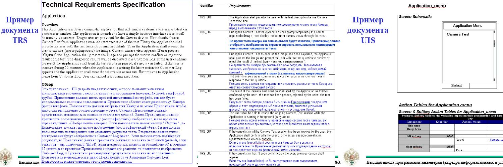

<p align="center">
 
 <p align="center"><b><font size=6>软件工程</font></b></p>
 <p align="center"><b>优质软件开发过程的基本原理及其计量方法 & 优质的软件开发技术<br>持续更新中...</b></p>
</p>


<div align=center>


<div align=left>
<!-- 顶部至此截止 -->


<!-- SPbSTU  -->

 <p align="center">
  
  </br>
  </br>
  <b><b>Санкт-Петербургский государственный политехнический университет</b></br></b>
  <b>Институт компьютерных наук и технологий</b>
 </p>
 <p align="center"></p>

</p>

<div align=left>
<!-- SPbSTU 最后一行 -->


[toc]

> 基于圣彼得堡国立理工大学的讲座


# 软件生命周期

## 软件产品

> Программное изделие (продукт)

软件产品（产品）--应按照国际、国家、公司标准和其他规范性文件开发，按照批准的TP制造，按照相关标准和技术规范（TS）验收，有注册号、工业产品分类代码、制造商的商标。


## 软件生命周期及其阶段

**软件开发的关键阶段：**

> Основные этапы эволюции ПО

|
|
|
|
|

| 真实世界                                                     | 抽象出来的世界模型                                           |
| ------------------------------------------------------------ | ------------------------------------------------------------ |
| 1. 要求/Требования/Requirements<br /><br />我们为什么要做一个软件产品？<br />结果应该是什么？ | 2. 规格/Спецификации/Specifications<br /><br />我们将如何开发软件产品以满足需求？ |
| 8. 维护/Эксплуатация и сопровождение / Maintenance<br /><br />结果是什么？ | 3,4,5,6,7. 实施/Реализация/ Development<br /><br />我们用编程语言中实现？ |


1. **【第 1 阶段】**

    - **需求分析（Анализ требований）**,编写一份文件，在文件中，根据流程自动化的需要和以往经验，正式确定用户对未来服务的目标、要求和标准，并评估实施投资的经济可行性。
    - **需求开发（Разработка требований）**是创建一个文件（需求模型），在该文件中，对用户和客户来说重要的未来产品的一系列属性、功能、特点、使用模式、状态和情况被正式确定为主题领域。
    - **需求规范（Спецификация требований | Requirement Specification）**- 一个文件（需求模型的规范），包含对设计对象的足够准确和完整的描述，在需求分析的基础上开发。规范是对一项任务的准确和完整的描述，它比用编程语言实现这项任务的程序更容易被参与解决的人编写、理解和阅读。规范语言通常是一种比编程语言更高层次的语言，例如非正式规范的自然语言，或者像UCM、SDL、MSC这样的正式规范语言。

    

    

2. **【第 2 阶段】**

    **实施规范（Разработка реализационных спецификаций）**，创建文件（模型），记录关于要设计的系统的数据结构、算法、接口和协议的决定，特别是平台和应用架构。

    > 实施规范（Разработка реализационных спецификаций）:
    >
    > 

    **规格书（Specification）**是一个分层次的文件系统，其中高层设计（HLD - High Level Design）是由详细设计（DD - Detail Design）补充的。通过这种方式，设计创造了一个文件系统（一套模型），这些文件是实施的任务。最好的设计是用正式的规范语言对系统进行描述，如UCM、SDL、MSC、UML。

    > TRM:
    >
    > 

    

3. **【第 3 阶段】**

    **编码（Кодирование）**-将实施规范转换为代码，以满足需求规范。在这一步骤中，规格被手动或自动转化为软件模块，并被定义为所选编程语言的代码。编码的结果是一个可执行的代码。

    

4. **【第 4 阶段】**

    **调试和测试（Отладка и тестирование）**- 在运行时根据要求和规范检查代码。

    测试有几个阶段
    - 在模块层面 - 单元测试（модульное тестирование | Unit Testing）
    - 在模块间层面 - 集成测试（интеграционное тестирование | Integration Testing）
    - 在产品层面 - 系统测试（системное тестирование | System Testing）

    

5. **【第 5 阶段】**

    **环境和目标平台定制（Настройка на окружение и целевую платформу）**- 在目标编译过程中提供。调试确保代码适应微控制器（计算机）和操作系统的类型和特点、所需资源、环境（(environment) ），并优化软件的性能。

    

6. **【第 6 阶段】**

    **系统测试（Системное тестирование）**- 在模拟和/或真实的运行环境和环境中，根据需求和规范检查运行时的代码。

    > 整合多平台解决方案的验证和测试流程：
    >
    > 
    >
    > |
    > |
    > |
    > |
    > |

    

7. **【第 7 阶段】**

    **文档化（Документирование）** - 按照国际（ISO/IEEE）、国家（ESPD/ANSI/...）和公司标准创建和完成产品操作和用户文档的过程。

    **将软件转变为产品（Превращение программного обеспечения в продукт）**--通过修复软件与安装包一起放在一个介质上，并以文件形式完成产品（其中一种方式）。

    **交付（Поставка）**-软件产品的复制（媒体复制）并交付给客户。

    

8. **【第 8 阶段】**

    **维护（Сопровождение）**是一个与软件产品运行同步进行的过程，目的是在整个使用期间确保软件运行的质量要求，包括识别和消除开发后剩余的错误（缺陷）。在这个阶段，当检测到缺陷时，系统会被升级，从而导致系统规格的调整。维护阶段的长度受到软件过时的限制，当软件产品被更先进的版本取代时，其设计考虑到了先前系统的开发和运行经验。

    维护工作包括向用户交付系统、调试、检测和消除操作中的错误，以及必要时进一步扩展系统。


---


## 软件项目中的需求规格

> ТРЕБОВАНИЯ, СПЕЦИФИКАЦИЯ ТРЕБОВАНИЙ В ПРОГРАММНОМ ПРОЕКТЕ (продолжение)
>
> https://sites.google.com/site/introalaingenieriadesoftware/unidad-1


### 需求规格

> Спецификации требований
>
> https://visuresolutions.com/zh-CN/blog/requirements-specification/
>
> 
>
> 需求说明书：
>
> - https://blog.51cto.com/u_11299290/5708979
>
>
> 常用的软件需求说明书模板:
>
> - 


**需求分析报告**：一般是对某个市场或者是客户群来讲的，类似于调研报告，重点是体现出产品要满足哪些功能，哪些是重点、热点。


**软件需求说明书**，又称软件需求规格说明书，英文名为**Software Requirements Specification（SRS）**，是根据与现场实际客户进行沟通，把客户的需求进行整理，CMMI中有标准的模板，重点是站在客户的角度讲产品功能。是需求人员在需求分析阶段需要完成的产物。它的作用是作为用户和软件开发者达成的技术协议书，作为设计工作的基础和依据，作为测试和验收的依据。

- 软件需求说明书应该完整、一致、精确、无二义性，同时又要简明、易懂、易修改。在一个团队中，须用统一格式的文档进行描述，为了使需求分析描述具有统一的风格，可以采用已有的且能满足项目需要的模板，也可以根据项目特点和开发团队的特点对标准模板进行适当的改动，形成自己的模板。
- 软件需求规范为客户和承包商或供应商（或市场和开发部门）之间就软件产品应该做什么和不应该做什么（或被期望做什么）达成协议提供了基础。
- **软件需求规范允许在设计开始前对需求进行彻底的评估**，并减少后续修改的数量。该规范还应该为**估计产品成本、风险和时间表提供一个现实的基础**。
- 软件需求规范也可以被组织用来作为制定有效的验证和核查计划的基础。软件需求规格提供了将软件产品转移到新用户或软件平台的基础。最后，它可以构成改进软件的基础。
- **软件需求通常是用自然语言编写的，但在软件需求规范中，可以用正式的或非正式的语言作为补充。**半正式的描述。选择适当的符号可以比自然语言更精确、更简洁地描述软件结构的具体要求和方面。一个一般的规则是，应该用符号来尽可能准确地描述需求。这对安全关键型软件、监管型软件和其他一些类型的稳健型软件尤为重要。然而，符号的选择往往受到文件作者和读者的培训、技能和偏好的限制。
- 一些质量指标已经被开发出来，可以用来将软件需求规范的质量与其他项目变量联系起来，如成本、验收、性能、进度。
    - 单个软件需求规格声明的质量指标包括命令式、指令式、弱化短语、选项和延续。
    - 整个软件需求规范文件的指标包括大小、可读性、规格、深度和文本结构。


**需求规格说明书**：是从业务规则讲起的，细一点偏向于软件的概要设计。是从开发、测试的角度去讲产品功能，里面要包含原型界面、业务接口、活动图等。

### 需求属性

> Атрибуты требований

- 在需求分类和需求属性之间存在着强烈的联系
- **需求不仅应包括对所需内容的说明，而且应包括帮助管理和解释需求的支持信息**。
- 需求属性应该被定义、记录并随着开发或维护的软件的发展而更新。
- 这应该包括需求的各个分类方面和验证方法或验收测试计划的相关部分
- 需求属性也可以包括额外的信息，如每个需求的简要理由，每个需求的来源和变化的历史。
- **需求的一个重要属性是==标识符(идентификатор)==，它允许毫不含糊地识别该需求。**


---

# 软件开发模型

> https://cloud.tencent.com/developer/article/1724043
>
> https://zhuanlan.zhihu.com/p/43885605

模型也称为软件开发生命周期（SDLC）模型/方法。每个过程模型都遵循其类型所独有的一系列阶段，以确保软件开发步骤中的成功。

## 瀑布模型

> 


瀑布模型（Waterfall） 是最简单的软件开发历史上第一个 SDLC 模型。在瀑布模型中，开发过程是线性的。任务和阶段按严格顺序一个接一个地完成。进度平稳地向下流动，就像瀑布上的水一样。

瀑布模型的主要缺点是不灵活。瀑布易于理解且易于管理。但是过早的延迟会拖延整个项目的时间表。由于一旦完成阶段，几乎没有修改的余地，因此只有进入维护阶段才能解决问题。如果需要灵活性，或者项目是长期的且正在进行的，则此模型不能很好地工作。

瀑布模型是一种比较老旧的软件开发模型，1970年温斯顿·罗伊斯提出了著名的“瀑布模型”，直到80年代都还是一直被广泛采用的模型。

　　瀑布模型将软件生命周期划分为制定计划、需求分析、软件设计、程序编写、软件测试和运行维护等六个基本活动，并且规定了它们自上而下、相互衔接的固定次序，如同瀑布流水，逐级下落。

　　在瀑布模型中，软件开发的各项活动严格按照线性方式进行，当前活动接受上一项活动的工作结果，实施完成所需的工作内容。当前活动的工作结果需要进行验证，如验证通过，则该结果作为下一项活动的输入，继续进行下一项活动，否则返回修改。

　　瀑布模型优点是严格遵循预先计划的步骤顺序进行，一切按部就班比较严谨。

　　瀑布模型强调文档的作用，并要求每个阶段都要仔细验证。但是，这种模型的线性过程太理想化，已不再适合现代的软件开发模式，几乎被业界抛弃，其主要问题在于：

　　1） 各个阶段的划分完全固定，阶段之间产生大量的文档，极大地增加了工作量；

　　2） 由于开发模型是线性的，用户只有等到整个过程的末期才能见到开发成果，从而增加了开发的风险；

　　3） 早期的错误可能要等到开发后期的测试阶段才能发现，进而带来严重的后果。

　　4） 各个软件生命周期衔接花费时间较长，团队人员交流成本大。

　　5） 瀑布式方法在需求不明并且在项目进行过程中可能变化的情况下基本是不可行的。


## 迭代和增量模型

> https://zh.wikipedia.org/zh-cn/迭代式开发
>
> https://en.wikipedia.org/wiki/Iterative_and_incremental_development


**迭代式开发**也被称作**迭代增量式开发**或**迭代进化式开发**，是一种与传统的[瀑布式开发](https://zh.wikipedia.org/wiki/瀑布式开发)相反的[软件开发方法](https://zh.wikipedia.org/w/index.php?title=软件开发方法&action=edit&redlink=1)，它弥补了传统开发方式中的一些弱点，具有更高的成功率和生产率。

迭代和增量 SDLC 模型将**迭代设计和工作流**与增量构建模型结合在一起。在这种情况下，团队将按周期开发产品，**并以渐进方式构建小零件**。

开发过程从简单实施一组严格限制的小型产品需求开始。然后对该产品进行增强，并使其本身成为更完整的版本，直到完成并准备好进行部署为止。**每次迭代都可能包含设计更新和新功能。**

迭代和增量模型的一个有价值的特点是**可以在不知道所有需求的情况下开始开发**。该模型包含其他 SDLC 模型的步骤-需求收集，设计，实施和测试，但要经过多次构建。开发团队可以利用先前构建中取得的成就来改善下一构建。

迭代和增量 SDLC 模型可能看起来像一组微型瀑布模型或微型 V 形模型。


# 软件开发流程、问题追踪和管理

> Процессы разработки ПО Отслеживание проблем, управление проблемами


## 概述

**问题是什么：**

用户、开发人员、测试人员发现的产品问题（bug），问题是一个正在运行程序的不正常行为


**问题的分类（Проблема становится）：**

- ==failure（сбоем）== 失败，导致程序错误或者不正常的行为
- ==改进型（запросом на улучшение）==，如果是软件产品中的遗漏，则提出改进要求（软件中需求的缺失，没以最佳的方式为用户实现需求，等等）
- ==特性（свойством программы）==，如果是软件的正常行为，那它不是一个错误，而是特性


**问题的声明周期（Жизненный цикл проблемы）：**

在软件产品中发现 bug 的生命周期一般有 5 各阶段：

1. 用户（或者任何对软件有经验的人）将问题**提交（информирует）**给软件制造商
2. 制造商在自己的环境中**重现（воспроизводит）**问题
3. 制造商**隔离（изолирует）**引发问题的条件
4. 制造商**定位和修复（находит и исправляет）**缺陷
5. 制造商**重新发布（передает）**正确版本


**制造商有义务解决一下问题：**

- 如何组织软件生命周期中出现的问题
- 哪些问题是当前**无法修复（нерешенными）**的
- 哪些问题是当前**严重（серьезными）**的
- 此问题在**以前是否出现过（похожиепроблемы）**


## 问题追踪

> Отслеживание проблем


### 问题的报告

> Отчеты о проблемах

为了能够更好的修正错误，开发者应该能够重现它

软件生命明周期中的 bug，应该伴随着**错误报告（отчетом о проблеме）**


**以下属于都代指问题报告：**

- PR (Problem Report)
- CR (Change Request)
- 错误报告 (Bug Report)


**错误报告中应该：**

- **问题的事实（Факты по проблеме）**

    - **问题的描述（Хронология проблемы | Problem History）**，对重现问题的最少步骤的描述、对资源文件的描述（比如，配置文件、输入文件、数据库记录等）

        > **问题的描述（Хронология проблемы | Problem History）:**
        >
        > - 描述重现问题所需的最小步骤集
        >
        > - 被访问资源的描述
        >
        >     *1. 在窗口 A中打开fox.pdf*
        >
        >     *2. 使用默认配置打印时...*
        >
        > - 如果问题无法重现，那么很可能不会被修复

    - **描述观察到的异常行为（Описание наблюдаемого поведения）**

        > **观察到的行为（Observed Behavior | Наблюдаемое поведение программы）：**
        >
        > - 描述问题的症状，即发生了什么事 与预期的行为相反的是
        >
        >     *一个程序崩溃，有以下信息...*
        >
        >     *STACK DUMP of CRASH (yyy OS)*
        >
        > - 在描述中保持中立是很重要的，坚持用事实说话而不是表现出情绪
        >
        > - 对于开发者来说，对观察到的行为的描述是非常重要的，因为它模拟了再现错误的步骤

    - **描述预期行为（Описание ожидаемого поведения）**

        > **预期行为（Expected Behavior | Ожидаемое поведение программы）：**
        >
        > - 从用户的角度描述应该发生的事情*（比如：该软件应该打印该文件）*
        > - 这些信息对开发者来说没有步骤顺序或诊断信息那么重要，但它确实有助于确定用户和开发者对软件产品在所述条件下的行为是否有相同的理解
        > - 审视现实（Проверка на «реальность»），用户的期望是否合理

    - **对问题性质的简短描述（one-line summary | Краткое описание сути）**

        > **对问题性质的简短描述（one-line summary | Краткое описание сути）:**
        >
        > - 发现问题的人必须简要描述问题*（比如：打开PDF文档时ABC崩溃了）*
        > - 通常情况下，问题的性质是决定其**严重性（серьезности）**（对客户的影响）和补救问题的**优先级（приоритете）**的基础

        

- **软件产品的事实**

    - 软件的版本（Номер версии）及具体编号（比如 ：Publishing Program 1.2 (Build 12B34)）

        > **唯一产品标识符（Product Release | Уникальный идентификатор продукта）：**
        >
        > - 表示软件产品的版本号或其他唯一标识符
        > - 需要指定确切的版本（比如：Publishing Program 1.2 (Build 12B34)）
        > - 存档（如果有关于不同软件版本如何工作的信息）这个问题是否只发生在这个版本的软件上，还是在其他版本中也很常见？

    - 软件的运行环境（Версия операционной системы）（比如：Mac OS X 10.5.5 (9F33) ）

        > **运行环境描述（Operating Environment | Описание операционной среды）：**
        >
        > 关于操作系统的信息通常表示为：
        >
        > - 这些信息可以是简短的，也可以是更详细的（“Windows 98 SE” or “Debian Linux ‘Sarge’ with the following packages... ”）
        >
        > 总结：问题发生在哪个环境中？它是否发生在其他操作环境中？(例如，如果产品在一个以上的平台上运行)
        >
        > 

    - 系统资源（Системные ресурсы）（比如：内存容量、磁盘空间、其他硬件资源）


**自动的事实调查（Автоматический сбор фактов）：**

- 许多软件产品包括特殊功能或独立工具，用于生成标准问题报告
    - 通常，这类工具会向供应商发送专有信息*（比如：一个完整的内核转储，存储故障发生时的程序状态）*
    - 用户隐私（Конфиденциальность пользователя）是自动事实调查中的一个大问题
- 用户应该了解你的产品可能**收集和发送（собирать и отправлять）**的任何信息，他们也应该能够**关闭（отключить）**负责收集这些信息的功能


### 问题的管理

> Управление проблемами

- ==方案一：==使用一个带有**问题列表（списком проблем）**的唯一文档，里面记录了关于目前所有**开放或者未解决（открытых или нерешенных）**的问题

    - 易于创建和维护 (+)
    - 一次只能有一个人处理一个文件（-）
    - 以前检测和纠正的问题会丢失（-）
    - 没有可扩展性（不能用一个文本文件来跟踪数百个问题）（-）

    

- ==方案二：==使用数据库来记录问题


### 问题的分类

> Классификация проблем


**对问题进行分类的典型属性（Типичные атрибуты）：**

- **严重程度（Серьёзность | Severity）**

    > **严重程度（Серьёзность | Severity）：**
    >
    > 严重程度决定了一个问题对**开发或产品发布过程的影响程度（процесс разработки или выпуска продукта）**。每个工具都可以有自己的严重程度属性值列表。下面是一个属性值列表的例子：
    >
    > - **增强（Enhancement | Пожелание）** – 希望改善软件的功能或可用性
    > - **琐碎（Trivial | Тривиальная）**- 外观问题，本质上不影响软件产品的功能
    > - **次要（Minor | Незначительная）**– 不需要紧急修复的问题
    > - **一般（Normal | Существенная）**– 这是一个 "常见 "的问题，*（比如：说软件功能的小幅损失）*
    > - **严重（Major | Серьёзная）**– 软件功能的重大损失
    > - **紧急（Critical | Критическая）**– 程序崩溃、数据丢失或严重的内存泄漏
    > - **禁止或阻止（Blocker or Showstopper | Чрезвычайная）**– 持续的系统错误，阻止进一步的开发和/或测试工作

    

- **优先级（Приоритет | Priority）**

    - 每个问题都有一定的**优先级（Приоритет | Priority）**
    - 优先级越高，对问题的反应越快
    - ==**优先性和严重性（Приоритет и Серьёзность）不一定是相关的!!**==
    - 优先级通常由管理层决定
    - **确定优先次序（Установка приоритетов**）—— 控制发展和解决问题的关键工具

    

- **标识符、检验人（Идентификатор | Identifier）**

    - 每个问题都有**唯一标识符（PR-number or CR-number，也称为故障号）**
    - 该标识符或编号通常用于所有内部开发文件--电子邮件、变更日志、进度报告等

    *比如：Subject: RP #1234 is fixed?*

    

- **评论（Комментарии | Comments）**

    - 任何用户和开发者都可以在问题报告上留下评论
    -  评论可以包括文件、文档、关于问题条件的信息、他们对缺陷位置的假设等

    

- **通知（Уведомления | Notification）**

    - 开发人员可以在问题报告中包括他们的电子邮件地址。然后，每当该报告发生变化时，他们将被自动通知
    - 用户也可以利用这一功能


### 问题的处理

> Обработка проблем


**处理问题 - 生命周期（Обработка проблем – жизненный цикл）：**


1. 错误报告被输入问题数据库

2. 错误报告是有效的，并且错误不是与已知的问题重复的；如果不是这样，报告就会转到已解决

3. 该问题被分配给一个开发者（实施者）

    **问题解决（разрешение проблемы）：**

    一个问题报告可以通过几种方式进入解决状态

    - **已解决（Fixed | Исправлена）**
    - **无效（Invalid | Недостоверная）**- 要么问题不是问题，要么报告包含不相关的事实
    - **重复（Duplicate | Дубликат）**- 该问题已经以另一个条目的形式存在于数据库中
    - **无法修复（Wontfix | Не подлежит исправлению）**-  永远不会被修复
    - **无法重现（Worksforme | Не воспроизводится）**- 该问题无法重现

4. 问题报告已处理，代码已纠正

5. 该问题已被修复；该修复已被验证，程序正常运行

6. 一个包含修复程序的新版本已经发布。该问题被认为已经结束

7. 问题又出现了！


---


**问题跟踪管理流程（Процесс управления отслеживанием проблем）：**

为了创建一个有效的问题管理程序，必须回答问题：

1. 如何（谁）创建（输入）问题报告？
2. 谁对问题报告进行分类？
3. 谁来确定优先次序（考虑问题的严重性、发生的可能性、遇到问题的用户数量、潜在危害）？
4. 谁负责解决这个问题？
5. 谁来关闭问题报告？
6. 问题的生命周期是什么？


---


**软件变更控制团队（Группы контроля над внесением изменений в ПО）：**

- 在许多组织中，一个专门的小组**（Software Change Control Board | 软件变更控制委员会）**负责
- 评估问题的影响（Оценку влияния проблемы）
- 分配执行者（Назначение исполнителей）
- 关闭问题报告（Закрытие отчетов о проблемах）


---


**基于问题的需求开发（Разработка на основе требований в виде проблем）：**

- 问题跟踪系统可以在产品创建的早期阶段使用，以存储需求。
- 每个主要的要求都可以分解成几个较小的要求，可以在一个数据库中进行追踪
- 当所有的 "问题-要求 "都被关闭时，产品就准备好了


---


**问题数据库中的重复管理（Управление дубликатами в базе проблем）：**

- 热点问题跟踪系统被大量的问题报告（"垃圾"）所淹没
- 通过以下方式消除重复的内容：
    - 简化错误报告
    - 要求在添加新条目之前搜索数据库中的重复内容
- 摆脱那些只发生过一次或很久以前以及在内部测试中发生的过时的问题


---

## 提交问题的形式

> Требования в виде проблем


## 问题的链接、修复、测试

> Связывание проблем, исправлений, тестов


**链接的问题和解决方法(Связь проблем и исправлений):**


---


**将问题和测试联系起来（Связь проблем и тестов）：**

- 在执行过程中失败的测试应该被记录在问题跟踪系统中吗？
- 最好将测试结果与问题报告分开存储（不同机构对此的处理方式不同）。
- 如果测试是自动化的，并快速执行，那么重新运行这些测试就比在测试期间发生的问题数据库中存储的故障更容易

## 工具

> Инструменты

**问题追踪工具的例子：**

- Bugzilla https://bugzilla/mozilla/org
- phpBugTracker – 一个轻量级的问题跟踪器  (http://phpbt.sourceforge.net)
- Issue-Tracker
- Trac - 可以与版本控制系统集成。简化了对不同版本产品的问题跟踪(http://trac/edgewall.org)
- SourceForge – (http://www.sourceforge.net)
- GForge


## 总结

- 终端用户发现的问题报告被储存在问题数据库中
- 问题报告应包含与再现问题有关的所有信息
- 定义一套用户应提供的标准项目是很有用的
- 一份有效的问题报告应该是
    - 要有良好的结构。
    - 描述一个可重复的活动序列。
    - 提供对问题的简明描述。
    - 尽可能的简单和概括。
    - 要保持中立和实事求是
- 定义一套用户应该提供的标准元素是很有用的
- 一个问题的典型生命周期从 "未确认 "的状态开始
- 该周期以 "关闭 "状态和具体的解决方案结束（例如 "已解决"、"不可重复"）。
- 通常情况下，软件变更控制小组负责确定优先次序并分配实施者

- 使用版本控制来分离补丁和功能开发
- 建立惯例，将问题报告与变更联系起来，反之亦然。
- 一旦创建了测试问题，问题报告将不再有意义


# CMMI

## 通用目标与通用实践以及过程域（CMMI1.3 第二部分）

> https://blog.51cto.com/mk6yeung/582121
>
> https://zhuanlan.zhihu.com/p/390023672

CMMI全称是Capability Maturity Model Integration，即能力成熟度模型集成。

CMMI是世界公认的软件产品进入国际市场的通行证，不仅是对产品质量的认证，更是一种软件过程改善的途径。如果一家公司最终通过CMMI的评估认证，标志着该**公司在质量管理的能力**已经上升到一个新的高度。

CMMI主要关注点就是成本效益、明确重点、过程集中和灵活性四个方面。


**CMMI的价值**

CMMI为企业带来价值主要体现在以下几个方面：

1） 对开发流程进行标准化和规范化，保证项目进度和质量。

2） 有利于成本控制，缩减不必要的项目开支。

3） 建立完备的知识库，不畏惧人才流失。

4） 持续改善流程，提高质量和效率。

5） 在一些投标项目竞争中，更具有优势。——这也是一般外包公司特别重视这个证的原因。

6） 来自美国制定的国际标准，更能得到国外的认可。——所以一般软件公司要准备融资上市前都力争拿到此证的原因。

> 传闻有这么一个故事，在一个项目投标过程中，一家公司说，我们 CMMI 认证是5级，另外几家都是3级，所以直接中标了。
>
> 软件外包公司之所以特别重视 CMMI 的认证，也是这个原因。
>
> 软件公司也会将拿到CMMI 认证视为争取国际融资的一个重要过程。


## CMMI 的结构


### 连续式

连续式表述（Continuous）

连续式表述可以提供最大的弹性，一个组织可以**选择改善单一流程相关的问题点的绩效**，或是可以使用多个领域以密切配合组织的经营目标。连续式表述允许对不同的流程执行不同等级的改善。但组织在选择上仍有一些限制，因为有一些流程领域是彼此相依赖的。


### 阶段式

阶段式表达（Staged）

阶段式表达提供系统化结构化的方式，一次一个阶段达到以模型为基础的流程改善。达到每一个阶段可确保有足够的流程基础建设，可作为下一个阶段流程改善的基础。

2级比较容易做到，3级的要求要多很多，一般来说建议2、3级一起来做。3级到4级间跨度和难度较大。但如果4级做得比较好，要做到5级难度不算很大。而评估的时候，如果2级的标准达到，但3级的要求达不到，就算4级的要求达到了，也只能算2级。


## CMMI 各级标准

### 过程域（PA）

过程域（Process Area），简称 PA，简单的说就是软件开发过程中的某一个方面。

每个ML等级都被分解为若干个过程域。

如上图，PA 共22个，2级有7个PA，3级有11个PA，4级有2个PA，5级有2个PA。各个过程域对应的名称及释义如下:

| CMMI等级 | 缩写 | 过程域(PA)英文名称                                           | 过程域中文名称     | 过程域的释义                                                 | 类别     |
| -------- | ---- | ------------------------------------------------------------ | ------------------ | ------------------------------------------------------------ | -------- |
| ML1      |      |                                                              |                    |                                                              |          |
|          |      |                                                              |                    |                                                              |          |
| ML2      | CM   | Configuration Management                                     | 配置管理           | 建立和维护在项目的整个软件生存周期中软件项目产品的完整性     | 支持管理 |
| ML2      | MA   | Measurement and Analysis                                     | 测量与分析         | 开发和维持度量的能力，以便支持对管理信息的需要，作为改进、了解、控制决策 | 支持管理 |
| ML2      | PPQA | Process and Product Quality Assurance                        | 过程和产品质量保证 | 为项目组和管理层提供项目过程和相关工作产品的客观信息         | 支持管理 |
| ML2      | PMC  | Project Monitoring and Control                               | 项目监督与控制     | 通过项目的跟踪与监控活动，及时反映项目的进度、费用、风险、规模、关键计算机资源及工作量等情况，通过对跟踪结果的分析，依据跟踪与监控策略采取有效的行动，使项目组能在既定的时间、费用、质量要求等情况下完成项目 | 项目管理 |
| ML2      | PP   | [Project Planning](https://www.cnblogs.com/cntosoft/archive/2012/05/30/2526203.html) | 项目计划           | 保证在正确的时间有正确的资源可用，为每个人员分配任务、协调人员，根据实际情况，调整项目 | 项目管理 |
| ML2      | REQM | Requirements Management                                      | 需求管理           | 需求管理的目的是在客户和软件项目之间就需要满足的需求建立和维护一致的约定 | 项目管理 |
| ML2      | SAM  | Supplier Agreement Management                                | 供应商协议管理     | 旨在对以正式协定的形式从项目之外的供方采办的产品和服务实施管理 | 项目管理 |
|          |      |                                                              |                    |                                                              |          |
| ML3      | DAR  | Decision Analysis and Resolution                             | 决策分析与解决方案 | 应用正式的评估过程依据指标评估候选方案，在此基础上进行决策   | 支持管理 |
| ML3      | IPM  | Integrated Project Management                                | 集成项目管理       | 根据从组织标准过程剪裁而来的集成的、定义的过程对项目和利益相关者的介入进行管理 | 项目管理 |
| ML3      | OPD  | Organizational Process Definition                            | 组织级过程定义     | 建立和维护有用的组织过程资产                                 | 过程管理 |
| ML3      | OPF  | Organizational Process Focus                                 | 组织级过程焦点     | 在理解现有过程强项和弱项的基础上计划和实施组织过程改善       | 过程管理 |
| ML3      | OT   | Organizational Training                                      | 组织培训管理       | 增加组织各级人员的技能和知识，使他们能有效地执行他们的任务   | 过程管理 |
| ML3      | PI   | Product Integration                                          | 产品集成           | 从产品部件组装产品，确保集成产品功能正确并交付产品           | 工程管理 |
| ML3      | RD   | Requirements Development                                     | 需求开发           | 需求开发的目的在于定义系统的边界和功能、非功能需求，以便涉众(客户、最终用户)和项目组对所开发的内容达成一致 | 工程管理 |
| ML3      | RSKM | Risk Management                                              | 风险管理           | 识别潜在的问题，以便策划应对风险的活动和必要时在整个项目生存周期中实施这些活动，缓解不利的影响，实现目标 | 项目管理 |
| ML3      | TS   | Technical Solution                                           | 技术解决方案       | 在开发、设计和实现满足需求的解决方案，解决方案的设计和实现等都围绕产品、产品组件和与过程有关的产品 | 工程管理 |
| ML3      | VAL  | Validation                                                   | 确认               | 确认证明产品或产品部件在实际应用下满足应用要求               | 工程管理 |
| ML3      | VER  | Verification                                                 | 验证               | 验证确保选定的工作产品满足需求规格                           | 工程管理 |
|          |      |                                                              |                    |                                                              |          |
| ML4      | OPP  | Organizational Process Performance                           | 组织过程绩效       | 建立与维护组织过程性能的量化标准，以便使用量化方式的管理项目 | 过程管理 |
| ML4      | QPM  | Quantitative Project Management                              | 量化的项目管理     | 量化管理项目已定义的项目过程，以达成项目既定的质量和过程性能目标 | 项目管理 |
|          |      |                                                              |                    |                                                              |          |
| ML5      | CAR  | Causal Analysis and Resolution                               | 因果分析与解决方案 | 识别缺失的原因并进行矫正，进一步的防止未来再次发生           | 支持管理 |
| ML5      | OPM  | organizational performance management                        | 组织绩效管理       | 选择并推展渐进创新的组织过程和技术改善，改善应是可度量的，所选择及推展的改善需支持基于组织业务目的的质量及过程执行目标 | 过程管理 |
|          |      |                                                              |                    |                                                              |          |


### 目标(Goal) & 实践(Practice)

每个**过程域(PA)**有明确的**目标(Goal)**和**实践(Practice)**，必须要达到该等级所有过程域的目标，才可达到该等级。而**达成目标的方式，即要完成这个目标对应的所有实践**。

目标和实践又包含：

**GG(Generic Goals)，中文名为通用目标**，对应GP(Generic Practices)，中文名为通用实践，应用于**能力维度**，所以适用于所有关键过程域。

**SG(Specific Goals)，中文名为特定目标**，对应SP(Specific Practices)，中文名为特定实践，应用于过程维度，只能适用某一特定关键过程域。


**CMMI 的等级、过程域、目标和实践的关系如下：**


#### GG & GP

**通用目标及通用实践：**

| **通用目标中文**       | **通用实践中文**                  | **描述** |
| ---------------------- | --------------------------------- | -------- |
| GG1 达成特定目标       | GP 1.1 执行特定实践               |          |
|                        |                                   |          |
| GG2 制度化已管理的过程 | GP 2.1 建立组织级方针             |          |
|                        | GP 2.2 计划过程                   |          |
|                        | **GP 2.3 提供资源**               |          |
|                        | GP 2.4 分配职责                   |          |
|                        | **GP 2.5 培训人员**               |          |
|                        | **GP 2.6 控制工作产品**           |          |
|                        | GP 2.7 识别并引入相关的利益相关者 |          |
|                        | GP 2.8 监督和控制过程             |          |
|                        | GP 2.9 坚持客观的评价             |          |
|                        | GP 2.10 更高层领导审核状态        |          |
|                        |                                   |          |
| GG3 制度化已定义的过程 | GP 3.1 建立一个已定义的过程       |          |
|                        | GP 3.2 收集（经验）改进信息       |          |


#### SG & SP

**特定目标及特定实践：**

<div class="table-box"><table><tbody><tr><td style="background:rgb(237,125,49);"><p><span style="font-weight:bold;"><span style="color:rgb(255,255,255);"><span style="font-family:'Microsoft YaHei';"><span style="font-size:14px;">CMMI等级</span></span></span></span></p></td><td style="background:rgb(237,125,49);"><p><span style="font-weight:bold;"><span style="color:rgb(255,255,255);"><span style="font-family:'Microsoft YaHei';"><span style="font-size:14px;">缩写</span></span></span></span></p></td><td style="background:rgb(237,125,49);"><p><span style="font-weight:bold;"><span style="color:rgb(255,255,255);"><span style="font-family:'Microsoft YaHei';"><span style="font-size:14px;">过程域中文名称</span></span></span></span></p></td><td style="background:rgb(237,125,49);"><p><span style="font-weight:bold;"><span style="color:rgb(255,255,255);"><span style="font-family:'Microsoft YaHei';"><span style="font-size:14px;">特定目标中文</span></span></span></span></p></td><td style="background:rgb(237,125,49);"><p><span style="font-weight:bold;"><span style="color:rgb(255,255,255);"><span style="font-family:'Microsoft YaHei';"><span style="font-size:14px;">特定实践中文</span></span></span></span></p></td><td style="background:rgb(237,125,49);"><p><span style="font-weight:bold;"><span style="color:rgb(255,255,255);"><span style="font-family:'Microsoft YaHei';"><span style="font-size:14px;">交付物</span></span></span></span></p></td></tr><tr><td><p><span style="font-family:'Microsoft YaHei';"><span style="font-size:14px;">　ML1</span></span></p></td><td><p><span style="font-family:'Microsoft YaHei';"><span style="font-size:14px;">&nbsp;</span></span></p></td><td><p><span style="font-family:'Microsoft YaHei';"><span style="font-size:14px;">&nbsp;</span></span></p></td><td><p><span style="font-family:'Microsoft YaHei';"><span style="font-size:14px;">&nbsp;</span></span></p></td><td><p><span style="font-family:'Microsoft YaHei';"><span style="font-size:14px;">&nbsp;</span></span></p></td><td><p><span style="font-family:'Microsoft YaHei';"><span style="font-size:14px;">&nbsp;</span></span></p></td></tr><tr><td rowspan="56"><p><span style="font-family:'Microsoft YaHei';"><span style="font-size:14px;">ML2</span></span></p></td><td rowspan="7"><p><span style="font-family:'Microsoft YaHei';"><span style="font-size:14px;">CM</span></span></p></td><td rowspan="7"><p><span style="font-family:'Microsoft YaHei';"><span style="font-size:14px;">配置管理</span></span></p></td><td rowspan="3"><p><span style="font-family:'Microsoft YaHei';"><span style="font-size:14px;">SG1 建立基线</span></span></p></td><td><p><span style="font-family:'Microsoft YaHei';"><span style="font-size:14px;">SP 1.1 &nbsp;识别配置项</span></span></p></td><td><p><span style="font-family:'Microsoft YaHei';"><span style="font-size:14px;">配置计划</span></span></p></td></tr><tr><td><p><span style="font-family:'Microsoft YaHei';"><span style="font-size:14px;">SP 1.2 &nbsp;建立配置管理系统</span></span></p></td><td><p><span style="font-family:'Microsoft YaHei';"><span style="font-size:14px;">配置计划</span></span></p></td></tr><tr><td><p><span style="font-family:'Microsoft YaHei';"><span style="font-size:14px;">SP 1.3 &nbsp;创建或发布基线</span></span></p></td><td><p><span style="font-family:'Microsoft YaHei';"><span style="font-size:14px;">配置计划</span></span></p></td></tr><tr><td rowspan="2"><p><span style="font-family:'Microsoft YaHei';"><span style="font-size:14px;">SG2 跟踪并控制变更</span></span></p></td><td><p><span style="font-family:'Microsoft YaHei';"><span style="font-size:14px;">SP 2.1 跟踪变更请求</span></span></p></td><td><p><span style="font-family:'Microsoft YaHei';"><span style="font-size:14px;">变更控制、变更申请、分析变更记录</span></span></p></td></tr><tr><td><p><span style="font-family:'Microsoft YaHei';"><span style="font-size:14px;">SP 2.2 控制变更</span></span></p></td><td><p><span style="font-family:'Microsoft YaHei';"><span style="font-size:14px;">变更控制、变更申请、分析变更记录</span></span></p></td></tr><tr><td rowspan="2"><p><span style="font-family:'Microsoft YaHei';"><span style="font-size:14px;">SG3 建立完整性</span></span></p></td><td><p><span style="font-family:'Microsoft YaHei';"><span style="font-size:14px;">SP 3.1 建立配置管理记录</span></span></p></td><td><p><span style="font-family:'Microsoft YaHei';"><span style="font-size:14px;">功能审计、物理审计</span></span></p></td></tr><tr><td><p><span style="font-family:'Microsoft YaHei';"><span style="font-size:14px;">SP 3.2 执行配置审计</span></span></p></td><td><p><span style="font-family:'Microsoft YaHei';"><span style="font-size:14px;">功能审计、物理审计</span></span></p></td></tr><tr><td rowspan="8"><p><span style="font-family:'Microsoft YaHei';"><span style="font-size:14px;">MA</span></span></p></td><td rowspan="8"><p><span style="font-family:'Microsoft YaHei';"><span style="font-size:14px;">测量与分析</span></span></p></td><td rowspan="4"><p><span style="font-family:'Microsoft YaHei';"><span style="font-size:14px;">SG1 协调度量和分析活动</span></span></p></td><td><p><span style="font-family:'Microsoft YaHei';"><span style="font-size:14px;">SP 1.1 确定度量目标</span></span></p></td><td><p><span style="font-family:'Microsoft YaHei';"><span style="font-size:14px;">度量计划</span></span></p></td></tr><tr><td><p><span style="font-family:'Microsoft YaHei';"><span style="font-size:14px;">SP 1.2 细化度量</span></span></p></td><td><p><span style="font-family:'Microsoft YaHei';"><span style="font-size:14px;">度量计划</span></span></p></td></tr><tr><td><p><span style="font-family:'Microsoft YaHei';"><span style="font-size:14px;">SP 1.3 确定数据收集和存储规程</span></span></p></td><td><p><span style="font-family:'Microsoft YaHei';"><span style="font-size:14px;">度量计划、度量数据表</span></span></p></td></tr><tr><td><p><span style="font-family:'Microsoft YaHei';"><span style="font-size:14px;">SP 1.4 确定分析规程</span></span></p></td><td><p><span style="font-family:'Microsoft YaHei';"><span style="font-size:14px;">度量计划、度量数据表</span></span></p></td></tr><tr><td rowspan="4"><p><span style="font-family:'Microsoft YaHei';"><span style="font-size:14px;">SG2 提供度量结果</span></span></p></td><td><p><span style="font-family:'Microsoft YaHei';"><span style="font-size:14px;">SP 2.1 收集度量数据</span></span></p></td><td><p><span style="font-family:'Microsoft YaHei';"><span style="font-size:14px;">度量计划</span></span></p></td></tr><tr><td><p><span style="font-family:'Microsoft YaHei';"><span style="font-size:14px;">SP 2.2 分析度量数据</span></span></p></td><td><p><span style="font-family:'Microsoft YaHei';"><span style="font-size:14px;">&nbsp;</span></span></p></td></tr><tr><td><p><span style="font-family:'Microsoft YaHei';"><span style="font-size:14px;">SP 2.3 存储数据和度量结果</span></span></p></td><td><p><span style="font-family:'Microsoft YaHei';"><span style="font-size:14px;">&nbsp;</span></span></p></td></tr><tr><td><p><span style="font-family:'Microsoft YaHei';"><span style="font-size:14px;">SP 2.4 通报度量结果</span></span></p></td><td><p><span style="font-family:'Microsoft YaHei';"><span style="font-size:14px;">里程碑报告</span></span></p></td></tr><tr><td rowspan="4"><p><span style="font-family:'Microsoft YaHei';"><span style="font-size:14px;">PPQA</span></span></p></td><td rowspan="4"><p><span style="font-family:'Microsoft YaHei';"><span style="font-size:14px;">过程和产品质量保证</span></span></p></td><td rowspan="2"><p><span style="font-family:'Microsoft YaHei';"><span style="font-size:14px;">SG1 客观评价过程与工作产品</span></span></p></td><td><p><span style="font-family:'Microsoft YaHei';"><span style="font-size:14px;">SP1.1客观评价过程</span></span></p></td><td><p><span style="font-family:'Microsoft YaHei';"><span style="font-size:14px;">&nbsp;</span></span></p></td></tr><tr><td><p><span style="font-family:'Microsoft YaHei';"><span style="font-size:14px;">SP1.2客观评价工作产品</span></span></p></td><td><p><span style="font-family:'Microsoft YaHei';"><span style="font-size:14px;">过程检查表、不符合项报告、工作记录</span></span></p></td></tr><tr><td rowspan="2"><p><span style="font-family:'Microsoft YaHei';"><span style="font-size:14px;">SG2 提供客观洞察</span></span></p></td><td><p><span style="font-family:'Microsoft YaHei';"><span style="font-size:14px;">SP2.1沟通并解决不符合问题</span></span></p></td><td><p><span style="font-family:'Microsoft YaHei';"><span style="font-size:14px;">产品检查表、工作记录</span></span></p></td></tr><tr><td><p><span style="font-family:'Microsoft YaHei';"><span style="font-size:14px;">SP2.2建立记录</span></span></p></td><td><p><span style="font-family:'Microsoft YaHei';"><span style="font-size:14px;">&nbsp;</span></span></p></td></tr><tr><td rowspan="10"><p><span style="font-family:'Microsoft YaHei';"><span style="font-size:14px;">PMC</span></span></p></td><td rowspan="10"><p><span style="font-family:'Microsoft YaHei';"><span style="font-size:14px;">项目监督与控制</span></span></p></td><td rowspan="7"><p><span style="font-family:'Microsoft YaHei';"><span style="font-size:14px;">SG1 对照计划监督项目</span></span></p></td><td><p><span style="font-family:'Microsoft YaHei';"><span style="font-size:14px;">SP1.1监督项目计划参数</span></span></p></td><td><p><span style="font-family:'Microsoft YaHei';"><span style="font-size:14px;">MPP、周报、项目进展报告</span></span></p></td></tr><tr><td><p><span style="font-family:'Microsoft YaHei';"><span style="font-size:14px;">SP1.2监督承诺</span></span></p></td><td><p><span style="font-family:'Microsoft YaHei';"><span style="font-size:14px;">项目进展报告</span></span></p></td></tr><tr><td><p><span style="font-family:'Microsoft YaHei';"><span style="font-size:14px;">SP1.3监督项目风险</span></span></p></td><td><p><span style="font-family:'Microsoft YaHei';"><span style="font-size:14px;">风险识别表</span></span></p></td></tr><tr><td><p><span style="font-family:'Microsoft YaHei';"><span style="font-size:14px;">SP1.4监督数据管理</span></span></p></td><td><p><span style="font-family:'Microsoft YaHei';"><span style="font-size:14px;">SVN/配置管理</span></span></p></td></tr><tr><td><p><span style="font-family:'Microsoft YaHei';"><span style="font-size:14px;">SP1.5监督干系人的参与</span></span></p></td><td><p><span style="font-family:'Microsoft YaHei';"><span style="font-size:14px;">MPP、项目计划</span></span></p></td></tr><tr><td><p><span style="font-family:'Microsoft YaHei';"><span style="font-size:14px;">SP1.6进行进展评审</span></span></p></td><td><p><span style="font-family:'Microsoft YaHei';"><span style="font-size:14px;">里程碑报告、周报、会议纪要</span></span></p></td></tr><tr><td><p><span style="font-family:'Microsoft YaHei';"><span style="font-size:14px;">SP1.7进行里程碑评审</span></span></p></td><td><p><span style="font-family:'Microsoft YaHei';"><span style="font-size:14px;">会议纪要</span></span></p></td></tr><tr><td rowspan="3"><p><span style="font-family:'Microsoft YaHei';"><span style="font-size:14px;">SG2 管理纠正措施直至关闭</span></span></p></td><td><p><span style="font-family:'Microsoft YaHei';"><span style="font-size:14px;">SP2.1分析问题</span></span></p></td><td><p><span style="font-family:'Microsoft YaHei';"><span style="font-size:14px;">项目进展报告、项目偏差报告</span></span></p></td></tr><tr><td><p><span style="font-family:'Microsoft YaHei';"><span style="font-size:14px;">SP2.2采取纠正措施</span></span></p></td><td><p><span style="font-family:'Microsoft YaHei';"><span style="font-size:14px;">项目进展报告</span></span></p></td></tr><tr><td><p><span style="font-family:'Microsoft YaHei';"><span style="font-size:14px;">SP2.3管理纠正措施</span></span></p></td><td><p><span style="font-family:'Microsoft YaHei';"><span style="font-size:14px;">项目进展报告</span></span></p></td></tr><tr><td rowspan="14"><p><span style="font-family:'Microsoft YaHei';"><span style="font-size:14px;">PP</span></span></p></td><td rowspan="14"><p><span style="font-family:'Microsoft YaHei';"><span style="font-size:14px;">项目计划</span></span></p></td><td rowspan="4"><p><span style="font-family:'Microsoft YaHei';"><span style="font-size:14px;">SG1 建立估算</span></span></p></td><td><p><span style="font-family:'Microsoft YaHei';"><span style="font-size:14px;">SP 1.1 估算项目的范围</span></span></p></td><td><p><span style="font-family:'Microsoft YaHei';"><span style="font-size:14px;">项目计划（WBS分解结构）</span></span></p></td></tr><tr><td><p><span style="font-family:'Microsoft YaHei';"><span style="font-size:14px;">SP 1.2 估算项目属性</span></span></p></td><td><p><span style="font-family:'Microsoft YaHei';"><span style="font-size:14px;">项目计划（WBS分解结构）</span></span></p></td></tr><tr><td><p><span style="font-family:'Microsoft YaHei';"><span style="font-size:14px;">SP 1.3 定义项目生存周期阶段</span></span></p></td><td><p><span style="font-family:'Microsoft YaHei';"><span style="font-size:14px;">项目计划（WBS分解结构）</span></span></p></td></tr><tr><td><p><span style="font-family:'Microsoft YaHei';"><span style="font-size:14px;">SP 1.4 估算工作量和成本</span></span></p></td><td><p><span style="font-family:'Microsoft YaHei';"><span style="font-size:14px;">项目计划（WBS分解结构）</span></span></p></td></tr><tr><td rowspan="7"><p><span style="font-family:'Microsoft YaHei';"><span style="font-size:14px;">SG2 制定项目计划</span></span></p></td><td><p><span style="font-family:'Microsoft YaHei';"><span style="font-size:14px;">SP2.1建立预算与进度</span></span></p></td><td><p><span style="font-family:'Microsoft YaHei';"><span style="font-size:14px;">项目计划（WBS分解结构）</span></span></p></td></tr><tr><td><p><span style="font-family:'Microsoft YaHei';"><span style="font-size:14px;">SP2.2识别项目风险</span></span></p></td><td><p><span style="font-family:'Microsoft YaHei';"><span style="font-size:14px;">风险识别表</span></span></p></td></tr><tr><td><p><span style="font-family:'Microsoft YaHei';"><span style="font-size:14px;">SP2.3计划数据管理</span></span></p></td><td><p><span style="font-family:'Microsoft YaHei';"><span style="font-size:14px;">配置管理、项目计划</span></span></p></td></tr><tr><td><p><span style="font-family:'Microsoft YaHei';"><span style="font-size:14px;">SP2.4计划项目资源</span></span></p></td><td><p><span style="font-family:'Microsoft YaHei';"><span style="font-size:14px;">项目计划（WBS分解结构-带资源要求）</span></span></p></td></tr><tr><td><p><span style="font-family:'Microsoft YaHei';"><span style="font-size:14px;">SP 2.5 知识和技能的计划</span></span></p></td><td><p><span style="font-family:'Microsoft YaHei';"><span style="font-size:14px;">培训计划（项目计划一部分）</span></span></p></td></tr><tr><td><p><span style="font-family:'Microsoft YaHei';"><span style="font-size:14px;">SP2.6计划干系人的参与</span></span></p></td><td><p><span style="font-family:'Microsoft YaHei';"><span style="font-size:14px;">项目计划（WBS分解结构）</span></span></p></td></tr><tr><td><p><span style="font-family:'Microsoft YaHei';"><span style="font-size:14px;">SP 2.7 制定项目计划</span></span></p></td><td><p><span style="font-family:'Microsoft YaHei';"><span style="font-size:14px;">项目计划（WBS分解结构）</span></span></p></td></tr><tr><td rowspan="3"><p><span style="font-family:'Microsoft YaHei';"><span style="font-size:14px;">SG3 获得对计划的承诺</span></span></p></td><td><p><span style="font-family:'Microsoft YaHei';"><span style="font-size:14px;">SP 3.1 审查从属计划</span></span></p></td><td><p><span style="font-family:'Microsoft YaHei';"><span style="font-size:14px;">项目计划、项目子计划评审报告</span></span></p></td></tr><tr><td><p><span style="font-family:'Microsoft YaHei';"><span style="font-size:14px;">SP 3.2 协调工作与资源配置</span></span></p></td><td><p><span style="font-family:'Microsoft YaHei';"><span style="font-size:14px;">调整后的计划</span></span></p></td></tr><tr><td><p><span style="font-family:'Microsoft YaHei';"><span style="font-size:14px;">SP 3.3 获得计划承诺</span></span></p></td><td><p><span style="font-family:'Microsoft YaHei';"><span style="font-size:14px;">计划评审（计划及会议纪要）</span></span></p></td></tr><tr><td rowspan="5"><p><span style="font-family:'Microsoft YaHei';"><span style="font-size:14px;">REQM</span></span></p></td><td rowspan="5"><p><span style="font-family:'Microsoft YaHei';"><span style="font-size:14px;">需求管理</span></span></p></td><td rowspan="5"><p><span style="font-family:'Microsoft YaHei';"><span style="font-size:14px;">SG1 管理需求</span></span></p></td><td><p><span style="font-family:'Microsoft YaHei';"><span style="font-size:14px;">SP1.1理解需求</span></span></p></td><td><p><span style="font-family:'Microsoft YaHei';"><span style="font-size:14px;">用户需求书（客户签字）</span></span></p></td></tr><tr><td><p><span style="font-family:'Microsoft YaHei';"><span style="font-size:14px;">SP1.2获得对需求的承诺</span></span></p></td><td><p><span style="font-family:'Microsoft YaHei';"><span style="font-size:14px;">用户需求书评审报告</span></span></p></td></tr><tr><td><p><span style="font-family:'Microsoft YaHei';"><span style="font-size:14px;">SP1.3管理需求变更</span></span></p></td><td><p><span style="font-family:'Microsoft YaHei';"><span style="font-size:14px;">需求变更申请</span></span></p></td></tr><tr><td><p><span style="font-family:'Microsoft YaHei';"><span style="font-size:14px;">SP1.4维护需求的双向可追溯性</span></span></p></td><td><p><span style="font-family:'Microsoft YaHei';"><span style="font-size:14px;">需求追踪矩阵</span></span></p></td></tr><tr><td><p><span style="font-family:'Microsoft YaHei';"><span style="font-size:14px;">SP1.5确保项目工作与需求间的协调一致</span></span></p></td><td><p><span style="font-family:'Microsoft YaHei';"><span style="font-size:14px;">不一致检查表</span></span></p></td></tr><tr><td rowspan="8"><p><span style="font-family:'Microsoft YaHei';"><span style="font-size:14px;">SAM</span></span></p></td><td rowspan="8"><p><span style="font-family:'Microsoft YaHei';"><span style="font-size:14px;">供应商协议管理</span></span></p></td><td rowspan="3"><p><span style="font-family:'Microsoft YaHei';"><span style="font-size:14px;">SG1 建立供应商协议</span></span></p></td><td><p><span style="font-family:'Microsoft YaHei';"><span style="font-size:14px;">SP 1.1 确定采购方式</span></span></p></td><td><p><span style="font-family:'Microsoft YaHei';"><span style="font-size:14px;">&nbsp;</span></span></p></td></tr><tr><td><p><span style="font-family:'Microsoft YaHei';"><span style="font-size:14px;">SP 1.2 选择供应商</span></span></p></td><td><p><span style="font-family:'Microsoft YaHei';"><span style="font-size:14px;">&nbsp;</span></span></p></td></tr><tr><td><p><span style="font-family:'Microsoft YaHei';"><span style="font-size:14px;">SP 1.3 签定供应商协议</span></span></p></td><td><p><span style="font-family:'Microsoft YaHei';"><span style="font-size:14px;">&nbsp;</span></span></p></td></tr><tr><td rowspan="5"><p><span style="font-family:'Microsoft YaHei';"><span style="font-size:14px;">SG2 履行供应商协议</span></span></p></td><td><p><span style="font-family:'Microsoft YaHei';"><span style="font-size:14px;">SP 2.1 执行供应商协议</span></span></p></td><td><p><span style="font-family:'Microsoft YaHei';"><span style="font-size:14px;">&nbsp;</span></span></p></td></tr><tr><td><p><span style="font-family:'Microsoft YaHei';"><span style="font-size:14px;">SP 2.2 监督选定的供应过程</span></span></p></td><td><p><span style="font-family:'Microsoft YaHei';"><span style="font-size:14px;">&nbsp;</span></span></p></td></tr><tr><td><p><span style="font-family:'Microsoft YaHei';"><span style="font-size:14px;">SP 2.3 评价供应商产品</span></span></p></td><td><p><span style="font-family:'Microsoft YaHei';"><span style="font-size:14px;">&nbsp;</span></span></p></td></tr><tr><td><p><span style="font-family:'Microsoft YaHei';"><span style="font-size:14px;">SP 2.4 验收采购的产品</span></span></p></td><td><p><span style="font-family:'Microsoft YaHei';"><span style="font-size:14px;">&nbsp;</span></span></p></td></tr><tr><td><p><span style="font-family:'Microsoft YaHei';"><span style="font-size:14px;">SP 2.5 移交产品</span></span></p></td><td><p><span style="font-family:'Microsoft YaHei';"><span style="font-size:14px;">&nbsp;</span></span></p></td></tr><tr><td rowspan="84"><p><span style="font-family:'Microsoft YaHei';"><span style="font-size:14px;">ML3</span></span></p></td><td rowspan="6"><p><span style="font-family:'Microsoft YaHei';"><span style="font-size:14px;">DAR</span></span></p></td><td rowspan="6"><p><span style="font-family:'Microsoft YaHei';"><span style="font-size:14px;">决策分析与解决方案</span></span></p></td><td rowspan="6"><p><span style="font-family:'Microsoft YaHei';"><span style="font-size:14px;">SG1 运用建立的准测评价候选方案，作为决策的基础</span></span></p></td><td><p><span style="font-family:'Microsoft YaHei';"><span style="font-size:14px;">SP 1.1 建立决策分析指导原则</span></span></p></td><td><p><span style="font-family:'Microsoft YaHei';"><span style="font-size:14px;">决策分析报告</span></span></p></td></tr><tr><td><p><span style="font-family:'Microsoft YaHei';"><span style="font-size:14px;">SP 1.2 建立评价准则</span></span></p></td><td><p><span style="font-family:'Microsoft YaHei';"><span style="font-size:14px;">决策分析报告</span></span></p></td></tr><tr><td><p><span style="font-family:'Microsoft YaHei';"><span style="font-size:14px;">SP 1.3 确定候选解决方案</span></span></p></td><td><p><span style="font-family:'Microsoft YaHei';"><span style="font-size:14px;">决策分析报告</span></span></p></td></tr><tr><td><p><span style="font-family:'Microsoft YaHei';"><span style="font-size:14px;">SP 1.4 选择评价方法</span></span></p></td><td><p><span style="font-family:'Microsoft YaHei';"><span style="font-size:14px;">决策分析报告</span></span></p></td></tr><tr><td><p><span style="font-family:'Microsoft YaHei';"><span style="font-size:14px;">SP 1.5 评价候选方案</span></span></p></td><td><p><span style="font-family:'Microsoft YaHei';"><span style="font-size:14px;">决策分析报告</span></span></p></td></tr><tr><td><p><span style="font-family:'Microsoft YaHei';"><span style="font-size:14px;">SP 1.6 选择解决方案</span></span></p></td><td><p><span style="font-family:'Microsoft YaHei';"><span style="font-size:14px;">决策分析报告</span></span></p></td></tr><tr><td rowspan="9"><p><span style="font-family:'Microsoft YaHei';"><span style="font-size:14px;">IPM</span></span></p></td><td rowspan="9"><p><span style="font-family:'Microsoft YaHei';"><span style="font-size:14px;">集成项目管理</span></span></p></td><td rowspan="6"><p><span style="font-family:'Microsoft YaHei';"><span style="font-size:14px;">SG1 应用项目定义过程</span></span></p></td><td><p><span style="font-family:'Microsoft YaHei';"><span style="font-size:14px;">SP 1.1 建立项目定义过程</span></span></p></td><td><p><span style="font-family:'Microsoft YaHei';"><span style="font-size:14px;">项目过程定义书</span></span></p></td></tr><tr><td><p><span style="font-family:'Microsoft YaHei';"><span style="font-size:14px;">SP 1.2 利用组织过程财富规划项目活动</span></span></p></td><td><p><span style="font-family:'Microsoft YaHei';"><span style="font-size:14px;">项目过程定义书</span></span></p></td></tr><tr><td><p><span style="font-family:'Microsoft YaHei';"><span style="font-size:14px;">SP 1.3 建立项目工作环境</span></span></p></td><td><p><span style="font-family:'Microsoft YaHei';"><span style="font-size:14px;">项目过程定义书，项目计划</span></span></p></td></tr><tr><td><p><span style="font-family:'Microsoft YaHei';"><span style="font-size:14px;">SP 1.4 集成计划</span></span></p></td><td><p><span style="font-family:'Microsoft YaHei';"><span style="font-size:14px;">项目计划、附属子计划</span></span></p></td></tr><tr><td><p><span style="font-family:'Microsoft YaHei';"><span style="font-size:14px;">SP 1.5 利用集成计划管理项目</span></span></p></td><td><p><span style="font-family:'Microsoft YaHei';"><span style="font-size:14px;">周报及进展报告</span></span></p></td></tr><tr><td><p><span style="font-family:'Microsoft YaHei';"><span style="font-size:14px;">SP 1.6 充实组织过程财富</span></span></p></td><td><p><span style="font-family:'Microsoft YaHei';"><span style="font-size:14px;">过程改进建议</span></span></p></td></tr><tr><td rowspan="3"><p><span style="font-family:'Microsoft YaHei';"><span style="font-size:14px;">SG2 与相关干系人协调和合作</span></span></p></td><td><p><span style="font-family:'Microsoft YaHei';"><span style="font-size:14px;">SP 2.1 管理干系人的介入</span></span></p></td><td><p><span style="font-family:'Microsoft YaHei';"><span style="font-size:14px;">项目计划</span></span></p></td></tr><tr><td><p><span style="font-family:'Microsoft YaHei';"><span style="font-size:14px;">SP 2.2 管理依存关系</span></span></p></td><td><p><span style="font-family:'Microsoft YaHei';"><span style="font-size:14px;">项目计划</span></span></p></td></tr><tr><td><p><span style="font-family:'Microsoft YaHei';"><span style="font-size:14px;">SP 2.3 解决协调问题</span></span></p></td><td><p><span style="font-family:'Microsoft YaHei';"><span style="font-size:14px;">项目计划</span></span></p></td></tr><tr><td rowspan="6"><p><span style="font-family:'Microsoft YaHei';"><span style="font-size:14px;">OPD</span></span></p></td><td rowspan="6"><p><span style="font-family:'Microsoft YaHei';"><span style="font-size:14px;">组织级过程定义</span></span></p></td><td rowspan="6"><p><span style="font-family:'Microsoft YaHei';"><span style="font-size:14px;">SG1 建立并维护一套组织过程资产</span></span></p></td><td><p><span style="font-family:'Microsoft YaHei';"><span style="font-size:14px;">SP 1.1 建立标准过程</span></span></p></td><td><p><span style="font-family:'Microsoft YaHei';"><span style="font-size:14px;">组织过程定义过程文件</span></span></p></td></tr><tr><td><p><span style="font-family:'Microsoft YaHei';"><span style="font-size:14px;">SP 1.2 建立生存周期模型描述</span></span></p></td><td><p><span style="font-family:'Microsoft YaHei';"><span style="font-size:14px;">生命周期指南、生命周期模型、组织过程定义文件</span></span></p></td></tr><tr><td><p><span style="font-family:'Microsoft YaHei';"><span style="font-size:14px;">SP 1.3 建立裁剪准则和指南</span></span></p></td><td><p><span style="font-family:'Microsoft YaHei';"><span style="font-size:14px;">裁剪指南</span></span></p></td></tr><tr><td><p><span style="font-family:'Microsoft YaHei';"><span style="font-size:14px;">SP 1.4 建立组织度量库</span></span></p></td><td><p><span style="font-family:'Microsoft YaHei';"><span style="font-size:14px;">组织级度量库</span></span></p></td></tr><tr><td><p><span style="font-family:'Microsoft YaHei';"><span style="font-size:14px;">SP 1.5 建立组织过程财富库</span></span></p></td><td><p><span style="font-family:'Microsoft YaHei';"><span style="font-size:14px;">组织级财富库</span></span></p></td></tr><tr><td><p><span style="font-family:'Microsoft YaHei';"><span style="font-size:14px;">SP 1.6 建立工作环境标准</span></span></p></td><td><p><span style="font-family:'Microsoft YaHei';"><span style="font-size:14px;">组织过程标准</span></span></p></td></tr><tr><td rowspan="9"><p><span style="font-family:'Microsoft YaHei';"><span style="font-size:14px;">OPF</span></span></p></td><td rowspan="9"><p><span style="font-family:'Microsoft YaHei';"><span style="font-size:14px;">组织级过程焦点</span></span></p></td><td rowspan="3"><p><span style="font-family:'Microsoft YaHei';"><span style="font-size:14px;">SG1 确定过程改进机会</span></span></p></td><td><p><span style="font-family:'Microsoft YaHei';"><span style="font-size:14px;">SP 1.1 建立组织过程的需要</span></span></p></td><td><p><span style="font-family:'Microsoft YaHei';"><span style="font-size:14px;">组织过程焦点的规章制度</span></span></p></td></tr><tr><td><p><span style="font-family:'Microsoft YaHei';"><span style="font-size:14px;">SP 1.2 评估组织过程</span></span></p></td><td><p><span style="font-family:'Microsoft YaHei';"><span style="font-size:14px;">预评估报表幻灯片</span></span></p></td></tr><tr><td><p><span style="font-family:'Microsoft YaHei';"><span style="font-size:14px;">SP 1.3 识别组织的过程改进机会</span></span></p></td><td><p><span style="font-family:'Microsoft YaHei';"><span style="font-size:14px;">过程改进计划（评审后）</span></span></p></td></tr><tr><td rowspan="2"><p><span style="font-family:'Microsoft YaHei';"><span style="font-size:14px;">SG2 规划和实施过程改进</span></span></p></td><td><p><span style="font-family:'Microsoft YaHei';"><span style="font-size:14px;">SP 2.1 制定过程行动计划</span></span></p></td><td><p><span style="font-family:'Microsoft YaHei';"><span style="font-size:14px;">过程改进建议</span></span></p></td></tr><tr><td><p><span style="font-family:'Microsoft YaHei';"><span style="font-size:14px;">SP 2.2 实施过程行动计划</span></span></p></td><td><p><span style="font-family:'Microsoft YaHei';"><span style="font-size:14px;">MSG会议记录</span></span></p></td></tr><tr><td rowspan="4"><p><span style="font-family:'Microsoft YaHei';"><span style="font-size:14px;">SG3 部署组织过程财富</span></span></p></td><td><p><span style="font-family:'Microsoft YaHei';"><span style="font-size:14px;">SP 3.1 部署组织过程财富</span></span></p></td><td><p><span style="font-family:'Microsoft YaHei';"><span style="font-size:14px;">试点项目导入计划</span></span></p></td></tr><tr><td><p><span style="font-family:'Microsoft YaHei';"><span style="font-size:14px;">SP 3.2 部署标准过程</span></span></p></td><td><p><span style="font-family:'Microsoft YaHei';"><span style="font-size:14px;">试点项目导入计划</span></span></p></td></tr><tr><td><p><span style="font-family:'Microsoft YaHei';"><span style="font-size:14px;">SP 3.3 监督实施</span></span></p></td><td><p><span style="font-family:'Microsoft YaHei';"><span style="font-size:14px;">配置管理过程文件、基线发布通知</span></span></p></td></tr><tr><td><p><span style="font-family:'Microsoft YaHei';"><span style="font-size:14px;">SP3.4 过程相关的经验纳入组织过程财富</span></span></p></td><td><p><span style="font-family:'Microsoft YaHei';"><span style="font-size:14px;">组织过程资产库、项目总结报告、项目评审报告</span></span></p></td></tr><tr><td rowspan="7"><p><span style="font-family:'Microsoft YaHei';"><span style="font-size:14px;">OT</span></span></p></td><td rowspan="7"><p><span style="font-family:'Microsoft YaHei';"><span style="font-size:14px;">组织培训管理</span></span></p></td><td rowspan="4"><p><span style="font-family:'Microsoft YaHei';"><span style="font-size:14px;">SG1 建立组织级培训能力</span></span></p></td><td><p><span style="font-family:'Microsoft YaHei';"><span style="font-size:14px;">SP 1.1 确定战略培训需求</span></span></p></td><td><p><span style="font-family:'Microsoft YaHei';"><span style="font-size:14px;">培训计划</span></span></p></td></tr><tr><td><p><span style="font-family:'Microsoft YaHei';"><span style="font-size:14px;">SP 1.2 确定由组织负责的培训需求</span></span></p></td><td><p><span style="font-family:'Microsoft YaHei';"><span style="font-size:14px;">年度培训计划</span></span></p></td></tr><tr><td><p><span style="font-family:'Microsoft YaHei';"><span style="font-size:14px;">SP 1.3 建立组织培训计划</span></span></p></td><td><p><span style="font-family:'Microsoft YaHei';"><span style="font-size:14px;">年度培训计划</span></span></p></td></tr><tr><td><p><span style="font-family:'Microsoft YaHei';"><span style="font-size:14px;">SP 1.4 建立培训能力</span></span></p></td><td><p><span style="font-family:'Microsoft YaHei';"><span style="font-size:14px;">&nbsp;</span></span></p></td></tr><tr><td rowspan="3"><p><span style="font-family:'Microsoft YaHei';"><span style="font-size:14px;">SG2 提供必要的培训</span></span></p></td><td><p><span style="font-family:'Microsoft YaHei';"><span style="font-size:14px;">SP 2.1 交付培训</span></span></p></td><td><p><span style="font-family:'Microsoft YaHei';"><span style="font-size:14px;">培训计划、月报</span></span></p></td></tr><tr><td><p><span style="font-family:'Microsoft YaHei';"><span style="font-size:14px;">SP 2.2 建立培训记录</span></span></p></td><td><p><span style="font-family:'Microsoft YaHei';"><span style="font-size:14px;">学员反馈表、签到表</span></span></p></td></tr><tr><td><p><span style="font-family:'Microsoft YaHei';"><span style="font-size:14px;">SP 2.3 评价培训效果</span></span></p></td><td><p><span style="font-family:'Microsoft YaHei';"><span style="font-size:14px;">部门培训反馈表、培训师评估表</span></span></p></td></tr><tr><td rowspan="9"><p><span style="font-family:'Microsoft YaHei';"><span style="font-size:14px;">PI</span></span></p></td><td rowspan="9"><p><span style="font-family:'Microsoft YaHei';"><span style="font-size:14px;">产品集成</span></span></p></td><td rowspan="3"><p><span style="font-family:'Microsoft YaHei';"><span style="font-size:14px;">SG1 准备产品集成</span></span></p></td><td><p><span style="font-family:'Microsoft YaHei';"><span style="font-size:14px;">SP 1.1 确定集成次序</span></span></p></td><td><p><span style="font-family:'Microsoft YaHei';"><span style="font-size:14px;">产品集成方案</span></span></p></td></tr><tr><td><p><span style="font-family:'Microsoft YaHei';"><span style="font-size:14px;">SP 1.2 建立产品集成环境</span></span></p></td><td><p><span style="font-family:'Microsoft YaHei';"><span style="font-size:14px;">产品集成方案</span></span></p></td></tr><tr><td><p><span style="font-family:'Microsoft YaHei';"><span style="font-size:14px;">SP 1.3 建立产品集成规程和准则</span></span></p></td><td><p><span style="font-family:'Microsoft YaHei';"><span style="font-size:14px;">产品集成方案、测试用例</span></span></p></td></tr><tr><td rowspan="2"><p><span style="font-family:'Microsoft YaHei';"><span style="font-size:14px;">SG2 确保接口兼容性</span></span></p></td><td><p><span style="font-family:'Microsoft YaHei';"><span style="font-size:14px;">SP2.1评审接口描述的完整性</span></span></p></td><td><p><span style="font-family:'Microsoft YaHei';"><span style="font-size:14px;">产品集成方案</span></span></p></td></tr><tr><td><p><span style="font-family:'Microsoft YaHei';"><span style="font-size:14px;">SP2.2管理接口</span></span></p></td><td><p><span style="font-family:'Microsoft YaHei';"><span style="font-size:14px;">产品集成方案</span></span></p></td></tr><tr><td rowspan="4"><p><span style="font-family:'Microsoft YaHei';"><span style="font-size:14px;">SG3 装配产品组件并交付产品</span></span></p></td><td><p><span style="font-family:'Microsoft YaHei';"><span style="font-size:14px;">SP3.1确定需集成的产品组件准备就绪</span></span></p></td><td><p><span style="font-family:'Microsoft YaHei';"><span style="font-size:14px;">单元测试BUG管理表、代码走查表</span></span></p></td></tr><tr><td><p><span style="font-family:'Microsoft YaHei';"><span style="font-size:14px;">SP 3.2 组装产品构件</span></span></p></td><td><p><span style="font-family:'Microsoft YaHei';"><span style="font-size:14px;">产品集成方案</span></span></p></td></tr><tr><td><p><span style="font-family:'Microsoft YaHei';"><span style="font-size:14px;">SP 3.3 核查组装的产品构件</span></span></p></td><td><p><span style="font-family:'Microsoft YaHei';"><span style="font-size:14px;">集成测试总结报告、BUG管理表</span></span></p></td></tr><tr><td><p><span style="font-family:'Microsoft YaHei';"><span style="font-size:14px;">SP3.4打包并交付产品或产品组件</span></span></p></td><td><p><span style="font-family:'Microsoft YaHei';"><span style="font-size:14px;">产品交付确认单</span></span></p></td></tr><tr><td rowspan="10"><p><span style="font-family:'Microsoft YaHei';"><span style="font-size:14px;">RD</span></span></p></td><td rowspan="10"><p><span style="font-family:'Microsoft YaHei';"><span style="font-size:14px;">需求开发</span></span></p></td><td rowspan="2"><p><span style="font-family:'Microsoft YaHei';"><span style="font-size:14px;">SG1 开发客户需求</span></span></p></td><td><p><span style="font-family:'Microsoft YaHei';"><span style="font-size:14px;">SP 1.1 获取客户的需要</span></span></p></td><td><p><span style="font-family:'Microsoft YaHei';"><span style="font-size:14px;">用户需求调查表、DemoBS、DemoCS</span></span></p></td></tr><tr><td><p><span style="font-family:'Microsoft YaHei';"><span style="font-size:14px;">SP 1.2 生成客户需求</span></span></p></td><td><p><span style="font-family:'Microsoft YaHei';"><span style="font-size:14px;">用户需求说明书、需求功能列表</span></span></p></td></tr><tr><td rowspan="3"><p><span style="font-family:'Microsoft YaHei';"><span style="font-size:14px;">SG2 开发产品需求</span></span></p></td><td><p><span style="font-family:'Microsoft YaHei';"><span style="font-size:14px;">SP 2.1 建立产品需求和构件需求</span></span></p></td><td><p><span style="font-family:'Microsoft YaHei';"><span style="font-size:14px;">需求规格说明书</span></span></p></td></tr><tr><td><p><span style="font-family:'Microsoft YaHei';"><span style="font-size:14px;">SP 2.2 分配产品构件需求</span></span></p></td><td><p><span style="font-family:'Microsoft YaHei';"><span style="font-size:14px;">需求规格说明书</span></span></p></td></tr><tr><td><p><span style="font-family:'Microsoft YaHei';"><span style="font-size:14px;">SP 2.3 确定接口需求</span></span></p></td><td><p><span style="font-family:'Microsoft YaHei';"><span style="font-size:14px;">需求规格说明书</span></span></p></td></tr><tr><td rowspan="5"><p><span style="font-family:'Microsoft YaHei';"><span style="font-size:14px;">SG3 分析并确认需求</span></span></p></td><td><p><span style="font-family:'Microsoft YaHei';"><span style="font-size:14px;">SP 3.1 建立操作概念和场景</span></span></p></td><td><p><span style="font-family:'Microsoft YaHei';"><span style="font-size:14px;">需求规格说明书（用例图）</span></span></p></td></tr><tr><td><p><span style="font-family:'Microsoft YaHei';"><span style="font-size:14px;">SP 3.2 定义功能需求</span></span></p></td><td><p><span style="font-family:'Microsoft YaHei';"><span style="font-size:14px;">需求规格说明书</span></span></p></td></tr><tr><td><p><span style="font-family:'Microsoft YaHei';"><span style="font-size:14px;">SP 3.3 分析需求</span></span></p></td><td><p><span style="font-family:'Microsoft YaHei';"><span style="font-size:14px;">需求规格说明书</span></span></p></td></tr><tr><td><p><span style="font-family:'Microsoft YaHei';"><span style="font-size:14px;">SP 3.4 平衡需求</span></span></p></td><td><p><span style="font-family:'Microsoft YaHei';"><span style="font-size:14px;">需求规格说明书</span></span></p></td></tr><tr><td><p><span style="font-family:'Microsoft YaHei';"><span style="font-size:14px;">SP 3.5 确认需求</span></span></p></td><td><p><span style="font-family:'Microsoft YaHei';"><span style="font-size:14px;">需求规格说明书评审会议纪要</span></span></p></td></tr><tr><td rowspan="7"><p><span style="font-family:'Microsoft YaHei';"><span style="font-size:14px;">RSKM</span></span></p></td><td rowspan="7"><p><span style="font-family:'Microsoft YaHei';"><span style="font-size:14px;">风险管理</span></span></p></td><td rowspan="3"><p><span style="font-family:'Microsoft YaHei';"><span style="font-size:14px;">SG1 准备风险管理</span></span></p></td><td><p><span style="font-family:'Microsoft YaHei';"><span style="font-size:14px;">SP 1.1 确定风险来源和类别</span></span></p></td><td><p><span style="font-family:'Microsoft YaHei';"><span style="font-size:14px;">风险库</span></span></p></td></tr><tr><td><p><span style="font-family:'Microsoft YaHei';"><span style="font-size:14px;">SP 1.2 定义风险参数</span></span></p></td><td><p><span style="font-family:'Microsoft YaHei';"><span style="font-size:14px;">风险库</span></span></p></td></tr><tr><td><p><span style="font-family:'Microsoft YaHei';"><span style="font-size:14px;">SP 1.3 建立风险管理策略</span></span></p></td><td><p><span style="font-family:'Microsoft YaHei';"><span style="font-size:14px;">风险库</span></span></p></td></tr><tr><td rowspan="2"><p><span style="font-family:'Microsoft YaHei';"><span style="font-size:14px;">SG2 识别并分析风险</span></span></p></td><td><p><span style="font-family:'Microsoft YaHei';"><span style="font-size:14px;">SP 2.1 识别风险</span></span></p></td><td><p><span style="font-family:'Microsoft YaHei';"><span style="font-size:14px;">风险识别跟踪表</span></span></p></td></tr><tr><td><p><span style="font-family:'Microsoft YaHei';"><span style="font-size:14px;">SP 2.2 风险评估、分类和确定优先级</span></span></p></td><td><p><span style="font-family:'Microsoft YaHei';"><span style="font-size:14px;">风险识别跟踪表</span></span></p></td></tr><tr><td rowspan="2"><p><span style="font-family:'Microsoft YaHei';"><span style="font-size:14px;">SG3 缓解风险</span></span></p></td><td><p><span style="font-family:'Microsoft YaHei';"><span style="font-size:14px;">SP 3.1 制定风险缓解计划</span></span></p></td><td><p><span style="font-family:'Microsoft YaHei';"><span style="font-size:14px;">风险识别跟踪表</span></span></p></td></tr><tr><td><p><span style="font-family:'Microsoft YaHei';"><span style="font-size:14px;">SP 3.2 实施风险缓解计划</span></span></p></td><td><p><span style="font-family:'Microsoft YaHei';"><span style="font-size:14px;">风险识别跟踪表</span></span></p></td></tr><tr><td rowspan="8"><p><span style="font-family:'Microsoft YaHei';"><span style="font-size:14px;">TS</span></span></p></td><td rowspan="8"><p><span style="font-family:'Microsoft YaHei';"><span style="font-size:14px;">技术解决方案</span></span></p></td><td rowspan="2"><p><span style="font-family:'Microsoft YaHei';"><span style="font-size:14px;">SG1 选择产品构件方案</span></span></p></td><td><p><span style="font-family:'Microsoft YaHei';"><span style="font-size:14px;">SP 1.1 开发候选方案和选择准则</span></span></p></td><td><p><span style="font-family:'Microsoft YaHei';"><span style="font-size:14px;">候选技术解决方案、决策分析报告</span></span></p></td></tr><tr><td><p><span style="font-family:'Microsoft YaHei';"><span style="font-size:14px;">SP 1.2 选择产品构件方案</span></span></p></td><td><p><span style="font-family:'Microsoft YaHei';"><span style="font-size:14px;">产品解决方案、决策分析报告</span></span></p></td></tr><tr><td rowspan="4"><p><span style="font-family:'Microsoft YaHei';"><span style="font-size:14px;">SG2 开发设计</span></span></p></td><td><p><span style="font-family:'Microsoft YaHei';"><span style="font-size:14px;">SP 2.1 设计产品或构件</span></span></p></td><td><p><span style="font-family:'Microsoft YaHei';"><span style="font-size:14px;">概要、详细、数据库设计</span></span></p></td></tr><tr><td><p><span style="font-family:'Microsoft YaHei';"><span style="font-size:14px;">SP 2.2 建立技术数据包</span></span></p></td><td><p><span style="font-family:'Microsoft YaHei';"><span style="font-size:14px;">概要、详细、数据库设计</span></span></p></td></tr><tr><td><p><span style="font-family:'Microsoft YaHei';"><span style="font-size:14px;">SP 2.3 设计接口</span></span></p></td><td><p><span style="font-family:'Microsoft YaHei';"><span style="font-size:14px;">概要、详细、数据库设计</span></span></p></td></tr><tr><td><p><span style="font-family:'Microsoft YaHei';"><span style="font-size:14px;">SP 2.4 &nbsp;分析制作、购买或重用</span></span></p></td><td><p><span style="font-family:'Microsoft YaHei';"><span style="font-size:14px;">项目计划</span></span></p></td></tr><tr><td rowspan="2"><p><span style="font-family:'Microsoft YaHei';"><span style="font-size:14px;">SG3 实现产品设计</span></span></p></td><td><p><span style="font-family:'Microsoft YaHei';"><span style="font-size:14px;">SP 3.1 实现构件的设计</span></span></p></td><td><p><span style="font-family:'Microsoft YaHei';"><span style="font-size:14px;">代码说明书、代码确认单</span></span></p></td></tr><tr><td><p><span style="font-family:'Microsoft YaHei';"><span style="font-size:14px;">SP 3.2 编写产品支持文档</span></span></p></td><td><p><span style="font-family:'Microsoft YaHei';"><span style="font-size:14px;">操作手册、培训文档、安装维护手册</span></span></p></td></tr><tr><td rowspan="5"><p><span style="font-family:'Microsoft YaHei';"><span style="font-size:14px;">VAL</span></span></p></td><td rowspan="5"><p><span style="font-family:'Microsoft YaHei';"><span style="font-size:14px;">确认</span></span></p></td><td rowspan="3"><p><span style="font-family:'Microsoft YaHei';"><span style="font-size:14px;">SG1 准备确认</span></span></p></td><td><p><span style="font-family:'Microsoft YaHei';"><span style="font-size:14px;">SP1.1选择需要确认的产品</span></span></p></td><td><p><span style="font-family:'Microsoft YaHei';"><span style="font-size:14px;">测试计划</span></span></p></td></tr><tr><td><p><span style="font-family:'Microsoft YaHei';"><span style="font-size:14px;">SP1.2建立确认环境</span></span></p></td><td><p><span style="font-family:'Microsoft YaHei';"><span style="font-size:14px;">测试计划</span></span></p></td></tr><tr><td><p><span style="font-family:'Microsoft YaHei';"><span style="font-size:14px;">SP1.3建立确认规程与准则</span></span></p></td><td><p><span style="font-family:'Microsoft YaHei';"><span style="font-size:14px;">测试计划</span></span></p></td></tr><tr><td rowspan="2"><p><span style="font-family:'Microsoft YaHei';"><span style="font-size:14px;">SG2 确认产品或产品组件</span></span></p></td><td><p><span style="font-family:'Microsoft YaHei';"><span style="font-size:14px;">SP2.1执行确认</span></span></p></td><td><p><span style="font-family:'Microsoft YaHei';"><span style="font-size:14px;">测试脚本、BUG管理表</span></span></p></td></tr><tr><td><p><span style="font-family:'Microsoft YaHei';"><span style="font-size:14px;">SP2.2分析确认结果</span></span></p></td><td><p><span style="font-family:'Microsoft YaHei';"><span style="font-size:14px;">产品交付确认单</span></span></p></td></tr><tr><td rowspan="8"><p><span style="font-family:'Microsoft YaHei';"><span style="font-size:14px;">VER</span></span></p></td><td rowspan="8"><p><span style="font-family:'Microsoft YaHei';"><span style="font-size:14px;">验证</span></span></p></td><td rowspan="3"><p><span style="font-family:'Microsoft YaHei';"><span style="font-size:14px;">SG1 准备验证</span></span></p></td><td><p><span style="font-family:'Microsoft YaHei';"><span style="font-size:14px;">SP1.1选择待验证的工作产品</span></span></p></td><td><p><span style="font-family:'Microsoft YaHei';"><span style="font-size:14px;">项目计划、测试计划</span></span></p></td></tr><tr><td><p><span style="font-family:'Microsoft YaHei';"><span style="font-size:14px;">SP1.2建立验证环境</span></span></p></td><td><p><span style="font-family:'Microsoft YaHei';"><span style="font-size:14px;">项目计划、测试计划</span></span></p></td></tr><tr><td><p><span style="font-family:'Microsoft YaHei';"><span style="font-size:14px;">SP1.3建立验证规程与准则</span></span></p></td><td><p><span style="font-family:'Microsoft YaHei';"><span style="font-size:14px;">项目计划、测试计划</span></span></p></td></tr><tr><td rowspan="3"><p><span style="font-family:'Microsoft YaHei';"><span style="font-size:14px;">SG2 执行同行评审</span></span></p></td><td><p><span style="font-family:'Microsoft YaHei';"><span style="font-size:14px;">SP 2.1 准备同行评审</span></span></p></td><td><p><span style="font-family:'Microsoft YaHei';"><span style="font-size:14px;">测试报告评审报告</span></span></p></td></tr><tr><td><p><span style="font-family:'Microsoft YaHei';"><span style="font-size:14px;">SP 2.2 执行同行评审</span></span></p></td><td><p><span style="font-family:'Microsoft YaHei';"><span style="font-size:14px;">测试报告评审报告</span></span></p></td></tr><tr><td><p><span style="font-family:'Microsoft YaHei';"><span style="font-size:14px;">SP 2.3 分析同行评审数据</span></span></p></td><td><p><span style="font-family:'Microsoft YaHei';"><span style="font-size:14px;">测试报告评审报告</span></span></p></td></tr><tr><td rowspan="2"><p><span style="font-family:'Microsoft YaHei';"><span style="font-size:14px;">SG3 验证选定的工作产品</span></span></p></td><td><p><span style="font-family:'Microsoft YaHei';"><span style="font-size:14px;">SP3.1执行验证</span></span></p></td><td><p><span style="font-family:'Microsoft YaHei';"><span style="font-size:14px;">测试总结报告、BUG管理表</span></span></p></td></tr><tr><td><p><span style="font-family:'Microsoft YaHei';"><span style="font-size:14px;">SP3.2分析验证结果</span></span></p></td><td><p><span style="font-family:'Microsoft YaHei';"><span style="font-size:14px;">测试总结报告、BUG管理表</span></span></p></td></tr><tr><td rowspan="13"><p><span style="font-family:'Microsoft YaHei';"><span style="font-size:14px;">ML4</span></span></p></td><td rowspan="5"><p><span style="font-family:'Microsoft YaHei';"><span style="font-size:14px;">OPP</span></span></p></td><td rowspan="5"><p><span style="font-family:'Microsoft YaHei';"><span style="font-size:14px;">组织过程绩效</span></span></p></td><td rowspan="5"><p><span style="font-family:'Microsoft YaHei';"><span style="font-size:14px;">SG1 建立基线和模型</span></span></p></td><td><p><span style="font-family:'Microsoft YaHei';"><span style="font-size:14px;">SP 1.1 选择过程</span></span></p></td><td><p><span style="font-family:'Microsoft YaHei';"><span style="font-size:14px;">&nbsp;</span></span></p></td></tr><tr><td><p><span style="font-family:'Microsoft YaHei';"><span style="font-size:14px;">SP 1.2 建立过程性能度量</span></span></p></td><td><p><span style="font-family:'Microsoft YaHei';"><span style="font-size:14px;">&nbsp;</span></span></p></td></tr><tr><td><p><span style="font-family:'Microsoft YaHei';"><span style="font-size:14px;">SP 1.3 建立质量和过程性能目标</span></span></p></td><td><p><span style="font-family:'Microsoft YaHei';"><span style="font-size:14px;">&nbsp;</span></span></p></td></tr><tr><td><p><span style="font-family:'Microsoft YaHei';"><span style="font-size:14px;">SP 1.4 建立过程性能基线</span></span></p></td><td><p><span style="font-family:'Microsoft YaHei';"><span style="font-size:14px;">&nbsp;</span></span></p></td></tr><tr><td><p><span style="font-family:'Microsoft YaHei';"><span style="font-size:14px;">SP 1.5 建立过程性能模型</span></span></p></td><td><p><span style="font-family:'Microsoft YaHei';"><span style="font-size:14px;">&nbsp;</span></span></p></td></tr><tr><td rowspan="8"><p><span style="font-family:'Microsoft YaHei';"><span style="font-size:14px;">QPM</span></span></p></td><td rowspan="8"><p><span style="font-family:'Microsoft YaHei';"><span style="font-size:14px;">量化的项目管理</span></span></p></td><td rowspan="4"><p><span style="font-family:'Microsoft YaHei';"><span style="font-size:14px;">SG1 定量项目管理</span></span></p></td><td><p><span style="font-family:'Microsoft YaHei';"><span style="font-size:14px;">SP 1.1 建立项目目标</span></span></p></td><td><p><span style="font-family:'Microsoft YaHei';"><span style="font-size:14px;">&nbsp;</span></span></p></td></tr><tr><td><p><span style="font-family:'Microsoft YaHei';"><span style="font-size:14px;">SP 1.2 组成项目定义过程</span></span></p></td><td><p><span style="font-family:'Microsoft YaHei';"><span style="font-size:14px;">&nbsp;</span></span></p></td></tr><tr><td><p><span style="font-family:'Microsoft YaHei';"><span style="font-size:14px;">SP 1.3 选择用于定量管理的子过程</span></span></p></td><td><p><span style="font-family:'Microsoft YaHei';"><span style="font-size:14px;">&nbsp;</span></span></p></td></tr><tr><td><p><span style="font-family:'Microsoft YaHei';"><span style="font-size:14px;">SP 1.4 管理项目性能</span></span></p></td><td><p><span style="font-family:'Microsoft YaHei';"><span style="font-size:14px;">&nbsp;</span></span></p></td></tr><tr><td rowspan="4"><p><span style="font-family:'Microsoft YaHei';"><span style="font-size:14px;">SG2 统计管理子过程性能</span></span></p></td><td><p><span style="font-family:'Microsoft YaHei';"><span style="font-size:14px;">SP 2.1 选择度量和分析技术</span></span></p></td><td><p><span style="font-family:'Microsoft YaHei';"><span style="font-size:14px;">&nbsp;</span></span></p></td></tr><tr><td><p><span style="font-family:'Microsoft YaHei';"><span style="font-size:14px;">SP 2.2 运用统计方法理解过程变动</span></span></p></td><td><p><span style="font-family:'Microsoft YaHei';"><span style="font-size:14px;">&nbsp;</span></span></p></td></tr><tr><td><p><span style="font-family:'Microsoft YaHei';"><span style="font-size:14px;">SP 2.3 监督选定的子过程性能</span></span></p></td><td><p><span style="font-family:'Microsoft YaHei';"><span style="font-size:14px;">&nbsp;</span></span></p></td></tr><tr><td><p><span style="font-family:'Microsoft YaHei';"><span style="font-size:14px;">SP 2.4 记录统计管理数据</span></span></p></td><td><p><span style="font-family:'Microsoft YaHei';"><span style="font-size:14px;">&nbsp;</span></span></p></td></tr><tr><td rowspan="12"><p><span style="font-family:'Microsoft YaHei';"><span style="font-size:14px;">ML5</span></span></p></td><td rowspan="5"><p><span style="font-family:'Microsoft YaHei';"><span style="font-size:14px;">CAR</span></span></p></td><td rowspan="5"><p><span style="font-family:'Microsoft YaHei';"><span style="font-size:14px;">因果分析与解决方案</span></span></p></td><td rowspan="2"><p><span style="font-family:'Microsoft YaHei';"><span style="font-size:14px;">SG1 确定缺陷原因</span></span></p></td><td><p><span style="font-family:'Microsoft YaHei';"><span style="font-size:14px;">SP 1.1 选择待分析的缺陷数据</span></span></p></td><td><p><span style="font-family:'Microsoft YaHei';"><span style="font-size:14px;">&nbsp;</span></span></p></td></tr><tr><td><p><span style="font-family:'Microsoft YaHei';"><span style="font-size:14px;">SP 1.2 分析原因</span></span></p></td><td><p><span style="font-family:'Microsoft YaHei';"><span style="font-size:14px;">&nbsp;</span></span></p></td></tr><tr><td rowspan="3"><p><span style="font-family:'Microsoft YaHei';"><span style="font-size:14px;">SG2 解决产生缺陷的根源</span></span></p></td><td><p><span style="font-family:'Microsoft YaHei';"><span style="font-size:14px;">SP 2.1 实施行动建议</span></span></p></td><td><p><span style="font-family:'Microsoft YaHei';"><span style="font-size:14px;">&nbsp;</span></span></p></td></tr><tr><td><p><span style="font-family:'Microsoft YaHei';"><span style="font-size:14px;">SP 2.2 评价变更的效果</span></span></p></td><td><p><span style="font-family:'Microsoft YaHei';"><span style="font-size:14px;">&nbsp;</span></span></p></td></tr><tr><td><p><span style="font-family:'Microsoft YaHei';"><span style="font-size:14px;">SP 2.3 记录数据</span></span></p></td><td><p><span style="font-family:'Microsoft YaHei';"><span style="font-size:14px;">&nbsp;</span></span></p></td></tr><tr><td rowspan="7"><p><span style="font-family:'Microsoft YaHei';"><span style="font-size:14px;">OPM</span></span></p></td><td rowspan="7"><p><span style="font-family:'Microsoft YaHei';"><span style="font-size:14px;">组织绩效管理</span></span></p></td><td rowspan="4"><p><span style="font-family:'Microsoft YaHei';"><span style="font-size:14px;">SG 1 选择改进</span></span></p></td><td><p><span style="font-family:'Microsoft YaHei';"><span style="font-size:14px;">SP 1.1 收集和分析改进建议</span></span></p></td><td><p><span style="font-family:'Microsoft YaHei';"><span style="font-size:14px;">&nbsp;</span></span></p></td></tr><tr><td><p><span style="font-family:'Microsoft YaHei';"><span style="font-size:14px;">SP 1.2 识别革新</span></span></p></td><td><p><span style="font-family:'Microsoft YaHei';"><span style="font-size:14px;">&nbsp;</span></span></p></td></tr><tr><td><p><span style="font-family:'Microsoft YaHei';"><span style="font-size:14px;">SP 1.3 试点改进</span></span></p></td><td><p><span style="font-family:'Microsoft YaHei';"><span style="font-size:14px;">&nbsp;</span></span></p></td></tr><tr><td><p><span style="font-family:'Microsoft YaHei';"><span style="font-size:14px;">SP 1.4 选择用于部署的改进</span></span></p></td><td><p><span style="font-family:'Microsoft YaHei';"><span style="font-size:14px;">&nbsp;</span></span></p></td></tr><tr><td rowspan="3"><p><span style="font-family:'Microsoft YaHei';"><span style="font-size:14px;">SG 2 部署改进</span></span></p></td><td><p><span style="font-family:'Microsoft YaHei';"><span style="font-size:14px;">SP 2.1 计划部署</span></span></p></td><td><p><span style="font-family:'Microsoft YaHei';"><span style="font-size:14px;">&nbsp;</span></span></p></td></tr><tr><td><p><span style="font-family:'Microsoft YaHei';"><span style="font-size:14px;">SP 2.2 管理部署</span></span></p></td><td><p><span style="font-family:'Microsoft YaHei';"><span style="font-size:14px;">&nbsp;</span></span></p></td></tr><tr><td><p><span style="font-family:'Microsoft YaHei';"><span style="font-size:14px;">SP 2.3 度量改进效果</span></span></p></td><td><p><span style="font-family:'Microsoft YaHei';"><span style="font-size:14px;">&nbsp;</span></span></p></td></tr></tbody></table></div>


# 软件设计

> 软件设计 - Software Design
>
> ТРКПО -> Лекция №5 - 04.10.2022

软件设计（Software Design）是软件产品设计（架构）领域的知识。**设计（Дизайн | Design）**被定义为"定义一个系统或组件的结构、组件、接口和其他特征的过程"，以及"[该]过程的结果" [^ISO/IEC/IEEE 24765:2010 Systems and Software Engineering—Vocabulary,ISO/IEC/IEEE, 2010.] 。

考虑到软件设计是一个过程，它是软件开发生命周期中的一项工程活动，在这个过程中，对软件需求进行分析，以获得对软件内部结构的描述，作为构建（编写）软件的基础。


**软件设计**（**Проектирование ПО** - 如果被看作是一种输出）**描述了软件的结构——即表示软件如何被分解（成）并组织成组件，以及这些组件之间的接口。**

- 对组件的描述应达到允许其构建（编程）的详细程度。

- 在软件开发过程中，软件工程师创建各种模型，形成一种待实现的解决方案的蓝图（蓝本）。可以对这些模型进行分析和评估，以确定它们是否能使各种要求得到满足。
- 还可以探索和评估替代性和妥协性的解决方案
- 由此产生的模型除了作为输入数据和作为建造（开发）和测试的起点外，还可以用来计划后续的开发活动，如系统的验证和确认
- 在软件生命周期过程的标准列表中，例如 *ISO/IEC/IEEE Std. 12207，软件生命周期过程*[^IEEE Std. 12207-2008 (a.k.a. ISO/IEC 12207:2008) Standard for Systems and Software Engineering—Software Life Cycle Processes, IEEE, 2008.]，软件工程包括两个活动，它们**建立在软件需求分析和软件开发之间**
    - ==架构性软件设计 | архитектурный дизайн ПО==（有时被称为高层设计）：对软件高层结构的描述和各种系统组件的定义
    - ==详细的软件设计 | детальный дизайн ПО==：每个组件都有详细的描述，以方便其构建（编写）
- 软件设计领域并**不**包括
    - 所有包含 "设计 "一词的主题。用Tom DeMarco的术语来说，这个关键领域讨论的主题主要涉及 D-desig（Decomposition design | 分解设计），其目的是将软件结构分解为组成的部分（一组片段或组件）。
    - FP-设计（Family Pattern design | 基于家族模式的架构设计），其目的是在一个软件产品家族中建立可用的共性，也被考虑在内。
    - I-设计 （I-design, Invention design），I-设计通常是在软件需求分析过程中进行的，以创建一个软件系统的高层次愿景。这种类型的设计是需求分析过程的结果，并将其转化为软件实施方法。


**软件设计（Software Design）知识领域与以下内容密切相关：**

- 软件需求 (требования к ПО | Software Requirements)
- 软件建设 (Разработка (написание) ПО | Software Construction)
- 软件工程管理 (управлением разработки ПО | Software Engineering Management)
- 软件工程模型和方法 (модели и методы разработки ПО | Software Engineering Models and Methods)
- 软件质量 (качество ПО | Software Quality)
- 计算基础 (основы вычислений | Computing Foundations)


## 软件项目中的设计

> ПРОЕКТИРОВАНИЕ В ПРОГРАММНОМ ПРОЕКТЕ

==设计(Design)== - 是分析(Analysis)、需求(Requirements)和开发(Development)阶段之间的中间位置。这是系统设计中最重要的创造性方面，也就是回答 **"如何实现需求规格(Requirement Specifications)中定义的所有内容"** 的问题。设计--将==需求规格（Requirements Specifications - RS）==转化为==高级设计（High Level Design - HLD）==规格，并将其细化到足以进入实施语言编码阶段的==详细程度（Detailed Design - DD）==。


==完成分解过程(Критерием окончания процесса декомпозиции)==的标准是获得足够详细的系统及其组成部分的设计描述，以便进入实施（编码、测试）阶段。


## 软件项目中的规范

> СПЕЦИФИКАЦИИ В ПРОГРАММНОМ ПРОЕКТЕ

==规范文本 (Тексты спецификаций)== - 是用规范语言对投射系统的下列属性进行的分层描述。

- 分解成组件的描述 (описание декомпозиции на компоненты) - 系统组件之间的结构从属关系的正式设定
- 对可允许的资源的描述 (описание допустимых ресурсов) - 对象和资源之间关系的正式规范
- 接口和协议的描述 (описание интерфейсов и протоколов) - 正式指定系统和组件的静态和行为使用规则
- 软件架构描述 (описание программной архитектуры) - 正式指定被设计系统的架构特征值的约束和/或标准


## 软件设计基础知识

> Основы проектирования (Software Design Fundamentals)

这一部分介绍了一些概念和术语，作为理解设计（作为一种活动）和设计（作为一种结果）的作用和内容的基础。


### 一般设计概念

> Общие концепции проектирования (General Design Concepts)

在一般意义上，**设计可以被看作是解决问题的一种形式**。例如，在理解设计的边界方面，一个没有最终（无条件）解决方案的问题的概念是很有意思的。
在理解一般意义上的设计时，一些其他的概念和理念也是值得关注的：目标(цели)、约束(ограничения)、替代方案(альтернативы)、表现形式(представления)和解决方案(решения)。


### 软件设计的背景

> Контекст проектирования (Context of Software Design)

为了理解软件设计的作用，有必要了解软件设计是如何融入软件开发生命周期的。

因此，了解软件需求分析(требований)、软件设计(проектирования)、构建(создания)、软件测试(тестирования)和软件维护(обслуживания)的基本特征很重要。


### 软件设计过程

> Процесс проектирования ПО (Software Design Process)

设计基本上被看作是一个两步的过程。
- 架构设计（高层设计(high-level design) 或 顶层设计(top-level design)）- 将软件分解成组件。
- 详细设计(detailed design) - 描述这些组件的预期行为。

这两个过程的产出是一套模型和人工制品，记录了所做的主要决定，以及对每个非微不足道的决定背后的理由的解释。通过记录理由，软件产品的长期支持（维护）得到了改善。


### 软件设计原则

> Принципы проектирования ПО (Software Design Principles)

软件设计原则是为许多不同的软件设计方法和概念提供基础的关键概念。

软件设计原则包括：

- **抽象 （абстракцию | Abstraction）**

    抽象是 "一种专注于与特定目的相关的信息而忽略其余信息的对象"。

    在软件设计的背景下，两个关键的抽象机制是**参数化**和**规范化**（可以理解为说明书）。

    - 通过**参数化**的抽象，从数据表示的细节中抽象出来，将数据表示为命名的参数。

    - 通过**规范化**的抽象导致了三种主要的抽象类型：

        - 程序抽象 - процедурная абстракция（动态的，即关于行为的）
        - 数据抽象 - абстракция данных（静态的，即关于信息的）
        - 控制抽象 - абстракция управления（即管理系统和它处理的信息）

        

- **耦合和内聚 （связанность и соединение | Coupling and Cohesion）**

    - ==耦合== - 决定了程序中各模块之间相互依赖的程度。也就是模块与外部连接的紧密程度

        1. 数据连接(Связаность по данным)。模块之间的通信只通过必要的数据元素的交换来进行。
            例如，模块A调用模块B。被调用模块的所有输入和输出参数都是简单的数据元素。

        2. 模式交流(Связаность по образцу)。数据结构被用来作为通信参数。因为该结构可能经常包含多余的、未使用的数据，这种类型的绑定不太可取。

        3. 通过控制进行联动(Связаность по управлению)。(绑定问题开始了！）模块A通过向模块B发送控制信号（设置标志或开关）来明确控制其操作。

        4. 通用的绑定方式(Общая связаность)。模块有能力读取和修改一些外部资源（数据库表、全局变量、文件）。也就是说，模块共享相同的全局数据结构。

        5. 当一个模块直接修改另一个模块的数据(Связанность по содержанию возникает)，或者从一个模块的方法中间有一个直接的跳转点到另一个模块的可执行代码（通过源代码中的`goto`语句）

            例如，一个模块直接引用另一个模块的内容（不是通过某个入口）；他们的程序代码是相互交错的。

        

        低耦合（最佳👍🏻）：通过必要数据连接

        高耦合（最差👎🏻）：源代码相互依赖（`goto`）连接

        

    - ==内聚== - 高内聚也就是一个模块或者方法只干某一件事。内聚衡量一个模块中各元素之间的连接强度。内聚力越大，模块的内部实现就越能瞒过外界。不同类型的内聚是有区别的。

        - Связаность по совпадению - 该模块中没有明确的内部连接。模块中的元素没有被控制流或数据流所连接。它们属于不同的类别和不同的主题领域，由于包含共同的代码（数据排序的共同方法等）而被联合起来。这样的模块大大地使软件开发和维护过程复杂化。

        - 逻辑连接（Логическая связаность）- 一个模块的各个部分是根据功能相似性原则联系起来的。例如，一个模块由不同的错误处理程序组成

            **劣势：**

            1. 复杂的对接
            2. 为了其中一个功能而改变配对时，引入错误的概率很高

            逻辑绑定模块的元素属于同一类别，但客户必须根据上下文选择要执行的行动。
            根据上下文要执行的行动。例如，一个信息转发模块包括通过电子邮件、传真、特殊协议、发送信息到聊天室等部分来发送信息。

            这导致模块的界面很差，用不同的参数和方法来执行相同的动作。

            3. 时间上的约束（Временная связаность）：一个模块的部分没有联系，但在系统的同一时期需要。例如，"晚上"模块可能有 "吃晚饭"、"脱衣服"、"睡觉 "等元素。
                缺点：与其他模块有很强的相互联系，因此对变化非常敏感。

            4. 程序性约束（Процедурная связаность）：一个模块的各个部分被其行动的顺序所约束，这些行动实现了某种行为场景。
                一个模块由多个元素组成，这些元素实现了独立的行动，但对它们来说，控制权的转移顺序很重要。

            5. 沟通性连接（Коммуникативная связаность）：一个模块的各个部分都与数据有关（与同一数据结构一起工作）。处理程序元素使用相同的（可能是外部的）数据或参与形成一个共同的数据结构

                *比如说：*

                ```text
                学生进度模块
                	生成进度报告
                	输出成绩不佳的学生
                	发放优等生名单
                模块结束
                ```


                在使用时，可以向客户提供过多的数据。几乎所有的情况下，将一个与通信有关的模块拆分成与功能有关的模块，会使软件的维护效果更好。

            6. 顺序连接（Последовательная связаность）：一个部分的输出数据被用作模块的另一部分的输入数据。通过顺序绑定，处理元素形成了一个数据处理的管道，一个的结果是另一模块的输入数据（就像 GLSL 的顶点着色器和片段着色器，上一个模块的输出-out，是下一个模块的输入-in）

            7. 功能连接（Функциональная связаность）：一个模块的各个部分共同实现一个单一的功能。一个功能可能很简单，也可能很复杂，也就是说，它可能分解成许多部分，但从外部客户的角度来看，它总是一个单一的动作。

                一个功能模块只解决单一问题

                **由功能相关的模块组成的系统是最容易维护的：**
                低内聚（最差）：线性连接
                高内聚（最佳）：功能模块链接

                

        如果软件系统没有被正确地划分为模块，这将导致在修改软件时出现相当大的困难。所以必须遵守以下规定

        - **低耦合、高内聚**，这将使每个模块被设计成一个 "黑盒子"，即每个模块的开发和修改都可以独立于系统的其他部分。

    

- **分解和模块化 （декомпозиция и разбиение на модули | Decomposition and Modularization）**

    将复杂的软件系统分解和划分为模块，是为了获得更小的、相对独立的软件组件，每个组件都承载不同的功能（逻辑上相关的功能组）。这些组件有明确定义的接口，描述它们的互动。

    - 一个软件系统被划分为命名和可寻址的组件（模块），这些组件被整合起来以解决一个问题。
    - 模块化是软件的一种属性，它使创建一个尽可能复杂的程序在管理上成为可能。
    - 但必须考虑进一步整合模块的成本：随着模块数量的增加，开发单个模块的成本可能会减少，但整合模块的成本会增加。

    

- **封装/信息隐藏 （инкапсуляция/сокрытие информации | Encapsulation/information hiding）**

    封装和信息隐藏是指对一个抽象（即一个模型）的内部细节进行分组和打包，并使外部对象无法接触到这些细节。

    - 信息隐藏（Информационная закрытость）意味着系统的各模块是独立的，只交换操作所需的信息。
    - 对该模块的操作和数据结构的访问受到限制
    - 通过这种方法，可以确保各模块是由独立的团队开发的，并便于对系统进行修改

    

- **接口和实现的分离 （разделение интерфейса и реализации | Separation of interface and implementation）**

    接口和实现的分离涉及到通过指定一个已知的（描述的）、可供客户（或其他组件）使用的接口来定义一个组件，这与组件本身的实现细节是分开的。

    

- **充分性、完整性和原始性 （достаточность, полнота и простота | Sufficiency, completeness and primitiveness）**

    实现充分性和完整性意味着要确保软件组件能够捕捉到抽象的所有重要特征，而不是其他。(也就是说，不要包括模型中缺少的功能）。
    简洁性意味着设计应该基于易于实现的模式。

    

- **[关注点的分离 （разделение интересов | Separation of concerns）](https://zh.wikipedia.org/zh-cn/%E5%85%B3%E6%B3%A8%E7%82%B9%E5%88%86%E7%A6%BB)**

    > [3] - IEEE Std. 1069-2009 Standard for Information Technology—Systems Design—Software Design Descriptions, IEEE, 2009.
    >
    > [4] ISO/IEC 42010:2011 Systems and Software Engineering—Recommended Practice for Architectural Description of Software- Intensive Systems, ISO/IEC, 2011

    设计问题（Проблема дизайна）是与一个或多个利益相关者（人）相关的设计领域。每个架构视图都创建了一个或多个关注点[3]

    在设计结果中，根据利益相关者的观点对问题进行分离，使得利益相关者能够同时关注多个问题，并提供了一种管理复杂性的手段[4]


## 软件设计中的关键问题

> Ключевые проблемы в проектировании ПО (Key Issues in Software Design)
>
> 
>
> 概念设计方法
>
> ==设计过程（Процесс проектирования）==对细节的方向是不变的。在使用自上而下、自下而上、内-外、边-内等策略时，对对象的分割或扩大是没有限制的，但分解/组合过程的建设性方法要求新创建对象的属性具有可预测性。
>
> 也就是说，通过固定对象输入的属性值，就有可能根据对象定义的细节和明确性，以一定的准确性预测相应的对象特征，包括输出的值。后者使得预测对象的行为成为可能，这导致了准备验证和测试的有目的的活动。
>
> 


**在软件开发中，有一些关键问题需要解决:**

- 其中一些涉及到软件作为一个整体必须解决的质量问题，如性能、安全性、可靠性、可用性等。
- 另一个重要的问题是如何布局、组织和打包软件组件。这是一个非常基本的问题，所有的设计方法都以这样或那样的方式解决这个问题（见软件设计原则和软件设计策略和方法）


**下面讨论其中的一些关键问题**（按字母顺序介绍，英文字母！）:

- ==并发性 (Параллелизм | Concurrency)==

    并发设计涉及到将软件分解为进程、任务和线程，并解决效率、原子性、同步和调度等相关问题。

    

- ==控制和处理事件 (Контроль и обработка событий | Control and Handling of Events)== 

    这个设计问题涉及如何处理数据和控制的流动，以及如何通过各种机制来处理反应性和临时性的事件，如隐性的设计问题涉及到如何组织数据和控制流，以及如何通过各种机制（如隐式调用和回调函数-call-back/方法）处理反应性和临时性事件

    

- ==数据持久性 (Сохранение данных | Data Persistence)==

    这个设计问题与如何处理长期存在的数据有关

    

- ==组件的分布 (Распределение компонентов | Distribution of Components)==

    决定软件如何在硬件（包括计算机硬件和网络设备）上分布，组件之间如何互动，以及如何使用中间件来处理异构软件。

    

- ==错误和异常处理以及故障容错 (Обработка ошибок и исключений и отказоустойчивость | Error and Exception Handling and Fault Tolerance)==

    需要就如何防止错误、如何处理错误以及如何处理异常做出决定

    

- ==互动和展示 (Взаимодействие и представление | Interaction and Presentation)==

    如何结构和组织用户互动和展示（例如，使用模型-展示-控制器的方法将展示和业务逻辑分开）。
    与用户界面有关的问题将单独处理。

    

- ==安全 (Безопасность, защита | Security)==

    安全设计关注的是如何防止未经授权的信息和其他资源的披露、创建、改变、移除或拒绝访问。它还关注如何通过限制损害面积、继续维护、加快维修和恢复、以及失败和安全恢复来抵御安全攻击或漏洞。

    **访问控制(Контроль доступа)** 是一个基本的安全概念，你还需要确保密码学的正确使用。

    

## 软件结构和架构

> Структура и архитектура ПО (Software Structure and Architecture)

从严格意义上讲，软件架构是 "一套思考系统所需的结构，它包括软件的元素、它们之间的关系和它们的属性"。20世纪90年代中期，软件架构开始作为一门更广泛的学科出现，其中包括对软件结构和架构更广泛的研究。这导致了在不同的抽象层次上出现了许多有趣的软件设计概念。其中一些概念在架构设计（如架构风格）以及详细设计（如设计模式）期间都是有用的。这些设计概念也可用于开发软件系列-семейств программ（也称为产品系列-линейки продуктов）。这些概念中的大多数可以被看作是描述设计的尝试，从而重用设计知识。


### 架构的结构和观点

> Архитектурные структуры (конструкции) и точки обзора (Architectural Structures and Viewpoints)

**可以描述和记录软件开发的各种高层方面。这些方面通常被称为观点**。

*"视图是软件架构的一个局部，它显示了软件系统的某些属性"。*


**表征(Представления)指的是与软件设计相关的各种问题**--例如，逻辑表征（满足功能需求）与过程表征（并发问题）、物理表征（分配问题）、开发表征（如何将设计分解为具有明确表征块之间依赖关系的实施块）。

不同的作者使用不同的术语--例如，行为和功能表示、结构表示和数据建模表示。

因此，软件开发是一个在设计过程中创造的多方面的人工制品，通常由相对独立和正交的表征组成。


### 架构风格

> Архитектурные стили (Architectural Styles)

架构风格是*"元素类型和关系的专业化，以及对其使用方式的一系列限制"*。因此，架构风格可以被看作是提供软件的高层组织。

**不同的作者已经确定了一些基本的架构风格：**

- ==通用设计 - общие конструкции==

    （如图层、管道（一种命令，强制将一个程序的输出作为另一个程序的输入）和过滤器、工作区）

    (например, слои, pipes (команда, которая заставляет вывод одной процедуры быть вводом для другой) и фильтры, рабочие области)

    

- ==分布式系统 - распределенные системы==

    （如客户-服务器、三层、经纪）

    (например, клиент-сервер, трехуровневая, брокерская)

    

- ==交互式系统 - интерактивные системы==

    （如模型-视图-控制器，演示-抽象-控制）

    (например, Model-View-Controller, Presentation- Abstraction-Control)

    

    

- ==可适应的系统 - Адаптируемые системы==

    （如微内核--操作系统内核的一个小的模块化部分，实现其基本功能）

    (например, микроядро (microkernel - a small modular part of an operating system kernel which implements its basic features), отражение (reflection))

    

- 其他 - Другие

    （如批处理、解释器、基于规则的过程控制）

    (например, пакетная обработка, интерпретаторы, управление процессом, на основе правил (rule-based))


### 设计模式

> Шаблоны проектирования (Design Patterns)

简而言之，设计模式是 *"在特定情况下对一个共同问题的一般解决方案"*。设计模式并不直接用来完成[代码](https://zh.wikipedia.org/wiki/程式碼)的编写，而是描述在各种不同情况下，要怎么解决问题的一种方案。[面向对象](https://zh.wikipedia.org/wiki/面向对象程序设计)设计模式通常以[类别](https://zh.wikipedia.org/wiki/类_(计算机科学))或[对象](https://zh.wikipedia.org/wiki/物件_(電腦科學))来描述其中的关系和相互作用，但不涉及用来完成应用程序的特定类别或对象。设计模式能使不稳定依赖于相对稳定、具体依赖于相对抽象，避免会引起麻烦的紧耦合，以增强软件设计面对并适应变化的能力。

并非所有的软件模式都是设计模式，设计模式特指软件“设计”层次上的问题。还有其他非设计模式的模式，如[架构模式](https://zh.wikipedia.org/wiki/架构模式)。同时，[算法](https://zh.wikipedia.org/wiki/演算法)不能算是一种设计模式，因为算法主要是用来解决计算上的问题，而非设计上的问题。

架构风格可以被看作是描述软件高层组织的模式，而设计模式可以用来描述较低层次的细节。

**这些低级别的设计模式包括以下几部分:**

> https://zh.wikipedia.org/zh-cn/%E8%AE%BE%E8%AE%A1%E6%A8%A1%E5%BC%8F_(%E8%AE%A1%E7%AE%97%E6%9C%BA)
>
> 对应到：
>
> - шаблоны создания (например, builder, factory, prototype, singleton)
> - структурные шаблоны (например, adapter, bridge, composite, decorator, facade, flyweight, proxy)
> - шаблоны поведения (например, command, interpreter, iterator, mediator, memento, observer, state, strategy, template, visitor)


### 架构设计决定

> Решения по архитектурному дизайну (Architecture Design Decisions)

架构设计是一个创造性的过程。在设计过程中，软件开发者必须做出一些基本的决定，这些决定对软件和开发过程有很大影响。从决策的角度而不是从活动的角度来考虑建筑设计的过程是很有用的。

通常，对质量属性的影响和竞争的质量属性之间的权衡是设计决策的基础。


### 计划和框架的家族化

> Семейства программ и фреймворков (Families of Programs and Frameworks)

确保重复使用软件架构和组件的一种方法是开发程序系列，也称为软件产品系列。这可以通过识别这些家族成员之间的共同点，以及开发可重复使用和可定制的组件来说明家族成员之间的差异来完成。

在面向对象编程（OO）中，关键的概念是框架（结构/фреймворк/структура）：一个部分完整的软件系统，可以通过创建适当的特定扩展实例（如插件）来扩展。

**OO是一个定义了软件系统结构的软件平台；是便于开发和整合一个大的不同组件的软件。*


## 用户界面设计

> Дизайн пользовательского интерфейса  (User Interface Design)

用户界面设计应确保人与机器之间的互动能够实现对机器的有效操作和控制。

为了使软件充分发挥其潜力，用户界面的设计必须与目标用户的技能、经验和期望相匹配。


### 一般的用户界面设计原则

> Общие принципы проектирования пользовательского интерфейса (General User Interface Design Principles)

- 可学习性 (Обучаемость)。该软件应易于学习，以便用户能够迅速熟悉它。
- 用户的熟悉程度 (Знакомство с пользователем)。界面应该使用从将要使用该软件的人的经验中提取的术语和概念。
- 一致性 (Последовательность)。接口应该是一致的，以便以相同的方式进行可比较的操作。
- 惊喜最少 (Минимум сюрпризов)。软件行为不应该让用户感到惊讶（困惑）。
- 恢复能力 (Возможность восстановления)。接口应提供机制，使用户能够从错误中恢复。
- 用户指导 (Руководство пользователя)。当错误发生时，界面应该给出有意义的反馈，并为用户提供上下文的帮助。
- 考虑到用户的多样性 (Учитывать разнообразие пользователей)。界面应该为不同类型的用户和不同能力的用户（盲人、视力障碍者、聋人、色盲等）提供适当的交互机制。


### 用户界面设计问题

> Проблемы дизайна пользовательского интерфейса (User Interface Design Issues)

用户界面设计必须解决两个关键问题。
- 用户应该如何与软件互动？
- 软件的信息应该如何呈现给用户？

在设计用户界面时，应该考虑最合适的交互方式和软件的表现形式、软件使用者的背景和经验以及可用的设备之间的权衡。


### 用户交互模式的设计

> Дизайн способов взаимодействия с пользователем (The Design of User Interaction Modalities)

用户互动包括发布命令和向软件提供相关数据。用户互动风格可分为以下基本风格。
- 问题-答案 (Вопрос-ответ)。互动仅限于用户和软件之间的单一问题-答案的交流。用户向软件提出一个问题，而软件则返回问题的答案。
- 直接操纵 (Прямое манипулирование)。用户与计算机屏幕上的物体进行互动。直接操纵通常涉及一个指向性设备（如鼠标或触摸屏上的手指），它操纵一个对象并触发决定如何处理该对象的行动。
- 菜单选择 (Выбор меню)。用户从一个菜单命令列表中选择一个命令。

- 填写表格 (Заполнение формы)。用户填写表格上的字段。有时字段包括菜单，在这种情况下，表单有行动按钮，用户可以用它来启动一个行动。
- 命令语言 (Командный язык)。用户发出一个命令，并提供适当的参数来告诉软件要做什么。
- 自然语言 (Естественный язык)。用户用自然语言发布命令。也就是说，自然语言是命令语言的一个接口，并被分析。


### 信息展示的设计

信息的呈现方式可以是文字的，也可以是图形的。好的设计可以让你把信息的表现形式和信息本身分开。

MVC（模型-视图-控制器 | модель-представление-контроллер）方法是一种有效的方法，可以将信息的呈现与被呈现的信息分开。

软件开发者在设计信息的呈现方式时也会考虑软件的响应时间和反馈。响应时间通常是指从用户执行某个控制动作到软件响应的时间。

在软件准备回应时，最好能显示执行过程（进度）。在处理过程中，可以通过重新输入用户输入的数据来提供反馈。当需要呈现大量的信息时，可以使用抽象的可视化方式。

根据演示的风格，设计师也可以使用颜色来增强界面。有一些重要的建议。
- 限制使用的颜色数量。
- 使用颜色变化来显示软件状态的变化。- 使用颜色编码来支持用户任务。- 深思熟虑地、一致地使用颜色编码。
- 使用颜色，使色盲或色弱的人更容易接触到（例如，使用改变颜色饱和度和亮度，尽量避免蓝色和红色的组合）。
- 不要仅仅依靠颜色来向不同能力的用户（盲人、低视力、色盲等）传达重要信息。


### 用户界面设计过程
用户界面设计是一个迭代的过程；界面原型通常被用来定义软件用户界面的功能、组织和外观。

**这一过程涉及三个主要活动：**

- 用户分析 (анализ пользователей)

    在这个阶段，设计师分析用户的任务、工作环境、其他软件以及用户如何与其他人互动

    

- 软件原型设计 (прототипирование ПО)

    开发软件原型有助于用户指导界面的演变

    

- 界面评估 (оценка интерфейса)

    设计者可以观察用户对不断发展的界面软件的体验


### 本地化和国际化

> Локализация и интернационализация (Localization and Internationalization)

**用户界面设计通常需要考虑国际化和本地化，这是使软件适应目标市场的不同语言、地区差异和技术要求的手段。**

- 国际化 (Интернационализация)是开发一个软件应用程序的过程，使其能够适应不同的语言和地区，而不需要重大的技术变化。
- 本地化 (Локализация) 是通过添加地区/语言特定的组件和翻译文本，使国际化的软件适应某一地区或语言的过程。

符号、数字、货币、时间和计量单位等因素应在本地化和国际化中加以考虑。


### 隐喻和概念模型

> Метафоры и концептуальные модели (Metaphors and Conceptual Models)

用户界面设计者可以使用隐喻和概念模型，在软件和现实世界中用户已知的一些参考系统之间建立映射，这可以帮助用户更容易地学习和使用界面。

例如，"删除一个文件 "的操作可以通过使用一个垃圾桶的图标变成一个隐喻。

在设计用户界面时，软件开发者应该注意不要为每个概念使用一个以上的隐喻。

隐喻也给国际化带来了潜在的问题，因为并不是所有的隐喻在所有的文化中都有意义或以同样的方式被应用。


