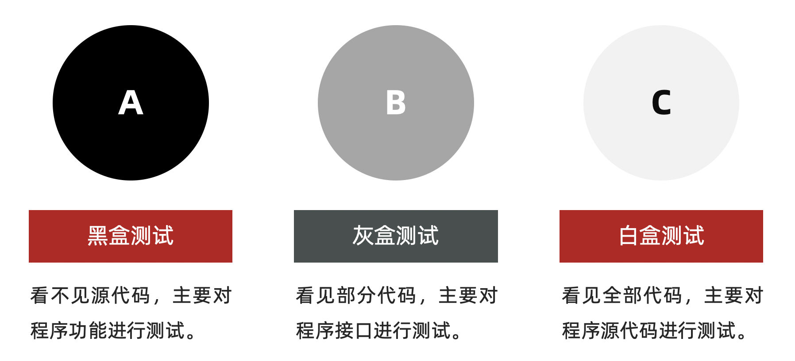
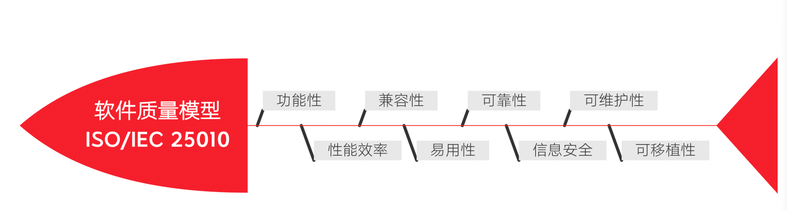

 
 
<b>软件测试</b>

 
<b>Software testing</b>

<!-- 顶部至此截止 -->

# 概述

- **软件的作用是什么**

    软件是控制计算机硬件的一种工具

    

- **什么是软件测试**

    使用**技术**手段**验证**软件是否满足需求。

    软件测试的目的是减少软件产品中的缺陷(bug)，保证软件的质量

    

- **测试的主流技能**

    - 功能测试

    - 自动化测试

    - 接口测试

    - 性能测试

        

    **主流方向建议：**

    - 功能测试 + 接口测试
    - 自动化测试 + 接口
    - 功能 + 性能

# 测试分类

- 阶段划分（阶段：软件产出过程顺序）
- 代码可见度

## 阶段划分

- **单元测试**

    - 说明：针对程序源代码进行测试（单元：最小独立功能代码段）

    - 提示：

        - 1、国内单元测试一般开发自测
        - 2、单元测试可以解决-快速定位缺陷
        - 3、提高测试执行效率

        

- **集成（接口）测试**

    - 说明：针对**单元与单元**之间的**接口**进行测试
    - 提示：又称接口测试。

    

- **系统测试**

    - 说明：针对系统整体功能+兼容+文档（说明、安装文档）

    

- **验收测试**

    - 内测：公司内部人员使用，发觉缺陷并修复。
    - 公测：让用户帮忙测试
    - 提示：验收测试,一般要根据项目类型决定是否使用。

## 代码可见度划分

> 代码可见度：代码可见的程度上划分

- **黑盒测试**：主要针对**功能**（阶段划分->**系统测试**）
- **灰盒测试**：针对**接口**测试（阶段划分->**集成测试**）
- **白盒测试**：针对程序**源代码**进行测试（阶段划分->**单元测试**）

**总结：**

- **系统测试**和**黑盒测试**重点核心是**功能测试**
- **集成测试**和**灰盒测试**又称**接口测试** 
- **单元测试**和**白盒测试**是对**代码**进行测试
- **自动化测试**归属**功能测试**
- **性能测试、安全测试归属专项测试**

# 测试模型

我们要解决的问题是，要从那些方面对软件进行测试。这个就是测试模型所做的事情

## 质量模型

- 功能性

    - 功能和测试**一一对应**，不能多也不能少
    - 要对错误处理人性化，比如报错不能是人看不懂的乱码

    

- 性能

    比如网站预估在线人数 20W。对于测试，我们可以使用服务器每秒处理请求数、服务器硬件配置是否满足

    

- 兼容性

    - 浏览器：谷歌、IE、火狐、欧朋、苹果
    - 操作系统：Windows 各个版本、Mac、Linux

    

- 易用性

    - 简洁、友好、流畅、美观

    

- 可靠性

    - 无响应、死机、卡顿

    

- 安全性

    - 密码传输加密
    - 数据库里存储加密

    

- 可以执性

    - 比如网站的迁移

    

- 可维护性

