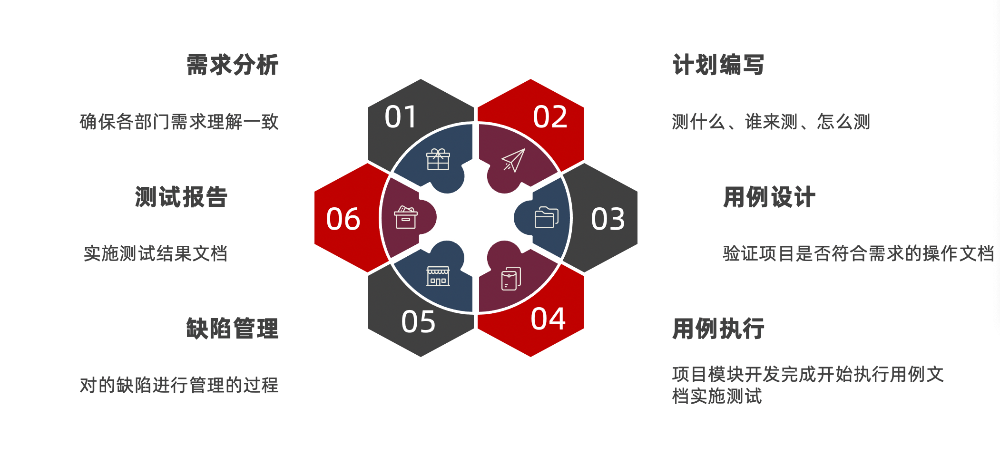
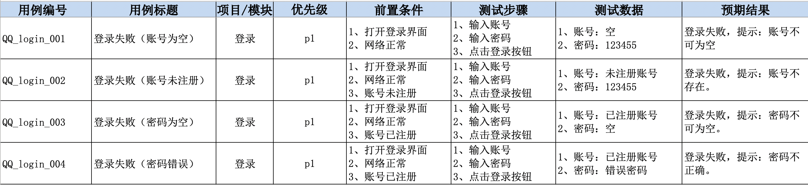
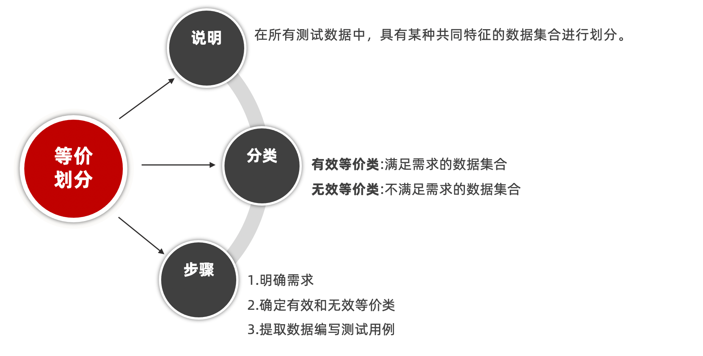
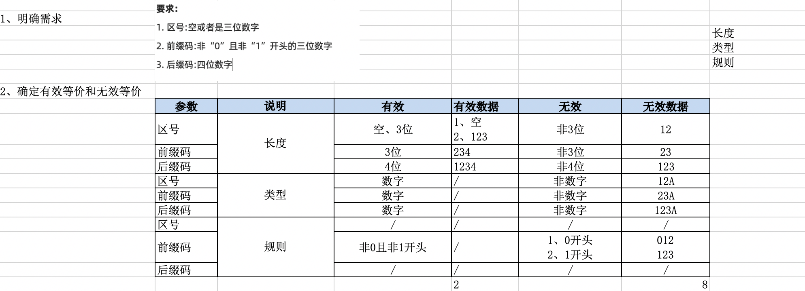
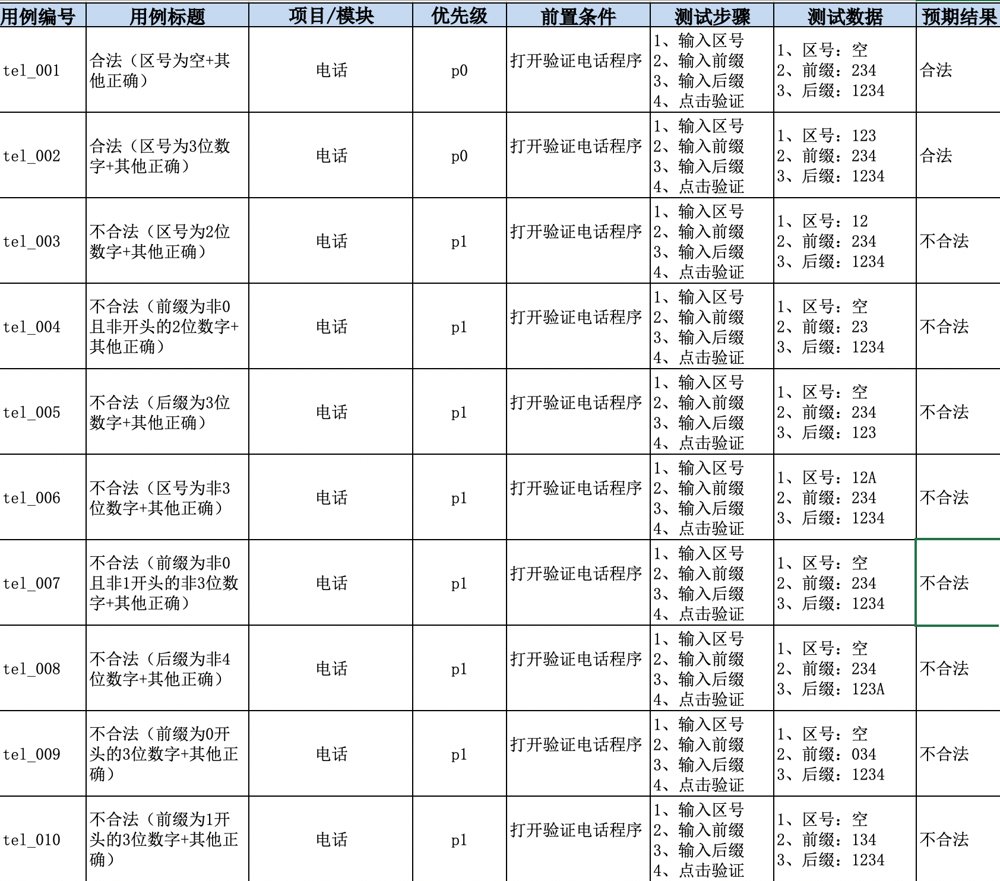

<p align="center">
 
 <p align="center"><b><font size=6>软件测试</font></b></p>
 <p align="center"><b>Software testing</b></p>
</p>


<div align=center>


[](LICENSE)


<div align=left>
<!-- 顶部至此截止 -->


# 概述

- **软件的作用是什么**

    软件是控制计算机硬件的一种工具

    

- **什么是软件测试**

    使用**技术**手段**验证**软件是否满足需求。

    软件测试的目的是减少软件产品中的缺陷(bug)，保证软件的质量

    

- **测试的主流技能**

    - 功能测试

    - 自动化测试

    - 接口测试

    - 性能测试

        

    **主流方向建议：**

    - 功能测试 + 接口测试
    - 自动化测试 + 接口
    - 功能 + 性能


# 测试分类

- 阶段划分（阶段：软件产出过程顺序）
- 代码可见度

## 阶段划分

- **单元（模块）测试**

    - 说明：针对程序源代码进行测试（单元：最小独立功能代码段）

    - 提示：

        - 1、国内单元测试一般开发自测
        - 2、单元测试可以解决-快速定位缺陷
        - 3、提高测试执行效率

        

- **集成（接口）测试**

    - 说明：针对**单元与单元**之间的**接口**进行测试
    - 提示：又称接口测试。

    

- **系统测试**

    - 说明：针对系统整体功能+兼容+文档（说明、安装文档）

    

- **验收测试**

    - 内测：公司内部人员使用，发觉缺陷并修复。
    - 公测：让用户帮忙测试
    - 提示：验收测试,一般要根据项目类型决定是否使用。


## 代码可见度划分

> 代码可见度：代码可见的程度上划分


- **黑盒测试**：主要针对**功能**（阶段划分->**系统测试**）
- **灰盒测试**：针对**接口**测试（阶段划分->**集成（接口）测试**）
- **白盒测试**：针对程序**源代码**进行测试（阶段划分->**单元（模块）测试**）


**总结：**

- **系统测试**和**黑盒测试**重点核心是**功能测试**
- **集成测试**和**灰盒测试**又称**接口测试** 
- **单元测试**和**白盒测试**是对**代码**进行测试，又称**模块测试**
- **自动化测试**归属**功能测试**
- **性能测试、安全测试归属专项测试**


# 测试模型

我们要解决的问题是，要从那些方面对软件进行测试。这个就是测试模型所做的事情

## 质量模型


- **功能性**

    - 功能和测试**一一对应**，不能多也不能少
    - 要对错误处理人性化，比如报错不能是人看不懂的乱码

    

- **性能**

    比如网站预估在线人数 20W。对于测试，我们可以使用服务器每秒处理请求数、服务器硬件配置是否满足

    

- **兼容性**

    - 浏览器：谷歌、IE、火狐、欧朋、苹果
    - 操作系统：Windows 各个版本、Mac、Linux

    

- **易用性**

    - 简洁、友好、流畅、美观

    

- 可靠性

    - 无响应、死机、卡顿

    

- **安全性**

    - 密码传输加密
    - 数据库里存储加密

    

- **可移植性**

    - 比如网站的迁移

    

- **可维护性**


# 测试流程



## 测试用例模板



八大要素编写规范

- 用例编号：项目_模块_编号
- 用例标题：预期结果（测试点）
- 模块/项目：所属项目或模块
- 前置条件：要执行此条用例，有哪些前置操作
- 优先级：表示用例的重要程度或者影响力 P0~p4（P0最高）。用户使用频率越高的功能为核心功能。
- 测试步骤：描述操作步骤
- 测试数据：操作的数据，没有的话可以为空
- 预期结果：期望达到的结果


## 用例设计方法

目标：

1、能对穷举场景设计测试点
2、能对限定边界规则设计测试点
3、能对多条件依赖关系进行设计测试点
4、能对于项目业务进行设计测试点


### 等价类

**等价类是指某个输入域的子集合。**在该子集合中，各个输入数据对于揭露程序中的错误都是等效的，并合理地假定：测试某等价类的代表值就等于对这一类其他值的测试，因此，可以把全部输入数据合理划分为若干等价类，在每一个等价类中取一个数据作为测试的输入条件就可以用少量代表性的测试数据取得较好的测试结果。等价类划分有两种不同的情况：有效等价类和无效等价类。

比如，性别是一个等价类；未成年人（0~17岁）是一个等价类；密码长度

- **有效等价类**

    是指对于程序的规格说明来说是==合理的、有意义的输入数据构成的集合==。利用有效等价类可检验程序是否实现了规格说明所规定的功能和性能。

    比如密码长度在指定区间（6~12 位）

- **无效等价类**

    指对程序的规格说明是==不合理的或无意义的输入数据所构成的集合==。对于具体的问题，[无效等价类](https://baike.baidu.com/item/无效等价类/7847821?fromModule=lemma_inlink)至少应有一个，也可能多个。

    比如密码长度不在指定区间（100 位或 1 位的密码）

设计测试用例时，要同时考虑这两种等价类。因为软件不仅要能接收合理的数据，也要能经受意外的考验，这样的测试才能确保软件具有更高的可靠性。


#### 等价类划分



1) 完备测试、避免冗余

2) 划分等价类重要的是：集合的划分、划分为**互不相交**的一组子集，而**子集的并是整个集合**

3) 并是整个集合：备性

4) 子集互不相交：保证一种形式的无冗余性

5) 同一类中标识（选择）一个测试用例，同一等价类中，往往处理相同，相同处理映射到“相同的执行路径”。


案例（电话）

```
要求：
1. 区号:空或者是三位数字
2. 前缀码:非“0”且非“1”开头的三位数字
3. 后缀码:四位数字
```






# CI/CD

> 作者：村上小树
> 链接：https://juejin.cn/post/7113562222852309023
> 来源：稀土掘金
> 著作权归作者所有。商业转载请联系作者获得授权，非商业转载请注明出处。

## CI

**CI**的全称是**Continuous Integration**，直译为**可持续集成**，而普遍对其的解释是**频繁地（一天多次）将代码集成到主干**。对于这个解释我们要搞懂其中的两个概念：

1. **主干**：是指包含多个已上和即将上线的特性的分支。
2. **集成**：是指把含新特性的分支合并(`merge`)到**主干**上的行为

我们借`github flow`分支管理策略作为例子来更加深入了解`CI`及上面的两个概念：


`github flow`在开发新特性的运行模式如下所示：

1. 基于`master`创建新的分支`feature`进行开发。注意这需要保证`master`的代码和特性永远是最稳定的。
2. 开发期间，定期提交更改(`commit and push change`)到远程仓库的`feature`分支
3. 在编码以及自测完成后，通过创建`pull request`去对`master`发起合并`feature`的请求
4. `pull request`在经过审核确认可行后合并到`master`分支
5. 删除已合并的特性分支`feature`

更多详细细节可看[GitHub flow](https://link.juejin.cn?target=https%3A%2F%2Fdocs.github.com%2Fcn%2Fget-started%2Fquickstart%2Fgithub-flow)。

在`github Flow`模型中，**主干**指`master`分支，广义上是一个包含多个已上和即将上线的特性的分支；**集成**指的是在`pull request`通过后把特性分支`merge`合并到**主干**，也就是`master`分支上。

阮一峰老师的[持续集成是什么？](https://link.juejin.cn?target=https%3A%2F%2Fwww.ruanyifeng.com%2Fblog%2F2015%2F09%2Fcontinuous-integration.html)里说到过：

> 持续集成的目的，就是让产品可以快速迭代，同时还能保持高质量。它的核心措施是，代码集成到主干之前，必须通过自动化测试。只要有一个测试用例失败，就不能集成。

而`github flow`模型**保证高质量的核心措施**是：在**集成**前通过`pull request`，从而触发审核（审核可以是一系列的自动化校验测试以及代码审核**Code Review**），在审核通过后再合并到**主干**，从而保证**主干**的稳定性。

下面我们就按照`github flow`模型的机制，在开头创建的项目上添加`CI`流程。


### 在项目中实现`CI`

根据上面所说的`github flow`模型**保证高质量的核心措施**可知，我们要定义的执行`CI`的**Workflow**（下称**CI Workflow**）的**Event**是`master`分支的`pull request`事件。而`Job`和`Step`的话没具体说明，而我们可以把目前最普遍的 **代码测试（Test）** 和 **代码扫描（Lint）** 加入其中。

其实现思路是，首先要借助一些第三方插件，在`package.json`中的`scripts`定义可以执行**代码测试（Test）\**和\**代码扫描（Lint）\**的命令，然后在把这些命令行加到\**CI Workflow**的**Step**里。

具体流程图如下所示：


#### 配置**CI Workflow**

在项目根目录里的`.github/workflows`文件夹上新建`ci.yml`，代码如下所示：

**ci.yml**

```yml
name: CI
# Event设置为main分支的pull request事件，
# 这里的main分支相当于master分支，github项目新建是把main设置为默认分支，我懒得改了所以就保持这样吧
on:
  pull_request:
    branches: main
jobs:
  # 只需要定义一个job并命名为CI
  CI:
    runs-on: ubuntu-latest
    steps:
      # 拉取项目代码
      - name: Checkout repository
        uses: actions/checkout@v2
      # 给当前环境下载node
      - name: Use Node.js
        uses: actions/setup-node@v3
        with:
          node-version: "16.x"
      # 检查缓存
      # 如果key命中缓存则直接将缓存的文件还原到 path 目录，从而减少流水线运行时间
      # 若 key 没命中缓存时，在当前Job成功完成时将自动创建一个新缓存
      - name: Cache
        # 缓存命中结果会存储在steps.[id].outputs.cache-hit里，该变量在继后的step中可读
        id: cache-dependencies
        uses: actions/cache@v3
        with:
          # 缓存文件目录的路径
          path: |
            **/node_modules
          # key中定义缓存标志位的生成方式。runner.OS指当前环境的系统。外加对yarn.lock内容生成哈希码作为key值，如果yarn.lock改变则代表依赖有变化。
          # 这里用yarn.lock而不是package.json是因为package.json中还有version和description之类的描述项目但和依赖无关的属性
          key: ${{runner.OS}}-${{hashFiles('**/yarn.lock')}}
      # 安装依赖
      - name: Installing Dependencies
        # 如果缓存标志位没命中，则执行该step。否则就跳过该step
        if: steps.cache-dependencies.outputs.cache-hit != 'true'
        run: yarn install
      # 运行代码扫描
      - name: Running Lint
        # 通过前面章节定义的命令行执行代码扫描
        run: yarn lint
      # 运行自动化测试
      - name: Running Test
        # 通过前面章节定义的命令行执行自动化测试
        run: yarn test
复制代码
```

关于上面的`Cahe`步骤中，7 天内未被访问的任何缓存条目将会被删除。 可以存储的缓存数没有限制，但存储库中所有缓存的总大小限制为 10 GB。更多内容请看[缓存依赖项以加快工作流程](https://link.juejin.cn?target=https%3A%2F%2Fdocs.github.com%2Fcn%2Factions%2Fusing-workflows%2Fcaching-dependencies-to-speed-up-workflows)。

当创建`pull request`合并到主干时，**CI Workflow**触发运行，此时可以看到下面的情况：


当**CI Workflow**运行完成时，其效果如下所示：


我们可以通过点击`Details`查看执行详细信息，如下所示：


也可以点开每个`step`查看控制台输出信息：


确认代码安全可靠后就可以点击`Merge pull request`来把新代码**集成**到**主干**上。从而基于`CI`完成一次**bug 修复**或**新特性迭代**。


合并成功后，可以点击`Delete branch`以删除已合并的特性分支。

### 补充

部分`DevOps`平台中的`CI`流程比上面我们实现的流程里多一个阶段：**编译并整理产物**，即基于当前版本的代码打包构建产物。在这篇文章中我把这个阶段放在`CD`流程里。


## 添加`CD`流程

### `CD`的概念

`CD`指的是 **持续交付（Continuous delivery）** 或者 **持续部署（continuous deployment）** 或者是两者的并集，我们借用[AWS 中对持续交付说明](https://link.juejin.cn?target=https%3A%2F%2Faws.amazon.com%2Fcn%2Fdevops%2Fcontinuous-delivery%2F)来说明下这两者的解释，如下：

>  采用持续交付时，系统会构建并测试每一个代码变更，然后将其推送到非生产测试环境或临时环境中。生产部署前可能存在多个并行测试阶段。**持续交付与持续部署之间的区别在于，需要手动批准才能更新到生产环境。对于持续部署，生产会在没有明确批准的情况下自动发生。**

从上面的解释中可知其有三个步骤：

1. 生成制品
2. 自动部署到测试环境以校验其稳定性
3. 部署到生产环境（自动的是**持续部署**，手动的是**持续交付**）

基于本文是以入门为主，且很多读者也就只有一个服务器来直接部署自己的小项目，因此本章节的`CD`实现中，我们以**持续部署（continuous deployment）** 且跳过上面第二步来实现，也就是生成制品后直接自动部署到生产环境。

------

其实对于**持续交付（Continuous delivery）** 和 **持续部署（continuous deployment）** ，不同`DevOps`平台有不同的解释，而不同的企业和项目也有不同的实现方式。但本质上不会有太大区别，而我们也没必要去花时间咬文嚼字，借用**Red Hat**对[ **CICD**说明 ](https://link.juejin.cn?target=https%3A%2F%2Fwww.redhat.com%2Fzh%2Ftopics%2Fdevops%2Fwhat-is-ci-cd)里的一句话总结，如下：

> CI/CD 既可能仅指持续集成和持续交付构成的关联环节，也可以指持续集成、持续交付和持续部署这三项构成的关联环节。更为复杂的是，有时"持续交付"也包含了持续部署流程。
>
> 归根结底，我们没必要纠结于这些语义，您只需记得 CI/CD 其实就是一个流程（通常形象地表述为管道），用于实现应用开发中的高度持续自动化和持续监控。因案例而异，该术语的具体含义取决于 CI/CD 管道的自动化程度。许多企业最开始先添加 CI，然后逐步实现交付和部署的自动化（例如作为云原生应用的一部分）。

### 在项目中实现`CD`

这是我们在本章节要实现的`CD`机制的流程图：


#### 先前准备

在编写**CD Workflow**前，我们要准备以下东西：

1. 内置`nginx`的服务器一台：用于部署制品
2. 服务器的密钥对：用于提供给流水线通过 ssh 免密登录到服务器进行部署
3. `Github`里的**Personal Access Token**：用于提供给流水线免密登录`github`账号进行发布制品的操作
4. 把步骤 2 和步骤 3 及其他关于机器的信息都放在对应仓库的**Secret**里

下面对上述需要准备的东西逐一讲解：

1. **准备一台服务器，在里面启动`nginx`服务。**

    读者可以直接通过`apt`下载`nginx`到指定目录后启动。我个人习惯以`docker`启动容器以开启`nginx`服务。因此我直接通过下面的`docker-compose.yml`去创建启动`nginx`容器：

    ```yml
    # 指定docker-compose解析的版本
    version: "3"
    services:
      pure-nginx:
        image: nginx:latest
        # 指定容器名
        container_name: pure-nginx
        restart: always
        # 指定持久卷，格式为 宿主机目录路径:容器目录路径
        # CD Workflow会通过密钥登录该服务器，然后把生成的制品放在/data/www里，在此之后直接访问宿主机的ip即可访问到项目页面
        volumes:
          - /data/www:/usr/share/nginx/html
        ports:
          - 80:80
    复制代码
    ```

2. **创建服务器的密钥对：用于提供给流水线通过 ssh 免密登录到服务器进行部署**

    每个平台都有创建密钥的教程，例如我的机器是腾讯云的，因此参考[这篇文章](https://link.juejin.cn?target=https%3A%2F%2Fcloud.tencent.com%2Fdocument%2Fproduct%2F1207%2F44573)去创建密钥，密钥分公钥和私钥。公钥存放在服务器上，私钥我们自己下载保存。在配置`CD Workflow`的免密登录机器的**步骤 step**之前，大家也可以参考这篇文章[使用密钥登录](https://link.juejin.cn?target=https%3A%2F%2Fcloud.tencent.com%2Fdocument%2Fproduct%2F1207%2F44643)，使用`VSCode`中的[Remote - SSH](https://link.juejin.cn?target=https%3A%2F%2Fmarketplace.visualstudio.com%2Fitems%3FitemName%3Dms-vscode-remote.remote-ssh)通过配置私钥尝试是否可以免密登录机器，如果成功后就可以放心交给流水线去登录。

3. **创建`Github`里的 Personal Access Token ：用于提供给流水线免密登录`github`账号进行发布制品的操作**

    参考`Github`官方文档[Creating a personal access token](https://link.juejin.cn?target=https%3A%2F%2Fdocs.github.com%2Fcn%2Fauthentication%2Fkeeping-your-account-and-data-secure%2Fcreating-a-personal-access-token)创建**Personal Access Token**。

    在上述文档里的第 8 步 **Select scopes** 时直接点击`repo`即可，其余的可不选，如下所示：

    

4. **把步骤 2 和步骤 3 及其他关于机器的信息都放在`github`仓库的 Secret 里**

    **Secret**是一些相对机密重要的信息，这些信息在 **Workflow** 里面需要用到，但又不能以明文的形式直接写在文件里以免泄露。此时我们可以放在**Secret**里，在 **Workflow** 运行时这些**Secret**会以环境变量的形式注入到`Runner`里，此时可以以`${{ secrets.xxx }}`的形式读取。

    在如图所示的页面下点击右上角的`New repository secret`去创建`secret`，在接下来要创建的`CD Workflow`中需要用到如图红字标记所示的四个**Secret**。

    

#### 配置**CD Workflow**

这里我们把执行`CD`的**Workflow**（下称**CD Workflow**）的**Event**定义为`master`分支的`push`事件，因为**CD Workflow**的执行是在`Merge pull request`完成后的，而合并行为会触发**主干**的`push`事件。

接下来在`.github/workflows`里新建`cd.yml`来定义**CD Workflow**，代码如下所示：

```yml
name: CD
on:
  # 以主干的push事件作为触发条件
  push:
    branches: main
jobs:
  CD:
    runs-on: ubuntu-latest
    steps:
      # 拉取代码
      - name: Checkout repository
        uses: actions/checkout@v2
      # 下载Node
      - name: Use Node.js
        uses: actions/setup-node@v3
        with:
          node-version: "16.x"
      # 添加缓存，逻辑和CI Workflow里的一样
      - name: Cache
        id: cache-dependencies
        uses: actions/cache@v3
        with:
          path: |
            **/node_modules
          key: ${{runner.OS}}-${{hashFiles('**/yarn.lock')}}
      # 安装依赖。命中缓存则跳过此步
      - name: Installing Dependencies
        if: steps.cache-dependencies.outputs.cache-hit != 'true'
        run: yarn install
      # 从package.json里获取version属性的值
      # 在CD Workflow中会给每个生成的制品打上标签，而标签取值于version值
      - name: Read Version
        # 读取出来的值会放在steps.[id].outputs.value供其他步骤step读取
        id: version
        uses: ashley-taylor/read-json-property-action@v1.0
        with:
          path: ./package.json
          property: version
      # 打包生成制品，且把制品压缩到assets.zip压缩包里
      - name: Building
        run: |
          yarn build
          zip -r assets ./dist/**
      # 基于当前commit进行版本发布(Create a release)，tag_name是v前缀加上package.json的version值
      - name: Create GitHub Release
        # 此步骤中，版本发布后会返回对应的url，以供下面上传制品的步骤中读取使用
        id: create_release
        uses: actions/create-release@v1
        env:
          # GITHUB_TOKEN是准备工作步骤三申请的Personal Access Token
          GITHUB_TOKEN: ${{ secrets.PROJECT_ACCESS_TOKEN }}
        with:
          tag_name: v${{steps.version.outputs.value}}
          release_name: v${{steps.version.outputs.value}}
          draft: false
          prerelease: false
      # 把assets.zip上传到仓库对应的发布版本Release上
      - name: Update Release Asset
        id: upload-release-asset
        uses: actions/upload-release-asset@v1
        env:
          GITHUB_TOKEN: ${{ secrets.PROJECT_ACCESS_TOKEN }}
        with:
          upload_url: ${{ steps.create_release.outputs.upload_url }}
          asset_path: ./assets.zip
          asset_name: assets.zip
          asset_content_type: application/zip
      # 把制品上传到部署机器
      - name: Upload to Deploy Server
        uses: easingthemes/ssh-deploy@v2.0.7
        env:
          # SSH_PRIVATE_KEY为准备工作步骤三中生成密钥对里的私钥
          SSH_PRIVATE_KEY: ${{ secrets.DEPLOY_TOKEN }}
          # 指定当前目录中要上传的内容
          SOURCE: "dist/"
          # 指定上传到部署机器的哪个目录下
          TARGET: "/data/www"
          # 上传前指令，此处用于清空TARGET下的文件
          ARGS: "-avzr --delete"
          # REMOTE_HOST为机器的公网IP
          REMOTE_HOST: ${{ secrets.REMOTE_HOST }}
          # REMOTE_USER为登录机器时用到账号名
          REMOTE_USER: ${{secrets.REMOTE_USER}}
复制代码
```

这样子就完成了**CD Workflow**的流程了，运行效果如下所示：


在**CD Workflow**运行完成后，可以输入自己机器的公网 IP 查看部署的项目。**注意：每次提 pr 时要确保 package.json 中的 version 值有变化，不然 CD Workflow 会在 Create GitHub Release 的步骤里报已存在 Tag 的错误。**

**关于 CD Workflow 细节补充：**

1. *为什么要获取`package.json`中`version`值，有什么作用?*

    `version`值在**CD Workflow**主要用于版本发布，此过程需要填写指定的`tag_name`。发布的版本如下所示：

    

    点进去后可以看到当前项目的所有版本，如下所示：

    

    我们也可以在通过[VSCode GitGraph 插件](https://link.juejin.cn?target=https%3A%2F%2Fmarketplace.visualstudio.com%2Fitems%3FitemName%3Dmhutchie.git-graph)来看到自己发布的版本标签（commit 写的有点随便，不要介意），如下所示：

    

    在每次**主干**更新后进行版本发布不仅符合开源项目的更新流程，而且利于我们之后部署特定**发布版本**的制品（可看下面**深入章节的回滚流程**）。

2. 为什么要有 **Update Release Asset** 这个步骤？

    首先，把制品放在对应的**发布版本**上是很常见的开源行为，读者也可以把制品下载下来放到`nginx`直接查看页面效果。其次也是很重要的，是为了**回滚（下面深入篇会写回滚机制的实现）\**的实现，回滚需要快速获取前一个\**发布版本**的制品覆盖到部署机器上。因此需要我们把每个制品都存放在对应的**发布版本**以实现持久化。

3. *为什么 **Update Release Asset(上传制品)** 阶段不使用[`actions/upload-artifact`](https://link.juejin.cn?target=https%3A%2F%2Fgithub.com%2Factions%2Fupload-artifact)：*

    首先在**Release**中上传制品是很多开源项目中常见的操作，其次`actions/upload-artifact`中存在两个缺点：

    1. 上传的制品只能供同一个`Workflow`的不同`Job`中使用。换言之，不同`Workflow`是不能使用这个制品的，这样子我们就不利于我们在不同的流程去调用这个制品。例如**回滚（下面深入篇会写回滚机制的实现）**，在当前部署机器上的项目存在问题时，我们可以通过回滚迅速把前一个稳定的版本的制品覆盖到部署机器上。
    2. 上传的制品最多只存在 90 天，不能做到持久化。

    因此这里没选择`actions/upload-artifact`。

## 添加状态徽章


我们可以在项目的`README.md`中加了`CI`和`CD`两个状态徽章来代表这个项目已成功实现了`CI`和`CD`的流程，如上图所示。这两个状态徽章是根据你指定的**Workflow**的名称和最近一次运行的结果动态变化的。如果对应的流水线并没有运行记录，则效果如图上的`E2E-Test`状态徽章所示。

徽章可以直接以下面的格式来插入到自己的`README.md`上：

```md

复制代码
```

例如我的`CI`和`CD`徽章分别如下所示：

```md


复制代码
```

关于更多有关工作流程状态徽章的可看官方文档[添加工作流程状态徽章](https://link.juejin.cn?target=https%3A%2F%2Fdocs.github.com%2Fcn%2Factions%2Fmonitoring-and-troubleshooting-workflows%2Fadding-a-workflow-status-badge)


